# pro-asixc1d-g3

# Índice

  * [1. Plano general de las instalaciones INNOCATETECH:](#1-plano-general-de-las-instalaciones-innocatetech)
    * [1.1. Plano sala del rack:](#11-plano-sala-del-rack)
    * [1.1.1. Estructuración de los Racks:](#111-estructuracion-de-los-racks)
      * [1.1.2. Componentes Técnicos Comunes por Rack:](#112-componentes-tecnicos-comunes-por-rack)
    * [1.2. Sistema de climatización del CPD:](#12-sistema-de-climatizacion-del-cpd)
    * [1.3. Medidas para dificultar la identificación de la sala:](#13-medidas-para-dificultar-la-identificacion-de-la-sala)
      * [1.3.1. Señalización Restrictiva:](#131-sealizacion-restrictiva)
      * [1.3.2. Seguridad de Rutas y Suministros:](#132-seguridad-de-rutas-y-suministros)
      * [1.3.3. Camuflaje Arquitectónico y Estético:](#133-camuflaje-arquitectonico-y-estetico)
    * [1.4. distribución y gestión del cableado:](#14-distribucion-y-gestion-del-cableado)
    * [1.5. Terra Tècnic (Suelo Técnico Elevado):](#15-terra-tecnic-suelo-tecnico-elevado)
      * [1.5.1. Sostre Tècnic (Falso Techo Registrable):](#151-sostre-tecnic-falso-techo-registrable)
      * [1.5.2. Estanqueidad con la Cristalera:](#152-estanqueidad-con-la-cristalera)
  * [2.	Infraestructura elèctrica:](#2-infraestructura-electrica)
    * [2.1 Sistemas de alimentación redundante:](#21-sistemas-de-alimentacion-redundante)
    * [2.2. Sistema SAI / UPS:](#22-sistema-sai--ups)
    * [2.3. Consumo eléctrico estimado:](#23-consumo-electrico-estimado)
    * [2.4. Distribución eléctrica en racks:](#24-distribucion-electrica-en-racks)
    * [2.5. Eficiencia energética:](#25-eficiencia-energetica)
    * [2.6. Seguridad Física](#26-seguridad-fisica)
      * [2.6.1. Medidas Pasivas:](#261-medidas-pasivas)
      * [2.6.2. Medidas activas:](#262-medidas-activas)
    * [2.7. Seguridad lógica](#27-seguridad-logica)
      * [2.7.1. Seguridad Lógica Pasiva:](#271-seguridad-logica-pasiva)
      * [2.7.2. Seguridad Lógica Activa:](#272-seguridad-logica-activa)
    * [2.8. Prevención de riesgos laborales:](#28-prevencion-de-riesgos-laborales)
      * [2.8.1. Riesgos Eléctricos:](#281-riesgos-electricos)
      * [2.8.2. Riesgos Ergonómicos:](#282-riesgos-ergonomicos)
      * [2.8.3. Riesgos por Ruido:](#283-riesgos-por-ruido)
      * [2.8.4. Riesgos Térmicos:](#284-riesgos-termicos)
      * [2.8.5. Riesgos de Incendio:](#285-riesgos-de-incendio)
      * [2.8.6. Riesgos de Caídas:](#286-riesgos-de-caidas)
      * [2.8.7. Riesgos por Radiaciones Electromagnéticas:](#287-riesgos-por-radiaciones-electromagneticas)
      * [2.8.8. Medidas Organizativas Generales:](#288-medidas-organizativas-generales)
  * [Implementación del CPD en la nube AWS con los servicios utilizados. Iker](#implementacion-del-cpd-en-la-nube-aws-con-los-servicios-utilizados-iker)
  * [2.10. Implementación de CPD a la nube AWS con los servicios utilizados](#210-implementacion-de-cpd-a-la-nube-aws-con-los-servicios-utilizados)
  * [3. Ansible - Creació de servidors (Logs | LDAP) .Iker](#3-ansible---creacio-de-servidors-logs--ldap-iker)
  * [4. Implantació dels serveis d'àudio i vídeo (Ivan)](#4-implantacio-dels-serveis-d-audio-i-video-ivan)
  * [5. Servidor MySQL (xavi-piero)](#5-servidor-mysql-xavi-piero)
    * [5.1 BBDDs](#51-bbdds)
    * [5.2 Script bash - Gestió d’usuaris:](#52-script-bash---gestio-d-usuaris)
      * [codi (link github)](#codi-link-github)
    * [5.3 Creación de la base de datos de la Web:](#53-creacion-de-la-base-de-datos-de-la-web)
    * [5.3 Triggers y eventos periódicos:](#53-triggers-y-eventos-periodicos)
  * [6. Servidor Web - SFTP (xavi)](#6-servidor-web---sftp-xavi)
    * [6.1 Nginx:](#61-nginx)
      * [6.1.1. Creación de certificados SSL:](#611-creacion-de-certificados-ssl)
      * [6.1.2. Configuración de la Página:](#612-configuracion-de-la-pagina)
      * [6.1.3. Configuración PHP](#613-configuracion-php)
    * [6.2 SFTP](#62-sftp)
      * [6.2.1 Configuración del servicio:](#621-configuracion-del-servicio)
      * [6.2.2. Creación de usuarios:](#622-creacion-de-usuarios)
      * [6.2.3. Pruebas:](#623-pruebas)

---

` GRUPO 3 PROYECTO TRANSVERSAL ``ASIXc1D`  

## <a href="#1-plano-general-de-las-instalaciones-innocatetech">1. Plano general de las instalaciones INNOCATETECH:</a>
[↑ Volver al índice](#indice)

<strong>El CPD se ubica en la planta baja</strong>, en una <strong>zona central.</strong> El núcleo del <strong>CPD está completamente cerrado por una estructura acristalada</strong> técnica de alta resistencia en este proyecto utilizamos vidrio laminado de seguridad con <strong>tratamiento acústico y térmico. </strong>  
<strong>Esta cristalera permite:</strong>  
* Aislamiento Térmico: Mantiene el aire frío dentro de la zona de racks, separándolo del resto del edificio.

* Supervisión Visual: Permite observar el estado de los equipos (LEDs de estado, orden) desde el exterior sin necesidad de entrar y alterar la temperatura de la sala.

* Discreción y Estética: El cristal puede ser electrocromático (se vuelve opaco con un interruptor) para ocultar la sala durante visitas no autorizadas, manteniendo la máxima discreción.

### <a href="#11-plano-sala-del-rack">1.1. Plano sala del rack:</a>
[↑ Volver al índice](#indice)

Hemos optado por una <strong>arquitectura de cinco servidores físicos </strong>distribuidos en <strong>cuatro racks para maximizar la seguridad y el rendimiento.</strong> Este esquema no solo asegura el aislamiento de procesos críticos, sino que <strong>facilita un crecimiento vertical y ágil</strong> ante el posible incremento de las futuras demandas.  
Hemos asignado cada servidor a una función específica para garantizar la independencia de procesos:  
* Rack 1: Servicio Web y SFTP (Secure File Transfer Protocol) Este servidor centraliza el acceso externo de la empresa. Por un lado, gestiona el portal corporativo y las interfaces de usuario de las plataformas digitales, optimizado para un alto tráfico de peticiones HTTP/HTTPS. Por otro lado, aloja el servicio SFTP para el intercambio seguro, robusto y cifrado de archivos con clientes y proveedores.
* Rack 2: Centralización de Logs (SIEM / Logging) Encargado de recibir y almacenar todos los registros de eventos (logs) de la red y el hardware. Es un nodo crítico para la auditoría de seguridad, el cumplimiento normativo y la detección de anomalías en tiempo real.
* Rack 3: Active Directory (AD) Dedicado exclusivamente a la gestión de la infraestructura de identidad de la empresa. Controla la autenticación de usuarios, las directivas de grupo (GPOs) y la asignación de permisos centralizados de forma segura.
* Rack 4: Procesamiento de Audio y Vídeo Servidor independiente dedicado a las capacidades de procesamiento, transcodificación y distribución para las plataformas de streaming de audio y contenido de vídeo de InnovateTech. Al estar separado del Active Directory, se garantiza que el alto consumo de ancho de banda y CPU no afecte la autenticación de la empresa.
* Rack 5: Base de Datos (DB Server) El motor de datos neurálgico de la organización. Está configurado con discos NVMe de ultra alta velocidad y redundancia para minimizar los tiempos de respuesta de las consultas y garantizar la alta disponibilidad de la información.

### <a href="#111-estructuracion-de-los-racks">1.1.1. Estructuración de los Racks:</a>
[↑ Volver al índice](#indice)

Para garantizar la alta disponibilidad, la eficiencia en el cableado y el mantenimiento ágil, cada uno de los 5 racks independientes se estructurará internamente utilizando armarios de <strong>42U de altura, 800 mm de ancho y 1100 mm de profundidad</strong> (permitiendo espacio lateral para la gestión de cableado vertical).  
Todos los racks seguirán un estándar de distribución homogéneo basado en la arquitectura <em>Top of Rack</em> (ToR) para datos y <em>Bottom of Rack</em> (BoR) para energía.  

#### <a href="#112-componentes-tecnicos-comunes-por-rack">1.1.2. Componentes Técnicos Comunes por Rack:</a>
[↑ Volver al índice](#indice)

A excepción de los servidores específicos, cada rack contará con los siguientes elementos de infraestructura interna:  
* Sistema de Alimentación Ininterrumpida (SAI/UPS) en Rack: Este sistema se ubicará en la base del rack, específicamente de la unidad U1 a la U3, con el objetivo de mantener el centro de gravedad lo más bajo posible por motivos de estabilidad. Se implementará un SAI de tecnología Online de Doble Conversión con una capacidad de 3000VA (3kVA) / 2700W en un formato rackeable de 2U o 3U, el cual incorporará una tarjeta de red SNMP para la monitorización remota del estado de las baterías y los consumos eléctricos. En cuanto a la redundancia, el equipo estará configurado para alimentar de forma continua la línea "A" de los servidores, mientras que la línea "B" se conectará a un bypass estático de la red general del CPD o a un segundo SAI centralizado según disponibilidad presupuestaria.

* Unidades de Distribución de Energía (PDU) Inteligentes: Para la distribución eléctrica interna se instalarán dos PDU conmutadas e inteligentes con un factor de forma Zero-U, lo que permite fijarlas verticalmente en la parte posterior del chasis del rack sin ocupar espacio de unidades útiles frontales. Estas unidades contarán con conexiones de entrada tipo IEC 320 C20 y salidas bloqueables para evitar desconexiones accidentales, distribuidas en puertos tipo IEC C13 y C19, ofreciendo además la capacidad de realizar el encendido o apagado remoto de enchufes individuales y la medición de corriente en tiempo real por cada puerto.

* Paneles de Parcheo (Patch Panels): La gestión del cableado estructurado se centralizará en la parte superior del rack, ocupando las unidades U41 y U42. Por un lado, se dispondrá de un patch panel de cobre de 1U con 24 puertos RJ-45 Categoría 6A FTP apantallado, diseñado con tecnología Keystone angular para facilitar la caída natural y fluida del cable hacia los organizadores verticales. Por otro lado, se integrará un patch panel de fibra óptica (FOBOT) de 1U equipado con un cassette deslizante para albergar hasta 24 acopladores LC-Duplex Monomodo o Multimodo (OM4), el cual estará destinado exclusivamente a gestionar los enlaces de alta velocidad o uplinks hacia el Switch Core del CPD.
* Electrónica de Red (Switch ToR): La conectividad de red local se resolverá mediante la arquitectura Top of Rack (ToR) situando el switch en la unidad U40, justo debajo de los paneles de parcheo para minimizar la longitud de los latiguillos. Se utilizará un switch gestionable con capacidades de Capa 2 y Capa 3 (L2/L3) que dispondrá de 24 puertos nativos de 1GbE/10GbE Base-T para la conexión de los servidores del rack, complementado con 4 puertos SFP+ de alta velocidad de 10Gbps/25Gbps para asegurar los uplinks hacia el núcleo de la infraestructura de red.

* Gestión de Cableado y Accesorios: Para garantizar un flujo de aire óptimo y un mantenimiento limpio, se instalarán dos organizadores de cable horizontales de 1U con pasacables de escobilla situados estratégicamente entre el switch y los patch panels. Adicionalmente, cada rack incluirá una bandeja fija ventilada de 1U para dar soporte a herramientas o dispositivos que no dispongan de un formato nativo rackeable, así como un kit de monitorización ambiental compuesto por sondas de temperatura y humedad conectadas directamente a la PDU o al SAI para alertar sobre cualquier anomalía térmica interna.

### <a href="#12-sistema-de-climatizacion-del-cpd">1.2. Sistema de climatización del CPD:</a>
[↑ Volver al índice](#indice)

En un <strong>CPD convencional abierto,</strong> el aire frío se mezcla rápidamente con el aire caliente ambiental, obligando a las unidades de aire acondicionado a <strong>trabajar a máxima potencia</strong> en la mayoría de casos. Por eso nosotros hemos optado por las cristaleras ya que estas r<strong>ompen este ciclo creando un recinto estanco:</strong>  
* Efecto Estanco: Al estar sellado, el aire frío inyectado por las unidades de precisión (CRAC) no se mezcla con el aire caliente de la oficina. Esto permite que los servidores trabajen a una temperatura constante de 21°C con un consumo eléctrico mínimo.

* Control de Presión Positiva: El sistema inyecta más aire del que extrae, creando una presión superior dentro del cristal. Al abrir la puerta, el aire sale hacia afuera, impidiendo físicamente la entrada de polvo o partículas que podrían dañar los componentes internos de los servidores.

* Humedad Controlada: Se mantiene entre el 45% y 50% para evitar fallos por electricidad estática o corrosión.

  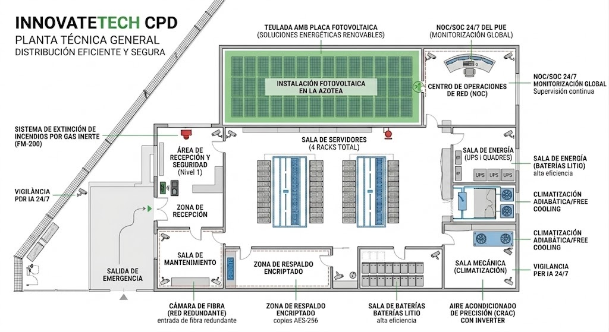

### <a href="#13-medidas-para-dificultar-la-identificacion-de-la-sala">1.3. Medidas para dificultar la identificación de la sala:</a>
[↑ Volver al índice](#indice)

Para proteger la i<strong>nfraestructura crítica de InnovateTech,</strong> es fundamental aplicar el principio de seguridad por oscuridad. El objetivo es que el CPD pase <strong>desapercibido para cualquier persona ajena </strong>al departamento de IT, <strong>minimizando el riesgo de sabotaje o ataques dirigidos.</strong>  

#### <a href="#131-sealizacion-restrictiva">1.3.1. Señalización Restrictiva:</a>
[↑ Volver al índice](#indice)

Por precaución a cualquier tipo de <strong>incidente ajeno a nuestro departamento de IT</strong>, nunca deberemos de usar <strong>carteles que digan "CPD", "Data Center" o "Servidores",</strong> con el  objetivo de conseguir discreción y que pase desapercibido por usuarios externos.  
<strong>La placa de la puerta</strong>, señalizará solamente con un cartel que diga:<strong> </strong>  
<strong>"PROHIBIDO EL PASO A PERSONAS NO AUTORIZADAS".</strong>  

  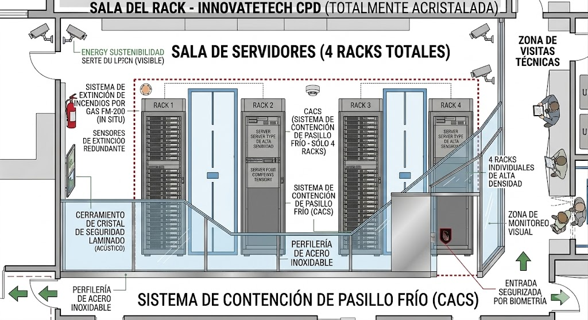

Como normal general en los planos públicos o de evacuación de la empresa, la sala se identificará únicamente como <strong>"Zona Técnica" o "Localización de Riesgo Especial"</strong>, sin especificar su contenido crítico.  

#### <a href="#132-seguridad-de-rutas-y-suministros">1.3.2. Seguridad de Rutas y Suministros:</a>
[↑ Volver al índice](#indice)

<strong>Las bandejas de cables y tuberías de refrigeración</strong> transcurrirá siempre por falsos techos cerrados, nunca de forma vista en pasillos comunes.  
En el directorio del edificio o del ascensor, <strong>no figurará ninguna referencia a la ubicación de la infraestructura tecnológica.</strong>  

#### <a href="#133-camuflaje-arquitectonico-y-estetico">1.3.3. Camuflaje Arquitectónico y Estético:</a>
[↑ Volver al índice](#indice)

Dado que el CPD se ha diseñado como una sala acristalada, se implementará un <strong>sistema de vidrio electrocrómico inteligente</strong>, el cual permite que el cristal se vuelva opaco (en tono blanco o negro) mediante un interruptor. Esta tecnología garantiza que, ante la presencia de personal externo, la sala se perciba simplemente como una pared decorativa o una sala de juntas vacía.  
Para reforzar esta discreción, la <strong>perfilería de la cristalera será idéntica</strong> a la utilizada en el resto de las oficinas, evitando que destaque como un elemento de alta seguridad. Asimismo, el CPD se ubica estratégicamente en el <strong>núcleo del edificio</strong>, eliminando cualquier ventana al exterior para prevenir la visibilidad desde la calle o la exposición ante drones y fotografía externa.  

  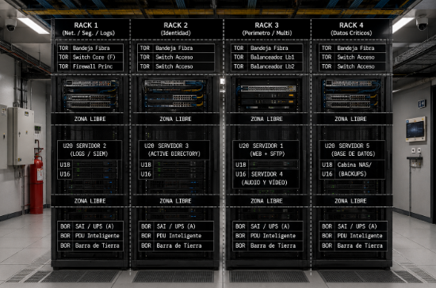

### <a href="#14-distribucion-y-gestion-del-cableado">1.4. distribución y gestión del cableado:</a>
[↑ Volver al índice](#indice)

Para la <strong>distribución y gestión del cableado</strong> en el CPD de InnovateTech, seguiremos un modelo de alta eficiencia basado en la normativa <u><strong>`ANSI/TIA-942`</strong></u>, asegurando que el despliegue sea escalable, ordenado y no interfiera con el sistema de climatización de la zona acristalada.  
La gestión se dividirá en dos niveles físicos totalmente segregados para evitar interferencias electromagnéticas (EMI) y facilitar el mantenimiento de los 5 servidores:  
<strong>`- Cableado de Energía (Bajo Suelo):`</strong>  
* Toda la alimentación eléctrica (procedente del SAI y el cuadro eléctrico) discurrirán por el suelo técnico.
* Se utilizarán bandejas de acero tipo rejilla situadas a una altura diferente de las canalizaciones de aire frío para no obstruir el flujo.
* Cada rack contará con dos unidades de distribución de energía (PDU) inteligentes para ofrecer redundancia a los servidores.

<strong>`- Cableado de Datos (Aéreo):`</strong>  
* Las conexiones de fibra óptica y cobre (Categoría 6A) se distribuirán mediante bandejas aéreas ancladas a la parte superior de los racks o suspendidas del techo técnico.
* Este despliegue aéreo permite una rápida identificación de los puertos y evita que el cableado de datos acumule calor en la zona inferior.
* Se utilizará un código de colores estricto (ej. Azul para datos, Rojo para gestión/logs, Amarillo para fibra) para minimizar errores humanos durante las intervenciones.

<strong>`- Gestión Interna en el Rack:`</strong>  
* Organizadores Verticales y Horizontales: Se instalarán guías en los laterales de cada uno de los 4 racks para peinar el cableado. Esto evita las "madejas" de cables que bloquean la salida de aire caliente de los servidores.
* Latiguillos a Medida: Se emplearán cables de la longitud exacta para evitar excedentes enrollados que perjudiquen la estética y la ventilación.
* Etiquetado Industrial: Cada extremo de cada cable estará identificado con etiquetas permanentes que indiquen origen, destino y servicio (ej. SRV-WEB-01 to SW-CORE-01).

### <a href="#15-terra-tecnic-suelo-tecnico-elevado">1.5. Terra Tècnic (Suelo Técnico Elevado):</a>
[↑ Volver al índice](#indice)

Se instalará un sistema de pavimento elevado a <strong>50 cm</strong> de altura respecto al suelo real del edificio.  
* La estructura estará formada por baldosas de 60x60 cm con núcleo de sulfato de calcio de alta densidad y acabado superior en vinilo antiestático. Se apoya sobre pedestales regulables de acero galvanizado unidos por travesaños para garantizar la estabilidad de los 4 racks.
* Su función térmica dentro del espacio vacío inferior (plénum) actúa como canal de impulsión del aire frío proveniente de la unidad CRAC. El aire sale exclusivamente a través de baldosas perforadas estratégicamente situadas frente a la entrada de los servidores.
* Para la gestión de Energía, a este nivel se utilizará para canalizar el cableado eléctrico y las tomas de tierra, manteniéndolos ocultos y separados de los datos.

#### <a href="#151-sostre-tecnic-falso-techo-registrable">1.5.1. Sostre Tècnic (Falso Techo Registrable):</a>
[↑ Volver al índice](#indice)

El techo se situará a una altura libre de <strong>2,80 metros</strong>.  
* Material: Placas de fibra mineral acústica con alta resistencia al fuego y propiedades de absorción sonora, necesarias para mitigar el ruido de los ventiladores.
* Retorno de Aire: El espacio superior se utiliza como plénum de retorno para el aire caliente que expulsan los servidores. Mediante rejillas de extracción, el aire caliente vuelve a la unidad CRAC para ser enfriado nuevamente.
* Seguridad y Sensores: En el sostre tècnic se integrarán:
* El sistema de detección de incendios por aspiración (VESDA).
* Las boquillas de descarga del gas extintor FM-200.
* Los sensores de temperatura y humedad conectados al sistema de monitorización.

#### <a href="#152-estanqueidad-con-la-cristalera">1.5.2. Estanqueidad con la Cristalera:</a>
[↑ Volver al índice](#indice)

Un punto crítico de este diseño es que tanto el suelo como el techo técnico estarán <strong>sellados herméticamente</strong> en sus perímetros contra la cristalera. Esto asegura que la presión positiva y el efecto estanco se mantengan dentro de la zona de racks, evitando fugas de aire hacia el resto de la oficina.  

## <a href="#2-infraestructura-electrica">2.	Infraestructura elèctrica:</a>
[↑ Volver al índice](#indice)

La infraestructura eléctrica del CPD estará diseñada para garantizar la continuidad del servicio incluso ante fallos eléctricos, evitando pérdidas de datos y caídas de servicios críticos. Para ello, implementaremos una arquitectura eléctrica redundante y segura que permita mantener los servidores y sistemas de red operativos en todo momento.  

### <a href="#21-sistemas-de-alimentacion-redundante">2.1 Sistemas de alimentación redundante:</a>
[↑ Volver al índice](#indice)

Todos los racks dispondrán de alimentación redundante mediante dos líneas eléctricas independientes conectadas a diferentes PDUs (Power Distribution Units). Esto permitirá que, en caso de fallo de una línea eléctrica, los equipos continúen funcionando utilizando la línea secundaria sin interrupción del servicio.  
Los servidores críticos contarán con fuentes de alimentación redundantes conectadas a PDUs separadas, reduciendo así el riesgo de caída total de un sistema por fallo eléctrico.  
Además, la instalación dispondrá de:  
* Cuadros eléctricos independientes para climatización y servidores.
* Protección mediante magnetotérmicos y diferenciales.
* Sistema de puesta a tierra reglamentario.
* Protección frente a sobretensiones y picos eléctricos.

### <a href="#22-sistema-sai--ups">2.2. Sistema SAI / UPS:</a>
[↑ Volver al índice](#indice)

Para proteger la infraestructura frente a cortes eléctricos, instalaremos un sistema de alimentación ininterrumpida (SAI/UPS) online de doble conversión. Este sistema permitirá mantener operativos los servicios críticos durante un tiempo determinado mientras se restablece el suministro eléctrico o se realiza un apagado controlado de los servidores.  
El SAI protegerá frente a cortes de corriente, microcortes eléctricos, variaciones de tensión, picos eléctricos, fluctuaciones de frecuencia.  

### <a href="#23-consumo-electrico-estimado">2.3. Consumo eléctrico estimado:</a>
[↑ Volver al índice](#indice)

Hemos realizado una estimación aproximada del consumo energético total de la infraestructura IT teniendo en cuenta los equipos instalados dentro del CPD.  

| EQUIPAMIENTO  | CONSUMO APROXIMADO |
| --- | --- |
| 5 servidores físicos | 2500 W |
| 4 switches gestionables | 400 W |
| Router / modem | 50 W |
| Sistema NAS / Backups | 300 W |
| Climatización auxiliar | 500 W |
| Total estimado | 3750 W |

Teniendo en cuenta este consumo, proponemos la utilización de un SAI de aproximadamente 5000 VA, proporcionando autonomía suficiente para mantener la infraestructura operativa entre 20 y 30 minutos.  
Este tiempo nos permitirá mantener los servicios activos temporalmente, evitar pérdidas de información, realizar backups o apagados controlados, también nos permitirá proteger la integridad de la base de datos y sistemas que sean críticos.  
Hemos calculado los valores de consumo de forma aproximada utilizando consumos medios habituales de servidores rack empresariales, electrónica de red y sistemas auxiliares del CPD, añadiendo además un margen de seguridad para soportar posibles picos de carga y futuras ampliaciones de la infraestructura.  

### <a href="#24-distribucion-electrica-en-racks">2.4. Distribución eléctrica en racks:</a>
[↑ Volver al índice](#indice)

Cada rack dispondrá de:  
* Dos unidades de distribución de energía (PDU) inteligentes para garantizar redundancia eléctrica.
* Cableado eléctrico separado del cableado de datos.
* Organización vertical del cableado
* Etiquetado de conexiones eléctricas
* Tomas protegidas frente a sobretensiones

La distribución eléctrica seguirá el modelo descrito en la gestión de cableado del CPD, utilizando canalizaciones bajo suelo técnico para la alimentación eléctrica y evitando interferencias electromagnéticas con el cableado de datos.  
Además, la organización interna de los racks contará con guías verticales y horizontales para mantener el cableado ordenado y evitar obstrucciones en el flujo de aire generado por el sistema de climatización.  

### <a href="#25-eficiencia-energetica">2.5. Eficiencia energética:</a>
[↑ Volver al índice](#indice)

Con el objetivo de reducir el impacto medioambiental y optimizar el consumo eléctrico, el CPD implementará medidas de eficiencia energética:  
* Uso de servidores virtualizados para reducir el hardware físico.
* Equipos con certificación energética eficiente.
* Optimización del sistema de climatización para mantener una temperatura estable con el mejor consumo posible.
* Monitorización del consumo energético
* Apagado automático de equipos no críticos fuera de horario

Estas medidas nos permitirán reducir el consumo eléctrico total del CPD y mejorar la sostenibilidad de la infraestructura tecnológica.  

### <a href="#26-seguridad-fisica">2.6. Seguridad Física</a>
[↑ Volver al índice](#indice)

Para la parte de la seguridad física, hemos implementado las siguientes medidas:  

#### <a href="#261-medidas-pasivas">2.6.1. Medidas Pasivas:</a>
[↑ Volver al índice](#indice)

* Traslado de nuestros servidores a una ubicación segura, alejada de zonas de riesgo, donde solo tiene acceso el personal autorizado (los administradores).
* Control ambiental de la temperatura y humedad de la sala.
* La sala está ubicada en una segunda planta, donde la información a nivel físico estará protegida de robos o vandalismo.

#### <a href="#262-medidas-activas">2.6.2. Medidas activas:</a>
[↑ Volver al índice](#indice)

* Para garantizar que no pueda acceder cualquiera, hemos implementado un control de acceso con tarjetas de proximidad.
* Además, contamos con cámaras de videovigilancia que monitorean el perímetro las 24 horas del día.

### <a href="#27-seguridad-logica">2.7. Seguridad lógica</a>
[↑ Volver al índice](#indice)

#### <a href="#271-seguridad-logica-pasiva">2.7.1. Seguridad Lógica Pasiva:</a>
[↑ Volver al índice](#indice)

* Una de las medidas preventivas realizadas a nivel de equipos es el cifrado de datos con herramientas avanzadas para lograr una mayor seguridad en nuestros sistemas.
* Implementamos la verificación de usuarios mediante contraseñas y autenticación en dos pasos, ayudándonos a verificar de manera eficiente que los empleados se identifican correctamente.
* Para la división de permisos y evitar que todos tengan acceso a la misma información, hemos agregado roles y permisos según el cargo del personal.
* Esto ayudará a que solo las personas autorizadas puedan acceder a información específica, evitando mezclas entre departamentos.

#### <a href="#272-seguridad-logica-activa">2.7.2. Seguridad Lógica Activa:</a>
[↑ Volver al índice](#indice)

* Para evitar visitas no autorizadas del exterior, hemos añadido un sistema de detección de intrusos que bloqueará ataques que puedan afectar a nuestro funcionamiento.
* También implementamos antivirus y antimalware, algunos de los cuales serán Bitdefender, GravityZone o Business Security.
* Contaremos con una empresa externa contratada que se encargará de monitorear y auditar las actividades de los dispositivos de la empresa en busca de vulnerabilidades o para localizar anomalías dentro de los sistemas.

### <a href="#28-prevencion-de-riesgos-laborales">2.8. Prevención de riesgos laborales:</a>
[↑ Volver al índice](#indice)

#### <a href="#281-riesgos-electricos">2.8.1. Riesgos Eléctricos:</a>
[↑ Volver al índice](#indice)

* Instalación con toma de tierra reglamentaria.
* Protecciones diferenciales y magnetotérmicas en todos los cuadros eléctricos.
* Señalización de peligro eléctrico (riesgo de electrocución) en armarios y racks.
* Prohibición de acceder a los cuadros eléctricos sin los EPI adecuados (guantes aislantes).
* Procedimiento de bloqueo y etiquetado LOTO antes de realizar tareas de mantenimiento.

#### <a href="#282-riesgos-ergonomicos">2.8.2. Riesgos Ergonómicos:</a>
[↑ Volver al índice](#indice)

* Altura regulable de los racks para evitar posturas forzadas.
* Uso de soportes para manipular equipos pesados (servidores, SAI/UPS).
* Formación en manipulación manual de cargas (RD 487/1997).
* Iluminación adecuada en los pasillos fríos/calientes para reducir la fatiga visual.

#### <a href="#283-riesgos-por-ruido">2.8.3. Riesgos por Ruido:</a>
[↑ Volver al índice](#indice)

* Medición del nivel de ruido de los sistemas de refrigeración (límite: 85 dB).
* Protección auditiva obligatoria si la permanencia es prolongada.
* Limitación del tiempo de exposición sin EPI.

#### <a href="#284-riesgos-termicos">2.8.4. Riesgos Térmicos:</a>
[↑ Volver al índice](#indice)

* Control de temperatura entre 18°C y 27°C (recomendación ASHRAE).
* Señalización de zonas de frío intenso (cold aisle / pasillo frío).
* Ropa adecuada para el personal que trabaja en zonas de climatización forzada.

#### <a href="#285-riesgos-de-incendio">2.8.5. Riesgos de Incendio:</a>
[↑ Volver al índice](#indice)

* Sistemas de detección precoz de humo (VESDA o similar).
* Extinción automática con gas inerte (FM-200 o Novec 1230); no se debe usar agua ni CO₂ en la zona de servidores.
* Vías de evacuación señalizadas y libres de obstáculos (RD 485/1997).
* Puertas cortafuegos RF-120 en los accesos.
* Simulacros periódicos de evacuación.

#### <a href="#286-riesgos-de-caidas">2.8.6. Riesgos de Caídas:</a>
[↑ Volver al índice](#indice)

* Suelo técnico con superficie antideslizante.
* Tapas del suelo técnico correctamente fijadas cuando no se estén realizando trabajos.
* Señalización de desniveles u obstáculos.
* Iluminación de emergencia autónoma en todos los pasillos.

#### <a href="#287-riesgos-por-radiaciones-electromagneticas">2.8.7. Riesgos por Radiaciones Electromagnéticas:</a>
[↑ Volver al índice](#indice)

* Distancia de seguridad a los equipos de gran emisión (antenas, switches de gran potencia).
* Evaluación periódica de los niveles de exposición.

#### <a href="#288-medidas-organizativas-generales">2.8.8. Medidas Organizativas Generales:</a>
[↑ Volver al índice](#indice)

* Acceso restringido: solo personal autorizado con formación en PRL.
* Registro de entrada/salida del personal al CPD.
* Procedimientos escritos para todas las tareas de mantenimiento.
* Equipos de trabajo en parejas (nunca trabajar solo en el CPD).
* Plan de emergencia y teléfonos de emergencia visibles.

## <a href="#implementacion-del-cpd-en-la-nube-aws-con-los-servicios-utilizados-iker">Implementación del CPD en la nube AWS con los servicios utilizados. Iker</a>
[↑ Volver al índice](#indice)

(mínimo de 4 - los servicios de audio, vídeo y bases de datos se valoran en los otros bloques). ○ Los servicios a montar (no se pueden utilizar AMIs del marketplace con software instalado) son:   
* Servicio web 
* Servicio de transferencia de ficheros seguro (sftp). Se autenticará con los usuarios de directorio activo. 
* Servicio de centralización de logs que recoja los logs de todos los equipos. 
* Servicio de directorio activo para guardar los usuarios. 
* Cada servicio deberá estar instalado en un servidor diferente (a excepción del servicio web y sftp). ○ Dos de las máquinas (como mínimo) deben estar configuradas con Ansible (incluyendo toda la configuración realizada en el servidor). ○ Las máquinas se deben administrar con un usuario específico (no se podrá utilizar el usuario por defecto del servidor) y el acceso se realizará con clave pública/privada (sin utilizar contraseña).

* Servidor Web y servidor SFTP juntos. 

* Dos maquinas configuradas en Ansible 

* Cada maquina tiene un usario admin.

* Acceso con llave privada/publica (no contraseña)

Implementació al núvol AWS (5 p)  
○ Web/sftp (1p)  
○ LDAP (0,5p)  
○ Logs centralitzats (1,5p)  
○ Ansible (1,5p)  
○ Usuaris administració (0,5p)  

## <a href="#210-implementacion-de-cpd-a-la-nube-aws-con-los-servicios-utilizados">2.10. Implementación de CPD a la nube AWS con los servicios utilizados</a>
[↑ Volver al índice](#indice)

Primero de todo, lanzaremos la primera instancia, que será el servidor Web-SFTP, y desde ahí mismo lanzaremos las otras dos instancias, que serán el servidor Directorio Activo (LDAP) y el servidor de logs.  

  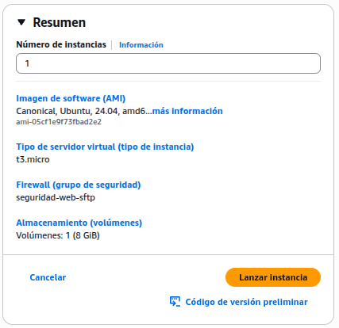

Creamos un grupo de seguridad para el servidor Web-SFTP, como es un servidor que solo necesita los puertos 22, 443 y 80 únicamente. Los configuramos y añadimos a nuestra instancia:  

| Servidor | Servicios | IP Pública | IP Privada |
| --- | --- | --- | --- |
| Servidor-Web | Nginx, SFTP | 54.197.85.133 | 172.31.26.247/20 |
| Servidor audio, video i videollamada | Icecast (audio-video), jitsi-meet (video-videollamada). | 34.202.38.124 | 172.31.22.20/20 |
| Servidor-Logs | Elastic, Kibana, AuditBeat | 34.229.219.83 | 172.31.29.157/20 |
| Servidor-Directori Actiu | LDAP | 44.223.1.104 | 172.31.22.126/20 |
| Servidor BD | Mysql | 34.226.127.76 | 172.31.30.119/20  |
| Repositorio github: https://github.com/ITB2526-PieroYcaza/ProyectoTransversal-Grupo3.git |  |  |  |

## <a href="#3-ansible---creacio-de-servidors-logs--ldap-iker">3. Ansible - Creació de servidors (Logs | LDAP) .Iker</a>
[↑ Volver al índice](#indice)

Entramos sin necesidad de contraseña a nuestro usuario que usaremos para el servidor Web-SFTP.  

  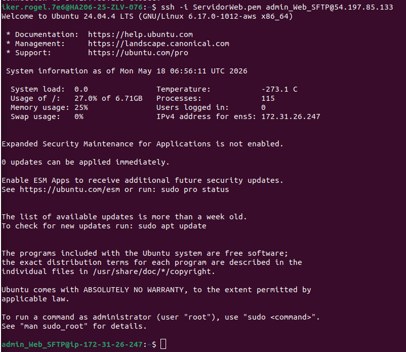

Ahora guardamos temporalmente las credenciales de AWS para que Ansible pueda crear las máquinas, necesita mis claves temporales que se tendran que ir renovando.  

  

Playbook para crear los servidores de log y Directorio Activo:  

  

Lanzamos el playbook de Ansible y creamos los dos servidores automatizados.  

  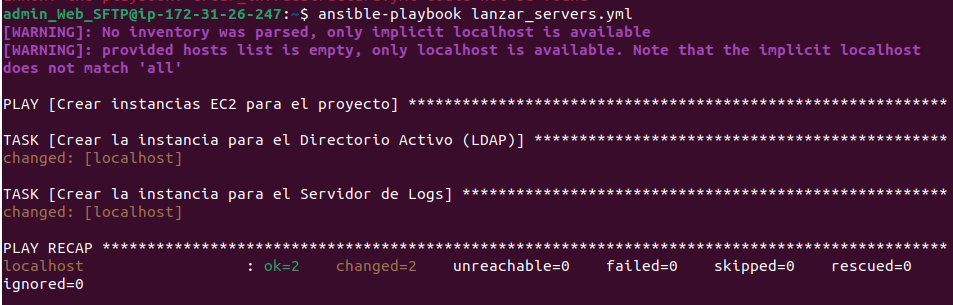

Ahora configuramos los servidores de logs y directorio activo mediante Ansible.   
Primero de todo, desde mi servidor web, dentro del fichero .ssh, creamos un fichero llamado ServidorWeb.pem, que dentro irá la llave de la clave .pem original que uso para conectarme a mi servidor. Así podemos entrar a configurar a los otros servidores sin necesidad de contraseña. Le damos también los permisos adecuados.   

  

  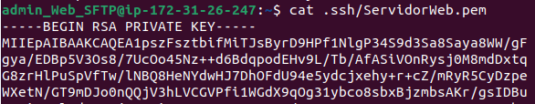

El siguiente paso es crear un fichero en donde irán las IPs privadas de los dos servidores que configuraremos vía Ansible:  

  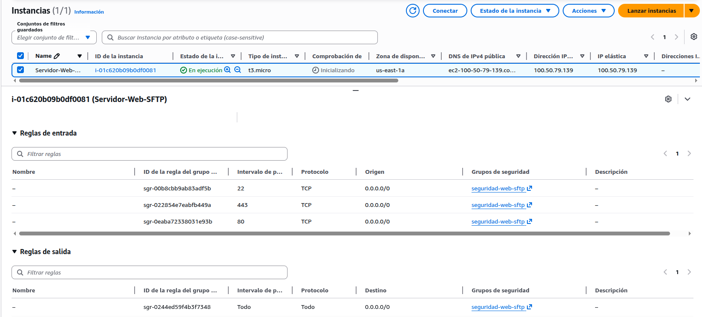

Luego, en el segundo fichero, indicamos cómo se comporta el Ansible, la primera linea host_key_checking = False. Como al conectarnos por ssh por primera vez nos pide si queremos conectarnos, al poner “false” hacemos que ansible entre sin preguntar nada, evitando que se quede esperando en la terminal a que escribamos “yes”.  
Con el inventario = inventory: Le indicamos al Ansible que busque las IPs de los servidores en el archivo llamado inventory que creamos antes.   

  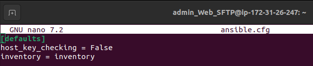

Comprobamos si se puede acceder por ping, que se conecta por SSH, asegurándonos de que podamos controlar los otros dos servidores. Los servidores nos devuelven el mensaje “ping”: “pong”.   

  

Ahora reescribimos el fichero inventory para indicarle más precisamente las máquinas en donde Ansible instalará los servicios correspondientes.   
Creamos grupos separados para cada máquina [directorio_activo] y [servidor_logs] para que Ansible sepa dónde instalar cada servicio. Luego creamos otro grupo [remoto:children] que engloba los grupos anteriores para cuando tengamos que hacer algo igual en las dos máquinas, lo metemos dentro de ese grupo. Y por último, en [remotos:var] le definimos el usuario que tienen las máquinas ahora mismo, que es Ubuntu, y la clave privada (ServidorWeb.pem).  

  

  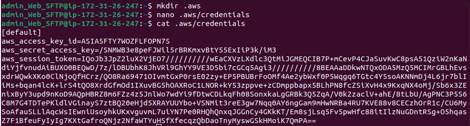

  

ghp_MOCK_TOKEN_REMOVED_BY_SAFETY_SCRIPT  

## <a href="#4-implantacio-dels-serveis-d-audio-i-video-ivan">4. Implantació dels serveis d'àudio i vídeo (Ivan)</a>
[↑ Volver al índice](#indice)

## <a href="#5-servidor-mysql-xavi-piero">5. Servidor MySQL (xavi-piero)</a>
[↑ Volver al índice](#indice)

### <a href="#51-bbdds">5.1 BBDDs</a>
[↑ Volver al índice](#indice)

* InnovateTech: Cubrirá todas las necesidades de la página web (usuarios, productos, servicios, etc).
* LDAP: Base de datos conectada al servicio LDAP del servidor respectivo. Almacena los usuarios de la empresa e información sobre estos.
* ICECAST: Base de datos conectada al servidor ICECAST de audio y video, almacenando todos los datos necesarios para el funcionamiento del servicio.
* Audit: Base de datos conectada al servidor Elastic. Este almacenará todos los logs registrados por el servidor de logs.

### <a href="#52-script-bash---gestio-d-usuaris">5.2 Script bash - Gestió d’usuaris:</a>
[↑ Volver al índice](#indice)

Es un script automatizado para crear, modificar y eliminar usuarios de MySQL:  

#### <a href="#codi-link-github">codi (link github)</a>
[↑ Volver al índice](#indice)

<strong>Prueba del funcionamiento + creación de usuario admin </strong>  

  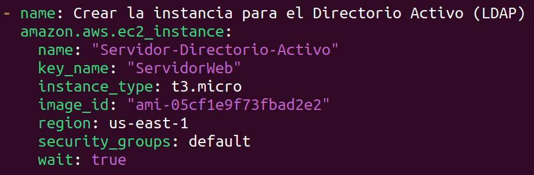

### <a href="#53-creacion-de-la-base-de-datos-de-la-web">5.3 Creación de la base de datos de la Web:</a>
[↑ Volver al índice](#indice)

Para dar soporte a los servicios de InnovateTech (gestión de personal, streaming de audio y vídeo, videollamadas y mediciones de ancho de banda), se implementa una base de datos relacional sobre un servidor EC2 dedicado con MySQL.  
La base de datos innovatetech_db está compuesta por 9 tablas: departamentos, empleados, grupos_calidad, usuarios_sistema, llamadas, videos, mediciones_ancho_banda, avisos_auditoria y control_backups. Sobre estas tablas se implementan triggers de seguridad y auditoría, y un evento periódico de backup automático.  
La implementación se divide en dos fases: primero la creación de la estructura, y después la aplicación de la lógica de control de acceso mediante triggers y eventos.  
* Dentro del servidor con el servicio MySQL se crea un directorio que almacenará el fichero Innovatetech_DB.sql.

  

* Dentro del directorio se crea el nano del fichero de la base de datos, el contenido del fichero se encuentra en el git del proyecto.

  

* Posteriormente, ejecutamos el comando que permitirá ejecutar el fichero y crear la base de datos.

  

* Verificamos haciendo un SHOW TABLES.

  

* Por último se reinicia el servicio

  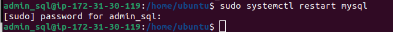

### <a href="#53-triggers-y-eventos-periodicos">5.3 Triggers y eventos periódicos:</a>
[↑ Volver al índice](#indice)

Una vez creada la estructura de la base de datos, se implementa la lógica de seguridad y automatización mediante triggers y un evento periódico.  
Los triggers cubren tres áreas: el control de cuotas de llamadas (límite de minutos mensuales y llamadas diarias por usuario), el bloqueo de usuarios en estado bloqueado para que no puedan realizar ni recibir llamadas, y la auditoría de accesos no autorizados, registrando en la tabla avisos_auditoria cualquier intento de modificar tablas restringidas según el rol del usuario de base de datos.  
El evento periódico realiza un backup automático diario a las 02:00 AM exportando las tablas críticas a ficheros .csv, minimizando así el impacto en el rendimiento del servidor durante el horario laboral. Cada ejecución queda registrada en la tabla control_backups con la fecha, las tablas incluidas y el resultado.  
* Primero se crea el fichero Triggers_y_Eventos.sql, el contenido del mismo está en este enlace del git.

  

* Seguidamente, se el comando que permitirá ejecutarlo.

  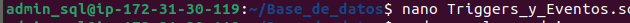

* Se hacen las verificaciones de los triggers.

  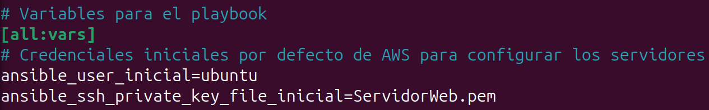

  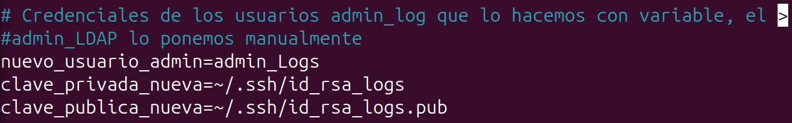

* Se hacen las verificaciones de los eventos.

  

* Para la realización de los backups es necesario que creemos el directorio en el /var/ y se ajusta la propiadad hacia mysql como propietario y grupo

  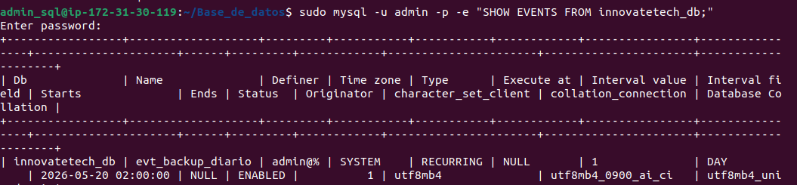

* Y para que persista tras reinicios, se añade al fichero lo siguiente “event_scheduler = ON”

  

* Finalmente se reinicia el servicio.

  

## <a href="#6-servidor-web---sftp-xavi">6. Servidor Web - SFTP (xavi)</a>
[↑ Volver al índice](#indice)

### <a href="#61-nginx">6.1 Nginx:</a>
[↑ Volver al índice](#indice)

Verificamos la instalación:  

  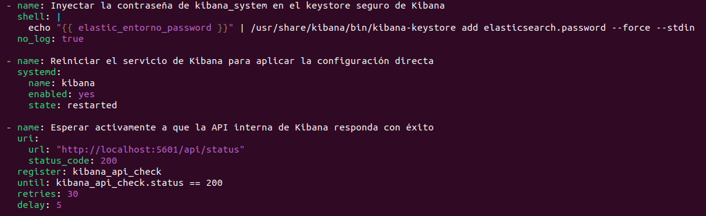

#### <a href="#611-creacion-de-certificados-ssl">6.1.1. Creación de certificados SSL:</a>
[↑ Volver al índice](#indice)

  

#### <a href="#612-configuracion-de-la-pagina">6.1.2. Configuración de la Página:</a>
[↑ Volver al índice](#indice)

Instalamos y verificamos la versión de php:  

  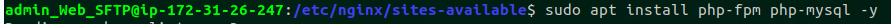

  

Hacemos las configuraciones necesarias para el funcionamiento de la página con las siguientes funciones:  
* Compatibilidad con PHP
* Funcionamiento HTTPS
* Redirección 80->443
* Uso de certificados autofirmados
* Encriptado con TLSv1.2-3

  

Y vemos los archivos en la ruta:  

  

#### <a href="#613-configuracion-php">6.1.3. Configuración PHP</a>
[↑ Volver al índice](#indice)

Ahora necesitamos conectar el php de la pagina con la BD y el LDAP de nuestro projecto:  
config.php:  
<strong>`enganchar imagen cuando se configure server LDAP`</strong>  

### <a href="#62-sftp">6.2 SFTP</a>
[↑ Volver al índice](#indice)

Instalamos proFTPd:  

  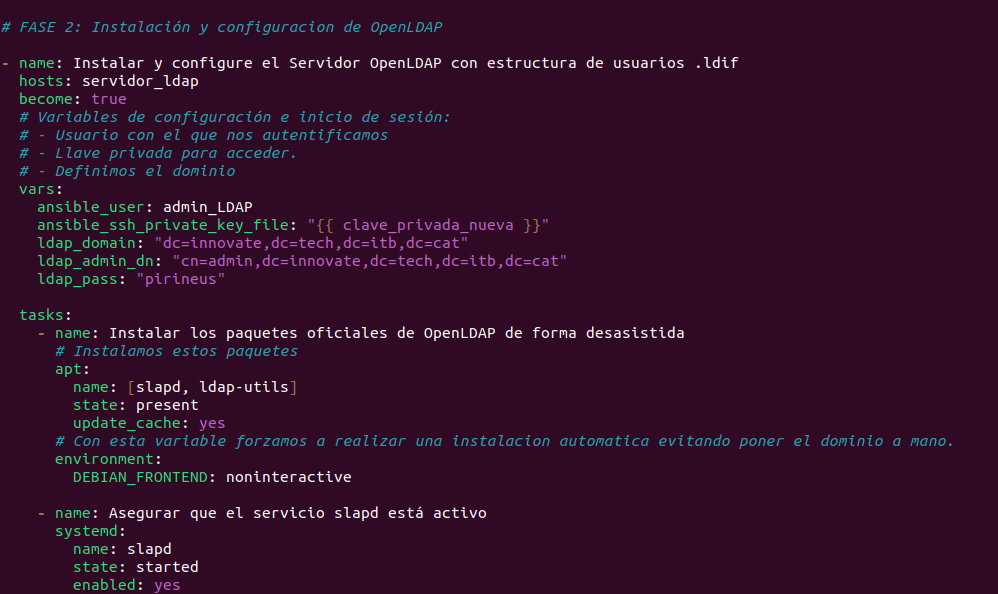

#### <a href="#621-configuracion-del-servicio">6.2.1 Configuración del servicio:</a>
[↑ Volver al índice](#indice)

Modo Standalone:  

  

Configuración para inicio de sesión con usuarios ftp  

  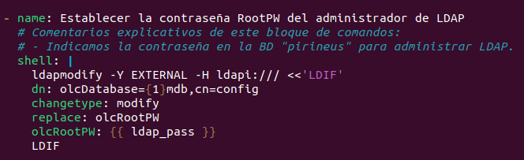

Login Anónimo:  

  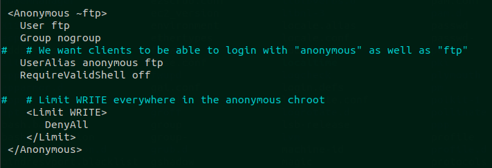

Habilitamos y configuramos <strong>SFTP:</strong>  

  

Utilizamos las siguientes configuraciones del archivo sftp.conf para encriptar con nuestras claves y que funcione por el puerto 2222:  

  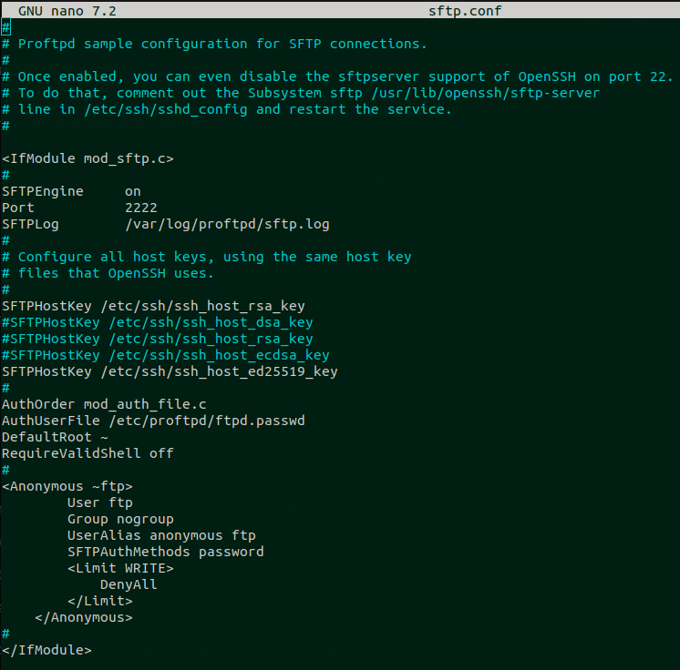

Habilitamos el módulo de sftp: (/etc/proftpd/modules.conf)  

  

Abrimos el puerto 2222 configurado al sftp.conf  

  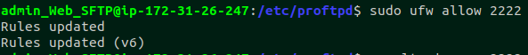

#### <a href="#622-creacion-de-usuarios">6.2.2. Creación de usuarios:</a>
[↑ Volver al índice](#indice)

Creamos usuarios para todos los miembros del grupo:  

  

  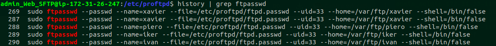

#### <a href="#623-pruebas">6.2.3. Pruebas:</a>
[↑ Volver al índice](#indice)

Primero verificamos los permisos de la estructura de directorios del FTP:  

  

<strong>`PRUEBA DE CONEXIÓN SFTP / FTP desde el server mysql:`</strong>  
Conexión con usuario:  

  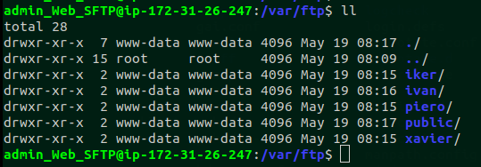

Conexión anónima FTP (prueba de lectura (ls y get) y escritura (put) fallido):  

  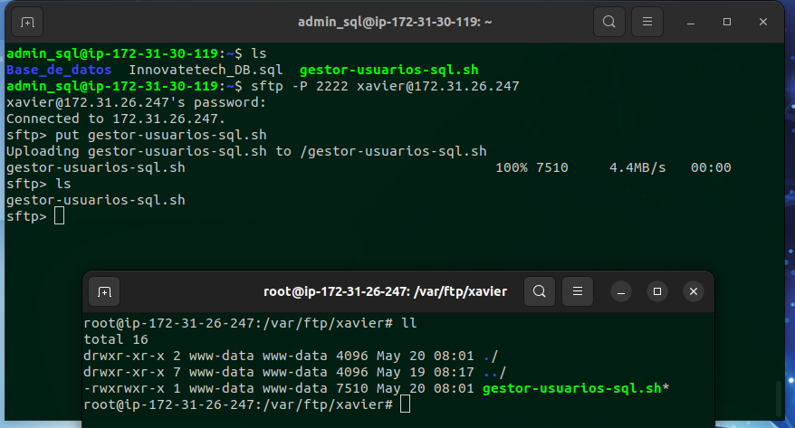

