# pro-asixc1d-g3

# Índice

  * [1. Plano general de las instalaciones Innovate Tech:](#1-plano-general-de-las-instalaciones-innovate-tech)
    * [1.1. Plano sala del rack:](#11-plano-sala-del-rack)
    * [1.1.1. Estructuración de los Racks:](#111-estructuracion-de-los-racks)
      * [1.1.2. Componentes Técnicos Comunes por Rack:](#112-componentes-tecnicos-comunes-por-rack)
      * [1.1.3. Direccionamiento Lógico De La Topología De Red:](#113-direccionamiento-logico-de-la-topologia-de-red)
      * [1.1.4. Segmentación de Red y Zonas de Seguridad:](#114-segmentacion-de-red-y-zonas-de-seguridad)
      * [1.1.5. Directivas Generales de Seguridad Lógica:](#115-directivas-generales-de-seguridad-logica)
    * [1.2. Sistema de climatización del CPD:](#12-sistema-de-climatizacion-del-cpd)
    * [1.3. Medidas para dificultar la identificación de la sala:](#13-medidas-para-dificultar-la-identificacion-de-la-sala)
      * [1.3.1. Señalización Restrictiva:](#131-sealizacion-restrictiva)
      * [1.3.2. Seguridad de Rutas y Suministros:](#132-seguridad-de-rutas-y-suministros)
      * [1.3.3. Camuflaje Arquitectónico y Estético:](#133-camuflaje-arquitectonico-y-estetico)
    * [1.4. Distribución y gestión del cableado:](#14-distribucion-y-gestion-del-cableado)
    * [1.5. Terra Tècnic (Suelo Técnico Elevado):](#15-terra-tecnic-suelo-tecnico-elevado)
      * [1.5.1. Sostre Tècnic (Falso Techo Registrable):](#151-sostre-tecnic-falso-techo-registrable)
      * [1.5.2. Estanqueidad con la Cristalera:](#152-estanqueidad-con-la-cristalera)
  * [2. Infraestructura Eléctrica:](#2-infraestructura-electrica)
    * [2.1. Sistemas de Alimentación Redundante:](#21-sistemas-de-alimentacion-redundante)
    * [2.2. Sistema SAI / UPS:](#22-sistema-sai--ups)
    * [2.3. Consumo Eléctrico Estimado y Autonomía:](#23-consumo-electrico-estimado-y-autonomia)
      * [Tabla de Balance Energético de la Infraestructura IT](#tabla-de-balance-energetico-de-la-infraestructura-it)
      * [2.3.1. Dimensionamiento y Autonomía:](#231-dimensionamiento-y-autonomia)
      * [2.3.2. Coste y espacio físico (Justificación económica):](#232-coste-y-espacio-fisico-justificacion-economica)
    * [2.4. Distribución Eléctrica en Racks:](#24-distribucion-electrica-en-racks)
    * [2.5. Eficiencia Energética y Sostenibilidad:](#25-eficiencia-energetica-y-sostenibilidad)
  * [3. Seguridad Física y Lógica](#3-seguridad-fisica-y-logica)
    * [3.1. Seguridad Física Avanzada del CPD:](#31-seguridad-fisica-avanzada-del-cpd)
      * [3.1.1 Camuflaje Arquitectónico y Seguridad por Oscuridad:](#311-camuflaje-arquitectonico-y-seguridad-por-oscuridad)
      * [3.1.2. Subsistema de Circuito Cerrado de Televisión (CCTV) con Analítica de IA:](#312-subsistema-de-circuito-cerrado-de-television-cctv-con-analitica-de-ia)
      * [3.1.3 Subsistema de Detección y Extinción Automática de Incendios por Gas Inerte:](#313-subsistema-de-deteccion-y-extincion-automatica-de-incendios-por-gas-inerte)
      * [3.1.4 Sondas Ambientales y Control de Condiciones Críticas (Climatización):](#314-sondas-ambientales-y-control-de-condiciones-criticas-climatizacion)
    * [3.2. Seguridad Lógica, de Sistemas y Redes:](#32-seguridad-logica-de-sistemas-y-redes)
      * [3.2.1. Segmentación de Red y Zonas de Seguridad Lógicas:](#321-segmentacion-de-red-y-zonas-de-seguridad-logicas)
      * [3.2.2. Protección Perimetral y Reglas de Firewall (Matriz de Puertos):](#322-proteccion-perimetral-y-reglas-de-firewall-matriz-de-puertos)
      * [3.2.3. Control de Identidad, Autenticación y Directivas de Grupo (RBAC):](#323-control-de-identidad-autenticacion-y-directivas-de-grupo-rbac)
      * [3.2.4. Intercambio Seguro de Archivos (SFTP) y Enjaulamiento de Usuarios:](#324-intercambio-seguro-de-archivos-sftp-y-enjaulamiento-de-usuarios)
      * [3.2.5. Criptografía Asimétrica para la Gestión de Infraestructura:](#325-criptografia-asimetrica-para-la-gestion-de-infraestructura)
      * [3.2.6. Auditoría Centralizada y Monitoreo SIEM:](#326-auditoria-centralizada-y-monitoreo-siem)
      * [3.2.7. Cifrado de Datos en Reposo y Copias de Seguridad (Backups):](#327-cifrado-de-datos-en-reposo-y-copias-de-seguridad-backups)
      * [3.2.8. Automatización Segura de Despliegues (Ansible Vault):](#328-automatizacion-segura-de-despliegues-ansible-vault)
      * [3.2.9. Tolerancia a Fallos de Hardware mediante Almacenamiento RAID](#329-tolerancia-a-fallos-de-hardware-mediante-almacenamiento-raid)
    * [3.3. Prevención de riesgos laborales:](#33-prevencion-de-riesgos-laborales)
    * [3.4. Implementación del CPD en la nube AWS con los servicios utilizados:](#34-implementacion-del-cpd-en-la-nube-aws-con-los-servicios-utilizados)
  * [4. Ansible - Creación de servidores Logs y LDAP](#4-ansible---creacion-de-servidores-logs-y-ldap)
    * [4.1 Acceso sin contraseña al usuario administrador](#41-acceso-sin-contrasea-al-usuario-administrador)
    * [4.2 Pasos previos para lanzar instancias EC2 vía Playbook](#42-pasos-previos-para-lanzar-instancias-ec2-via-playbook)
    * [4.3 Playbook lanzar instancias EC2 vía Playbook](#43-playbook-lanzar-instancias-ec2-via-playbook)
    * [4.4 Ansible - Paso previo para configurar los servidores Logs y LDAP](#44-ansible---paso-previo-para-configurar-los-servidores-logs-y-ldap)
    * [4.5 Ansible - Configurar playbook para configurar servidor de Log](#45-ansible---configurar-playbook-para-configurar-servidor-de-log)
    * [4.6 Ansible - Configurar playbook para configurar servidor de LDAP](#46-ansible---configurar-playbook-para-configurar-servidor-de-ldap)
    * [4.7 Ansible - Auditar servidor Web_SFTP](#47-ansible---auditar-servidor-web_sftp)
    * [4.8 Ansible - Auditar nuevos servidores](#48-ansible---auditar-nuevos-servidores)
    * [4.9 Pruebas de logs](#49-pruebas-de-logs)
  * [5. Servidores de audio, video y videoconferencia:](#5-servidores-de-audio-video-y-videoconferencia)
    * [5.1. Funcionalidad del servicio de audio:](#51-funcionalidad-del-servicio-de-audio)
    * [5.2. Instalación servicio de audio:](#52-instalacion-servicio-de-audio)
    * [5.3. Configuración del Source Client:](#53-configuracion-del-source-client)
    * [5.4. Formatos de audio digital utilizados:](#54-formatos-de-audio-digital-utilizados)
    * [5.5. Validación y comprobación del acceso:](#55-validacion-y-comprobacion-del-acceso)
  * [6. Implementación de servicio de audio en emisora:](#6-implementacion-de-servicio-de-audio-en-emisora)
    * [6.1. Instalación y configuración del servicio de radio:](#61-instalacion-y-configuracion-del-servicio-de-radio)
    * [6.2. Comprobación de funcionamiento:](#62-comprobacion-de-funcionamiento)
  * [7. Funcionalidad del servicio de vídeo:](#7-funcionalidad-del-servicio-de-video)
    * [7.1. Instalación del servicio de video:](#71-instalacion-del-servicio-de-video)
  * [8. Implementación del servicio de videollamada:](#8-implementacion-del-servicio-de-videollamada)
    * [8.1. ¿Qué es Docker y por qué lo usamos?](#81-que-es-docker-y-por-que-lo-usamos)
    * [8.2. Instalación del servicio Jitsi de videollamada:](#82-instalacion-del-servicio-jitsi-de-videollamada)
    * [8.3. Comprobaciones de Ancho de Banda y Rendimiento de Red:](#83-comprobaciones-de-ancho-de-banda-y-rendimiento-de-red)
      * [8.3.1. Análisis del Comportamiento en Concurrencia de Servicios:](#831-analisis-del-comportamiento-en-concurrencia-de-servicios)
      * [8.3.2. Relación de Resultados con el Consumo Teórico de los Servicios:](#832-relacion-de-resultados-con-el-consumo-teorico-de-los-servicios)
      * [8.3.3. Classification del Sistema y Propuestas de Optimización:](#833-classification-del-sistema-y-propuestas-de-optimizacion)
      * [8.3.4. Propuestas de Optimización Implementadas:](#834-propuestas-de-optimizacion-implementadas)
  * [9. Servidor MySQL:](#9-servidor-mysql)
    * [9.1. Infraestructura y Despliegue de la Base de Datos](#91-infraestructura-y-despliegue-de-la-base-de-datos)
      * [9.1.1. Arquitectura del Modelo Relacional](#911-arquitectura-del-modelo-relacional)
      * [9.1.2. Procedimiento de Implantación en el Servidor EC2:](#912-procedimiento-de-implantacion-en-el-servidor-ec2)
    * [9.2. Automatización y Gestión de Usuarios mediante Scripting (Bash):](#92-automatizacion-y-gestion-de-usuarios-mediante-scripting-bash)
      * [9.2.1. Funcionalidades Principales del Script](#921-funcionalidades-principales-del-script)
      * [9.2.2. Funcionamiento del Script:](#922-funcionamiento-del-script)
    * [9.3 Triggers y eventos periódicos:](#93-triggers-y-eventos-periodicos)
      * [9.3.1 Comprobación Triggers y eventos:](#931-comprobacion-triggers-y-eventos)
    * [9.4 Diagrama ER y Modelo Relacional:](#94-diagrama-er-y-modelo-relacional)
  * [10. Servidor Web - SFTP](#10-servidor-web---sftp)
    * [10.1 Nginx:](#101-nginx)
      * [10.1.1. Creación de certificados SSL:](#1011-creacion-de-certificados-ssl)
      * [10.1.2. Configuración de la Página:](#1012-configuracion-de-la-pagina)
      * [10.1.3. Configuración PHP Multiservidor:](#1013-configuracion-php-multiservidor)
    * [10.2 Servicio SFTP, autenticación con usuario de LDAP](#102-servicio-sftp-autenticacion-con-usuario-de-ldap)
      * [10.2.1 Autentificar con usuarios LDAP en el servicio SFTP:](#1021-autentificar-con-usuarios-ldap-en-el-servicio-sftp)
      * [10.2.2 Pruebas de conexión:](#1022-pruebas-de-conexion)
    * [Conclusión](#conclusion)

---

`GRUPO 3 PROYECTO TRANSVERSAL ``ASIXc1D`  

## <a href="#1-plano-general-de-las-instalaciones-innovate-tech">1. Plano general de las instalaciones Innovate Tech:</a>
[↑ Volver al índice](#indice)

<strong>El CPD se ubica en la planta baja</strong>, en una <strong>zona central.</strong> El núcleo del <strong>CPD está completamente cerrado por una estructura acristalada</strong> técnica de alta resistencia en este proyecto utilizamos vidrio laminado de seguridad con <strong>tratamiento acústico y térmico. </strong>  
<strong>Esta cristalera permite:</strong>  
* Aislamiento Térmico: Mantiene el aire frío dentro de la zona de racks, separándolo del resto del edificio.

* Supervisión Visual: Permite observar el estado de los equipos (LEDs de estado, orden) desde el exterior sin necesidad de entrar y alterar la temperatura de la sala.

* Discreción y Estética: El cristal puede ser electrocromático (se vuelve opaco con un interruptor) para ocultar la sala durante visitas no autorizadas, manteniendo la máxima discreción.

  

### <a href="#11-plano-sala-del-rack">1.1. Plano sala del rack:</a>
[↑ Volver al índice](#indice)

Hemos optado por una <strong>arquitectura de cinco servidores físicos </strong>distribuidos en <strong>cuatro racks para maximizar la seguridad y el rendimiento.</strong> Este esquema no solo asegura el aislamiento de procesos críticos, sino que <strong>facilita un crecimiento vertical y ágil</strong> ante el posible incremento de las futuras demandas.  
Hemos asignado cada servidor a una función específica para garantizar la independencia de procesos:  
* Rack 1: Servicio Web y SFTP (Secure File Transfer Protocol) Este servidor centraliza el acceso externo de la empresa. Por un lado, gestiona el portal corporativo y las interfaces de usuario de las plataformas digitales, optimizado para un alto tráfico de peticiones HTTP/HTTPS. Por otro lado, aloja el servicio SFTP para el intercambio seguro, robusto y cifrado de archivos con clientes y proveedores.
* Rack 2: Centralización de Logs (SIEM / Logging) Encargado de recibir y almacenar todos los registros de eventos (logs) de la red y el hardware. Es un nodo crítico para la auditoría de seguridad, el cumplimiento normativo y la detección de anomalías en tiempo real.
* Rack 3: Active Directory (AD) Dedicado exclusivamente a la gestión de la infraestructura de identidad de la empresa. Controla la autenticación de usuarios, las directivas de grupo (GPOs) y la asignación de permisos centralizados de forma segura.
* Rack 4: Procesamiento de Audio y Vídeo Servidor independiente dedicado a las capacidades de procesamiento, transcodificación y distribución para las plataformas de streaming de audio y contenido de vídeo de InnovateTech. Al estar separado del Active Directory, se garantiza que el alto consumo de ancho de banda y CPU no afecte la autenticación de la empresa.
* Rack 5: Base de Datos (DB Server) El motor de datos neurálgico de la organización. Está configurado con discos NVMe de ultra alta velocidad y redundancia para minimizar los tiempos de respuesta de las consultas y garantizar la alta disponibilidad de la información.

  

### <a href="#111-estructuracion-de-los-racks">1.1.1. Estructuración de los Racks:</a>
[↑ Volver al índice](#indice)

Para garantizar la alta disponibilidad, la eficiencia en el cableado y un mantenimiento ágil, <strong>cada uno de los 4 armarios de 42U de altura (800mm de ancho y 1100mm de profundidad)</strong> mantendrá un estándar de distribución homogéneo basado en la arquitectura <strong>Top of Rack (ToR)</strong> para datos y <strong>Bottom of Rack (BoR)</strong> para energía, distribuidos de la siguiente manera:   
Respetando<strong> la separación física por criticidad de servicios</strong>, los servidores se ubicarán de forma fija en la unidad <strong>U20</strong> de cada rack específico:  
* Rack 1 (Net. / Seg. Logs): Aloja el Servidor 2 dedicado a la Centralización de Logs (SIEM / Logging).
* Rack 2 (Identidad): Aloja el Servidor 3 destinado al Controlador de Dominio Principal de Active Directory (AD), el cual se implementará con LDAP. Con el fin de evitar un único punto de fallo (SPOF) en la autenticación corporativa, se planifica la futura incorporación de un Controlador de Dominio Secundario (Réplica) que se ubicará físicamente en un rack distinto.
* Rack 3 (Perímetro / Multi): Aloja el Servidor 1 (Servicio Web + SFTP) en la U20 y el Servidor 4 (Procesamiento de Audio y Vídeo) en la U16.
* Rack 4 (Datos Críticos): Aloja el Servidor 5 (Base de Datos) en la U20 junto a la Cabina NAS/SAN de Backups en las unidades U18/U16.

  

#### <a href="#112-componentes-tecnicos-comunes-por-rack">1.1.2. Componentes Técnicos Comunes por Rack:</a>
[↑ Volver al índice](#indice)

A excepción de los servidores específicos, cada rack contará con los siguientes elementos de infraestructura interna:  
<strong>Sistema de Alimentación Ininterrumpida (SAI/UPS) y Redundancia Eléctrica (BoR):</strong> Ubicado en la zona inferior para maximizar la <strong>estabilidad física</strong>, posicionando el módulo principal en la unidad <strong>U02</strong> y la <strong>Barra de Tierra</strong> en la <strong>U01</strong>. Se implementará un <strong>SAI Online de Doble Conversión de 3000VA (3kVA) / 2700W</strong> en formato rackeable, potencia que cubre holgadamente el consumo del hardware y ofrece un <strong>margen de crecimiento del 40%</strong>. Incluye tarjeta de red <strong>SNMP</strong> para monitorización remota.
Para garantizar la <strong>alta disponibilidad</strong> y la tolerancia a fallos (arquitectura tipo <strong>Tier II/III</strong>), cada rack contará con una topología de <strong>doble acometida eléctrica</strong>:  
* Línea A (Protegida): Alimentada continuamente por el SAI local del rack para absorber cortes, microcortes e irregularidades del suministro.
* Línea B (Redundante): Conectada a un circuito eléctrico independiente (como un bypass filtrado o un sistema de respaldo general del edificio). Esto asegura que, ante un fallo catastrófico del SAI, los equipos con fuentes de alimentación redundantes sigan operando sin interrupción.

<strong>Unidades de Distribución de Energía (PDU) Inteligentes:</strong> Para la distribución eléctrica interna se instalarán <strong>dos PDU conmutadas de factor de forma Zero-U</strong> por rack, fijadas verticalmente en la parte posterior del chasis sin ocupar espacio útil frontal.
Cada una se asociará a una línea eléctrica distinta: la <strong>PDU-A</strong> se conectará a la <strong>Línea A (SAI)</strong> y la <strong>PDU-B</strong> a la <strong>Línea B (Redundante)</strong>. Cuentan con conexiones de entrada <strong>IEC 320 C20</strong>, salidas bloqueables <strong>IEC C13 y C19</strong> para evitar desconexiones accidentales, capacidad de <strong>apagado/encendido remo</strong>  
<strong>Paneles de Parcheo y Electrónica de Red en la Parte Superior (ToR):</strong> La conectividad se centraliza en el bloque superior para minimizar la longitud de los latiguillos. Las unidades <strong>U42 y U41</strong> alojan la <strong>Bandeja de Fibra Óptica (FOBOT)</strong> con hasta 24 acopladores LC-Duplex para uplinks de alta velocidad y el <strong>Patch Panel de Cobre Cat 6A FTP</strong> de 24 puertos. Inmediatamente debajo, en la <strong>U40</strong>, se sitúa la electrónica de red principal (<strong>Switches Core/Acceso y Firewalls</strong>), optimizando el peinado de cables.  
<strong>Gestión de Cableado y Accesorios:</strong> Para garantizar un <strong>flujo de aire óptimo y un mantenimiento limpio</strong>, se instalarán <strong>dos organizadores de cable horizontales de 1U</strong> con pasacables de escobilla situados estratégicamente entre el switch y los patch panels. Adicionalmente, cada rack incluirá una <strong>bandeja fija ventilada de 1U</strong> para dar soporte a herramientas o dispositivos sin formato nativo rackeable, así como un <strong>kit de monitorización ambiental</strong> compuesto por <strong>sondas de temperatura y humedad</strong> conectadas directamente a la PDU o al SAI para alertar sobre cualquier anomalía térmica interna.   

#### <a href="#113-direccionamiento-logico-de-la-topologia-de-red">1.1.3. Direccionamiento Lógico De La Topología De Red:</a>
[↑ Volver al índice](#indice)

El diseño lógico de la infraestructura de red de <strong>InnovateTech</strong> se ha proyectado bajo los principios de <strong>alta disponibilidad, escalabilidad y seguridad perimetral</strong>. La topología implementada utiliza un esquema de segmentación física y lógica mediante interfaces independientes en el enrutador perimetral, permitiendo aislar de manera estricta los servicios accesibles desde el exterior de los recursos críticos de la red interna corporativa.   
Basándonos en la topología implementada, la distribución de direcciones IP es la siguiente:   

| Dispositivo / Servidor | Interfaz / Rol | Dirección IP | Máscara de Red | Puerta de Enlace (Gateway) |
| --- | --- | --- | --- | --- |
| Router0 | Interfaz Interna (LAN) | 10.0.1.1 | 255.255.255.0 (/24) | — |
| Router0 | Interfaz Perimetral (DMZ) | 10.0.2.1 | 255.255.255.0 (/24) | — |
| Router0 | Interfaz WAN (Internet) | 80.80.80.1 | 255.0.0.0 (/8) | Proveedor ISP |
| Server-PT FTP-WEB | Servidor 1 (Web + SFTP) | 10.0.2.2 | 255.255.255.0 (/24) | 10.0.2.1 |
| Server-PT AD | Servidor 3 (Active Directory) | 10.0.1.2 | 255.255.255.0 (/24) | 10.0.1.1 |
| Server-PT Video-Audio | Servidor 4 (Multimedia) | 10.0.1.3 | 255.255.255.0 (/24) | 10.0.1.1 |
| Server-PT Logs | Servidor 2 (SIEM / Logs) | 10.0.1.4 | 255.255.255.0 (/24) | 10.0.1.1 |
| Server-PT MySQL | Servidor 5 (Base de Datos) | 10.0.1.5 | 255.255.255.0 (/24) | 10.0.1.1 |

#### <a href="#114-segmentacion-de-red-y-zonas-de-seguridad">1.1.4. Segmentación de Red y Zonas de Seguridad:</a>
[↑ Volver al índice](#indice)

La infraestructura se divide en tres zonas lógicas de comunicación claramente diferenciadas:  
* Zona WAN (Internet): Conexión directa hacia el proveedor de servicios de Internet (ISP) a través de una interfaz pública para el tráfico entrante y saliente.
* Zona de Servidores Internos (LAN - Core de Red): Segmento privado (10.0.1.0/24) protegido, orientado a los servicios troncales de la empresa que no deben ser expuestos directamente a Internet. Aquí residen las bases de datos, el controlador de dominio y la gestión de auditoría.
* Zona Perimetral (DMZ / Red de Acceso Externo): Segmento privado diferenciado (10.0.2.0/24) destinado exclusivamente a albergar los servicios que interactúan con el tráfico público de Internet.

  

#### <a href="#115-directivas-generales-de-seguridad-logica">1.1.5. Directivas Generales de Seguridad Lógica:</a>
[↑ Volver al índice](#indice)

Para consolidar la seguridad del diseño, se definen a nivel de configuración las siguientes premisas fundamentales:   
<strong>Aislamiento Estricto de la DMZ:</strong> Cualquier compromiso o brecha de seguridad en el <strong>Servidor 1 (FTP-WEB)</strong> no afectará al resto de la organización, dado que el enrutador bloquea por defecto todo tráfico originado en el segmento `10.0.2.0/24` que intente direccionarse hacia el segmento `10.0.1.0/24`.  
<strong>Mitigación de Impacto por Ancho de Banda:</strong> El tráfico masivo de descarga o transcodificación generado por el servidor de <strong>Audio y Vídeo (</strong><strong>`10.0.1.3`</strong><strong>)</strong> se conmuta directamente en el <strong>Switch4</strong>, protegiendo el plano de control del <strong>Switch3</strong> donde operan la base de datos y la identidad corporativa.  

### <a href="#12-sistema-de-climatizacion-del-cpd">1.2. Sistema de climatización del CPD:</a>
[↑ Volver al índice](#indice)

En un <strong>CPD convencional abierto,</strong> el aire frío se mezcla rápidamente con el aire caliente ambiental, obligando a las unidades de aire acondicionado a <strong>trabajar a máxima potencia</strong> en la mayoría de casos. Por eso nosotros hemos optado por las cristaleras ya que estas r<strong>ompen este ciclo creando un recinto estanco:</strong>  
* Efecto Estanco: Al estar sellado, el aire frío inyectado por las unidades de precisión (CRAC) no se mezcla con el aire caliente de la oficina. Esto permite que los servidores trabajen a una temperatura constante de 21°C con un consumo eléctrico mínimo.

* Control de Presión Positiva: El sistema inyecta más aire del que extrae, creando una presión superior dentro del cristal. Al abrir la puerta, el aire sale hacia afuera, impidiendo físicamente la entrada de polvo o partículas que podrían dañar los componentes internos de los servidores.

* Humedad Controlada: Se mantiene entre el 45% y 50% para evitar fallos por electricidad estática o corrosión.

  

### <a href="#13-medidas-para-dificultar-la-identificacion-de-la-sala">1.3. Medidas para dificultar la identificación de la sala:</a>
[↑ Volver al índice](#indice)

Para proteger la i<strong>nfraestructura crítica de InnovateTech,</strong> es fundamental aplicar el principio de seguridad por oscuridad. El objetivo es que el CPD pase <strong>desapercibido para cualquier persona ajena </strong>al departamento de IT, <strong>minimizando el riesgo de sabotaje o ataques dirigidos.</strong>  

#### <a href="#131-sealizacion-restrictiva">1.3.1. Señalización Restrictiva:</a>
[↑ Volver al índice](#indice)

Por precaución a cualquier tipo de <strong>incidente ajeno a nuestro departamento de IT</strong>, nunca deberemos de usar <strong>carteles que digan "CPD", "Data Center" o "Servidores",</strong> con el  objetivo de conseguir discreción y que pase desapercibido por usuarios externos.  
<strong>La placa de la puerta</strong>, señalizará solamente con un cartel que diga:<strong> </strong>  
<strong>"PROHIBIDO EL PASO A PERSONAS NO AUTORIZADAS"</strong>  

  

Como normal general en los planos públicos o de evacuación de la empresa, la sala se identificará únicamente como <strong>"Zona Técnica" o "Localización de Riesgo Especial"</strong>, sin especificar su contenido crítico.  

#### <a href="#132-seguridad-de-rutas-y-suministros">1.3.2. Seguridad de Rutas y Suministros:</a>
[↑ Volver al índice](#indice)

<strong>Las bandejas de cables y tuberías de refrigeración</strong> transcurrirá siempre por falsos techos cerrados, nunca de forma vista en pasillos comunes.  
En el directorio del edificio o del ascensor, <strong>no figurará ninguna referencia a la ubicación de la infraestructura tecnológica.</strong>  

#### <a href="#133-camuflaje-arquitectonico-y-estetico">1.3.3. Camuflaje Arquitectónico y Estético:</a>
[↑ Volver al índice](#indice)

Dado que el CPD se ha diseñado como una sala acristalada, se implementará un <strong>sistema de vidrio electrocrómico inteligente</strong>, el cual permite que el cristal se vuelva opaco (en tono blanco o negro) mediante un interruptor. Esta tecnología garantiza que, ante la presencia de personal externo, la sala se perciba simplemente como una pared decorativa o una sala de juntas vacía.  
Para reforzar esta discreción, la <strong>perfilería de la cristalera será idéntica</strong> a la utilizada en el resto de las oficinas, evitando que destaque como un elemento de alta seguridad. Asimismo, el CPD se ubica estratégicamente en el <strong>núcleo del edificio</strong>, eliminando cualquier ventana al exterior para prevenir la visibilidad desde la calle o la exposición ante drones y fotografía externa.  

  

### <a href="#14-distribucion-y-gestion-del-cableado">1.4. Distribución y gestión del cableado:</a>
[↑ Volver al índice](#indice)

Para la <strong>distribución y gestión del cableado</strong> en el CPD de InnovateTech, seguiremos un modelo de alta eficiencia basado en la normativa <u><strong>`ANSI/TIA-942`</strong></u>, asegurando que el despliegue sea escalable, ordenado y no interfiera con el sistema de climatización de la zona acristalada.  
La gestión se dividirá en dos niveles físicos totalmente segregados para evitar interferencias electromagnéticas (EMI) y facilitar el mantenimiento de los 5 servidores:  
<strong>`- Cableado de Energía (Bajo Suelo):`</strong>  
* Toda la alimentación eléctrica (procedente del SAI y el cuadro eléctrico) discurrirán por el suelo técnico.
* Se utilizarán bandejas de acero tipo rejilla situadas a una altura diferente de las canalizaciones de aire frío para no obstruir el flujo.
* Cada rack contará con dos unidades de distribución de energía (PDU) inteligentes para ofrecer redundancia a los servidores.

<strong>`- Cableado de Datos (Aéreo):`</strong>  
* Las conexiones de fibra óptica y cobre (Categoría 6A) se distribuirán mediante bandejas aéreas ancladas a la parte superior de los racks o suspendidas del techo técnico.
* Este despliegue aéreo permite una rápida identificación de los puertos y evita que el cableado de datos acumule calor en la zona inferior.
* Se utilizará un código de colores estricto (ej. Azul para datos, Rojo para gestión/logs, Amarillo para fibra) para minimizar errores humanos durante las intervenciones.

<strong>`- Gestión Interna en el Rack:`</strong>  
* Organizadores Verticales y Horizontales: Se instalarán guías en los laterales de cada uno de los 4 racks para peinar el cableado. Esto evita las "madejas" de cables que bloquean la salida de aire caliente de los servidores.
* Latiguillos a Medida: Se emplearán cables de la longitud exacta para evitar excedentes enrollados que perjudiquen la estética y la ventilación.
* Etiquetado Industrial: Cada extremo de cada cable estará identificado con etiquetas permanentes que indiquen origen, destino y servicio (ej. SRV-WEB-01 to SW-CORE-01).

### <a href="#15-terra-tecnic-suelo-tecnico-elevado">1.5. Terra Tècnic (Suelo Técnico Elevado):</a>
[↑ Volver al índice](#indice)

Se instalará un sistema de pavimento elevado a <strong>50 cm</strong> de altura respecto al suelo real del edificio.  
* La estructura estará formada por baldosas de 60x60 cm con núcleo de sulfato de calcio de alta densidad y acabado superior en vinilo antiestático. Se apoya sobre pedestales regulables de acero galvanizado unidos por travesaños para garantizar la estabilidad de los 4 racks.
* Su función térmica dentro del espacio vacío inferior (plénum) actúa como canal de impulsión del aire frío proveniente de la unidad CRAC. El aire sale exclusivamente a través de baldosas perforadas estratégicamente situadas frente a la entrada de los servidores.
* Para la gestión de Energía, a este nivel se utilizará para canalizar el cableado eléctrico y las tomas de tierra, manteniéndolos ocultos y separados de los datos.

#### <a href="#151-sostre-tecnic-falso-techo-registrable">1.5.1. Sostre Tècnic (Falso Techo Registrable):</a>
[↑ Volver al índice](#indice)

El techo se situará a una altura libre de <strong>2,80 metros</strong>.  
* Material: Placas de fibra mineral acústica con alta resistencia al fuego y propiedades de absorción sonora, necesarias para mitigar el ruido de los ventiladores.
* Retorno de Aire: El espacio superior se utiliza como plénum de retorno para el aire caliente que expulsan los servidores. Mediante rejillas de extracción, el aire caliente vuelve a la unidad CRAC para ser enfriado nuevamente.
* Seguridad y Sensores: En el sostre tècnic se integrarán:
* El sistema de detección de incendios por aspiración (VESDA).
* Las boquillas de descarga del gas extintor FM-200.
* Los sensores de temperatura y humedad conectados al sistema de monitorización.

#### <a href="#152-estanqueidad-con-la-cristalera">1.5.2. Estanqueidad con la Cristalera:</a>
[↑ Volver al índice](#indice)

Un punto crítico de este diseño es que tanto el suelo como el techo técnico estarán <strong>sellados herméticamente</strong> en sus perímetros contra la cristalera. Esto asegura que la presión positiva y el efecto estanco se mantengan dentro de la zona de racks, evitando fugas de aire hacia el resto de la oficina.  

  

## <a href="#2-infraestructura-electrica">2. Infraestructura Eléctrica:</a>
[↑ Volver al índice](#indice)

La infraestructura eléctrica del CPD de <strong>InnovateTech</strong> está diseñada bajo criterios de <strong>alta disponibilidad y tolerancia a fallos</strong>, alineándose con los principios de la normativa <strong>ANSI/TIA-942</strong>. El objetivo central es garantizar la continuidad absoluta del negocio, blindando los servicios críticos corporativos ante anomalías en el suministro y asegurando un entorno libre de caídas o pérdidas de datos.  

### <a href="#21-sistemas-de-alimentacion-redundante">2.1. Sistemas de Alimentación Redundante:</a>
[↑ Volver al índice](#indice)

Para eliminar cualquier <strong>punto único de fallo (SPOF)</strong> de origen eléctrico, la sala acristalada técnica implementa una arquitectura de <strong>doble acometida independiente (Líneas A y B)</strong> que llega de forma nativa a cada uno de los <strong>4 armarios rack de 42U</strong>:  
* Línea A (Línea Protegida/Principal): Canaliza la energía filtrada de manera continua a través del SAI/UPS Online de Doble Conversión local de cada rack. Cubre la primera fuente de alimentación del hardware.
* Línea B (Línea Redundante/Soporte): Conectada a un circuito eléctrico independiente del edificio (bypass filtrado / cuadro general de respaldo). Alimenta la segunda fuente de los servidores activos.
* Fuentes de Alimentación Redundantes (Hot-Swap): Los 5 servidores físicos (instalados de forma fija en sus respectivas unidades U20/U16), la cabina NAS/SAN de Backups y la electrónica de red crítica (Switches Core y Firewalls situados en la U40) se conectan en paralelo a ambas líneas. Ante la caída o corte de una de las fases, los equipos continúan operando a través de la línea secundaria sin microcortes ni degradación del servicio.

<em><strong>`Adicionalmente, la seguridad de la instalación se consolida mediante:`</strong></em>  
* Segmentación por Cuadros: Cuadros eléctricos independientes y aislados para el sistema de climatización de precisión (CRAC) y para la electrónica/servidores IT.
* Protecciones Avanzadas: Magnetotérmicos curvos específicos y diferenciales de alta inmunidad por cada línea de rack.
* Sistema de Puesta a Tierra: Red mallada reglamentaria con conexión directa a la Barra de Tierra ubicada en la unidad U01 de cada rack.
* Supresión de Transitorios: Protecciones multinivel frente a sobretensiones transitorias y permanentes en la cabecera de los cuadros.

### <a href="#22-sistema-sai--ups">2.2. Sistema SAI / UPS:</a>
[↑ Volver al índice](#indice)

De acuerdo con las especificaciones de infraestructura interna común, no se utiliza un único bloque centralizado, sino que se descentraliza la protección instalando <strong>un sistema SAI / UPS independiente por cada rack</strong>:  
* Se desplegará un SAI Online de doble Conversión de 3000VA (3kVA) / 2700W en formato rackeable (posicionado de forma fija en la unidad U02 para estabilidad física). Esta tecnología rectifica continuamente la corriente alterna a continua y la vuelve a transformar en alterna pura, aislando por completo la carga IT de las fluctuaciones de la red exterior.
* Ofreceremos una protección activa y en tiempo real frente a las 9 anomalías principales de la red eléctrica: cortes de corriente, microcortes, variaciones de tensión (subidas y bajadas), picos eléctricos, ruido electromagnético, fluctuaciones de frecuencia y distorsión armónica.
* Gestionaremos cada módulo de baterías integrando una tarjeta de red con protocolo SNMP, enlazada de forma directa con el Servidor 2 (SIEM / Logging - 10.0.1.4) en la LAN. Esto permite monitorizar de forma remota y en tiempo real las métricas de autonomía, temperatura de baterías y alertas tempranas de fallo de suministro.

### <a href="#23-consumo-electrico-estimado-y-autonomia">2.3. Consumo Eléctrico Estimado y Autonomía:</a>
[↑ Volver al índice](#indice)

Hemos calculado el balance energético nominal de la infraestructura IT del CPD para asegurar que la capacidad de los acumuladores cubra con solvencia la demanda y mantenga el <strong>margen de crecimiento proyectado del 40%</strong>:  

#### <a href="#tabla-de-balance-energetico-de-la-infraestructura-it">Tabla de Balance Energético de la Infraestructura IT</a>
[↑ Volver al índice](#indice)

| Equipamiento IT | Cantidad / Rol | Consumo Nominal Unitario | Consumo Total Estimado |
| --- | --- | --- | --- |
| Servidores Físicos | 5 unidades (Distribuidos en Racks 1 al 4) | 500 W | 2500 W |
| Electrónica de Red | Switches Core, Acceso y Firewalls (U40) | 100 W | 400 W |
| Enrutador Perimetral | Router0 (Interfaces WAN / LAN / DMZ) | 50 W | 50 W |
| Almacenamiento Crítico | Cabina NAS / SAN de Backups (Rack 4 - U18/U16) | 300 W | 300 W |
| Sistemas Auxiliares | Sondas ambientales, PDU inteligentes, extractores | 125 W | 500 W |
| TOTAL ESTIMADO (Carga IT) | — | — | 3750 W |

#### <a href="#231-dimensionamiento-y-autonomia">2.3.1. Dimensionamiento y Autonomía:</a>
[↑ Volver al índice](#indice)

Con una carga IT total de <strong>3750 W</strong> distribuida estratégicamente entre los 4 armarios, la potencia máxima de los 4 SAIs instalados (`4 x 2700W = 10800 W `) se encuentra trabajando a un régimen óptimo de carga.  
Ante un posible corte total del suministro externo del edificio, la autonomía conjunta de los bancos de baterías garantiza una ventana operativa de <strong>entre 20 y 30 minutos a plena carga</strong>. Este tiempo de respaldo es crítico y se aprovechará de forma automatizada para:  
* Absorber los microcortes habituales de la red pública sin levantar alertas críticas.
* Iniciar la conmutación y estabilización del suministro de emergencia externo en caso de fallos prolongados.
* Ejecutar scripts de apagado controlado y ordenado (Graceful Shutdown) del entorno si el corte es definitivo, salvaguardando la integridad de los datos en el Servidor 5 de Base de Datos y cerrando de manera limpia las sesiones activas en el Servidor 1 de Web/SFTP.

#### <a href="#232-coste-y-espacio-fisico-justificacion-economica">2.3.2. Coste y espacio físico (Justificación económica):</a>
[↑ Volver al índice](#indice)

Si intentaramos dimensionar un banco de baterías para aguantar, por ejemplo, <strong>4 o 5 horas</strong> a plena carga (3750 W continuos):  
* El coste de los SAIs se multiplicaría por cinco o por diez, saliéndose totalmente de presupuesto.
* El peso de las baterías de plomo o litio requeriría reforzar el suelo del CPD acristalado que está previsto para el futuro.
* Necesitaríamos una sala dedicada entera solo para almacenar armarios de baterías.

<em>"Este tiempo de respaldo de entre 20 y 30 minutos se considera óptimo y sobredimensionado bajo los estándares de la industria, dado que la infraestructura está diseñada para que en un plazo máximo de 5 minutos el sistema de conmutación transfiera la carga a un grupo electrógeno externo, o en su defecto, proceda al apagado totalmente automatizado de los nodos en menos de 7 minutos." </em>  

### <a href="#24-distribucion-electrica-en-racks">2.4. Distribución Eléctrica en Racks:</a>
[↑ Volver al índice](#indice)

La canalización y entrega de energía en el interior de los racks se ejecutará siguiendo los criterios de segregación y ordenación estipulados en los <strong>apartados 1.1.2 y 1.4</strong> de este proyecto, asegurando los siguientes parámetros de cumplimiento:  
* Conectividad en Rack (Zero-U): Se consolidará el uso de dos PDU inteligentes verticales (Zero-U) por armario, vinculadas de forma independiente a las Líneas A y B para garantizar la redundancia de alimentación en el plano posterior del chasis sin penalizar el espacio frontal (U) disponible.
* Segregación y Blindaje contra EMI: Toda la distribución de fuerza discurrirá exclusivamente por el suelo técnico (plénum inferior). Queda prohibido cualquier confinamiento o cruce con las bandejas aéreas de datos (ToR), anulando el riesgo de interferencias electromagnéticas (EMI).
* Optimización Termodinámica: El peinado del cableado mediante guías traseras y el uso de latiguillos a medida garantizarán que las tomas eléctricas no obstruyan el flujo de extracción de aire caliente hacia el falso techo.
* Identificación de Líneas: Se aplicará el código de colores estricto y el etiquetado industrial permanente en ambos extremos de cada cable de alimentación, agilizando las tareas de mantenimiento y mitigando el riesgo de desconexiones accidentales por error humano.

### <a href="#25-eficiencia-energetica-y-sostenibilidad">2.5. Eficiencia Energética y Sostenibilidad:</a>
[↑ Volver al índice](#indice)

Para optimizar el indicador <strong>PUE (Power Usage Effectiveness)</strong> y minimizar los costes operativos del CPD, la infraestructura eléctrica y de cómputo se alineará con las siguientes directivas de sostenibilidad:  
* Consolidación de Hardware: Se explotará la virtualización en los 5 servidores físicos para maximizar el ratio de cómputo por vatio consumido, reduciendo la huella de carbono y el calor disipado en la sala.
* Certificación Energética: Todo el equipamiento crítico (servidores y almacenamiento) implementará fuentes de alimentación con certificación mínima 80 PLUS Platinum, garantizando una eficiencia de conversión superior al 92%.
* Gestión Dinámica de Cargas (Green IT): Se configurarán perfiles energéticos bajo demanda en los procesadores y tecnología Green Ethernet (IEEE 802.3az) en los switches de la U40 para desactivar los puertos e interfaces sin tráfico fuera del horario operativo.
* Métricas en Tiempo Real: Los datos combinados de las PDU inteligentes y el kit de sondas ambientales permitirán auditar desviaciones térmicas y ajustar el régimen de trabajo de las unidades CRAC, asegurando el mantenimiento de los 21°C con el menor impacto eléctrico posible.

## <a href="#3-seguridad-fisica-y-logica">3. Seguridad Física y Lógica</a>
[↑ Volver al índice](#indice)

### <a href="#31-seguridad-fisica-avanzada-del-cpd">3.1. Seguridad Física Avanzada del CPD:</a>
[↑ Volver al índice](#indice)

La protección perimetral y ambiental de la <strong>sala acristalada técnica</strong> de <strong>InnovateTech</strong> combina medidas pasivas de camuflaje con <strong>sistemas activos de monitorización y supresión</strong> para garantizar una <strong>disponibilidad continua</strong> y mitigar riesgos catastróficos.  

#### <a href="#311-camuflaje-arquitectonico-y-seguridad-por-oscuridad">3.1.1 Camuflaje Arquitectónico y Seguridad por Oscuridad:</a>
[↑ Volver al índice](#indice)

El uso del <strong>vidrio electrocrómico inteligente</strong> que se vuelve opaco, la <strong>perfilería idéntica</strong> a las oficinas, la <strong>ocultación de bandejas de cables</strong> en falso techo y la <strong>señalización restrictiva/discreta</strong> como "Zona Técnica" para que pase desapercibida.  

#### <a href="#312-subsistema-de-circuito-cerrado-de-television-cctv-con-analitica-de-ia">3.1.2. Subsistema de Circuito Cerrado de Televisión (CCTV) con Analítica de IA:</a>
[↑ Volver al índice](#indice)

Para asegurar una <strong>vigilancia ininterrumpida (24/7)</strong> de los <strong>4 armarios rack</strong> y los accesos perimetrales, se despliega una <strong>infraestructura de videovigilancia IP redundante</strong> conectada directamente al <strong>NOC/SOC</strong>:  
* Hardware y Distribución: Se instalan cámaras domo IP de alta definición (mínimo 4K) con visión nocturna infrarroja adaptativa (IR) y lentes gran angular. Se posicionan estratégicamente en los ángulos superiores internos de la sala acristalada (enfocando tanto al pasillo frío CACS como a la parte posterior de los racks) y en los puntos de acceso exterior controlados por biometría.
* Analítica de Video basada en Inteligencia Artificial: El sistema de grabación de vídeo en red (NVR) integra algoritmos de IA configurados para:
* Detección de Merodeo y Cruce de Línea: Generación de alertas automáticas si personal no autorizado permanece en el perímetro del vidrio electrocrómico.
* Reconocimiento Facial Integrado: Validación en tiempo real cruzando los rostros con la base de datos de empleados del Directorio Activo.
* Detección de "Piggybacking" o "Tailgating": Alertas inmediatas al NOC si dos personas intentan ingresar secuencialmente a la sala aprovechando una única apertura física validada.

* Almacenamiento y Resguardo: Los flujos de vídeo se transmiten cifrados bajo el protocolo RTSP/HTTPS y se almacenan en un volumen securizado del NAS (Rack 4), con una política de retención de grabaciones de 30 días naturales en estricto cumplimiento con el RGPD.

#### <a href="#313-subsistema-de-deteccion-y-extincion-automatica-de-incendios-por-gas-inerte">3.1.3 Subsistema de Detección y Extinción Automática de Incendios por Gas Inerte:</a>
[↑ Volver al índice](#indice)

Dado que el uso de agua o espuma destruiría de manera irreversible los <strong>5 servidores físicos</strong> y la electrónica de red, el CPD implementa un sistema estanco de extinción mediante <strong>inundación total por Gas Inerte FM-200 (HFC-227ea)</strong>, diseñado bajo la normativa <strong>NFPA 2001</strong>:  
* Detección Temprana (Pre-alarma): La sala está dotada de sensores ópticos e ionizantes de humo dispuestos en un esquema redundante de doble lazo (combinando sensores en el ambiente y bajo el suelo técnico elevado). Se añade un sistema de aspiración de humos de alta sensibilidad (VESDA) que muestra continuamente el aire para detectar trazas de partículas de combustión antes de que el humo sea visible.
* Lógica de Actuación y Extinción:

* Confirmación de Incendio: Para evitar falsos disparos, la descarga de gas requiere la activación simultánea de dos sensores de lazos independientes (coincidencia de zona).

* Protocolo de Seguridad Humana: Al confirmarse el evento, se acciona una alarma acústica y óptica intermitente (estroboscópica) dentro y fuera de la sala, iniciando una cuenta atrás de 30 segundos para permitir la evacuación segura a través de la salida de emergencia. Simultáneamente, se envía una señal de parada de emergencia al sistema de climatización CRAC para evitar que la ventilación disipe el agente extintor.

* Descarga Inerte: Al finalizar la cuenta atrás, las electroválvulas liberan el gas FM-200 almacenado en los cilindros de alta presión a través de las boquillas difusoras. El gas extingue el fuego por absorción de calor a nivel molecular en menos de 10 segundos, manteniendo un nivel de oxígeno seguro para las personas y sin dejar residuos conductores ni corrosivos sobre el hardware.

#### <a href="#314-sondas-ambientales-y-control-de-condiciones-criticas-climatizacion">3.1.4 Sondas Ambientales y Control de Condiciones Críticas (Climatización):</a>
[↑ Volver al índice](#indice)

El control del microclima interno es vital para prevenir fallos catastróficos por <strong>sobrecalentamiento</strong> o <strong>cortocircuitos por estática</strong>. La <strong>climatización adiabática por precisión (CRAC)</strong> trabaja en simbiosis con un kit de monitorización ambiental embebido:  
* Sensores de Parámetros Críticos: Cada armario rack dispone de sondas de temperatura y humedad relativas cableadas en la parte superior, media e inferior.
* Métricas Operativas: El sistema monitoriza de forma estricta que la temperatura del pasillo frío se mantenga constante a 21°C (±1°C) y la humedad relativa permanece rigurosamente controlada entre el 45% y el 50%.
* Alertas SNMP y Notificación Remota: Las lecturas ambientales son consolidadas por las PDU inteligentes (factor Zero-U) y transmitidas mediante el protocolo SNMP hacia el servidor de logs/SIEM (Servidor 2). Si una sonda registra un umbral de advertencia (>24°C), se activa una alerta visual en el NOC y se automatiza una notificación crítica a los administradores de sistemas para intervenir de forma preventiva.

### <a href="#32-seguridad-logica-de-sistemas-y-redes">3.2. Seguridad Lógica, de Sistemas y Redes:</a>
[↑ Volver al índice](#indice)

Complementando la segmentación de red perimetral por hardware, la seguridad lógica de <strong>InnovateTech</strong> se articula a nivel de firmware, sistemas operativos, servicios de red y configuraciones de nube para blindar los activos de información. El marco normativo y operativo se compone de los siguientes pilares de protección:  

#### <a href="#321-segmentacion-de-red-y-zonas-de-seguridad-logicas">3.2.1. Segmentación de Red y Zonas de Seguridad Lógicas:</a>
[↑ Volver al índice](#indice)

La infraestructura de red se dividirá estrictamente en <strong>tres zonas lógicas independientes</strong> mapeadas en el enrutador perimetral (<strong>Router0</strong>), aislando el tráfico público de los recursos corporativos críticos:  
* Zona WAN (Internet): Interfaz pública (80.80.80.1/8) expuesta de forma directa al proveedor de servicios de Internet (ISP).
* Zona Perimetral (DMZ / Red de Acceso Externo): Segmento privado diferenciado (10.0.2.0/24) que alojará exclusivamente al Servidor 1 (Servicio Web + SFTP). Se aplicará un aislamiento estricto de la DMZ: el enrutador bloqueará por defecto todo tráfico originado en esta zona que intente direccionarse hacia la LAN interna corporativa, asegurando que un compromiso del servidor web no afecte al resto de la organización.
* Zona de Servidores Internos (LAN Core de Red): Segmento privado (10.0.1.0/24) protegido de accesos externos directos. En este segmento se ubican de forma segura los nodos críticos de la infraestructura:
* Servidor 2: Centralización de auditoría (SIEM / Logs).
* Servidor 3: Controlador de identidad y autenticación (Active Directory / LDAP).
* Servidor 4: Sistemas multimedia y almacenamiento de recursos.
* Servidor 5: Motor neurálgico de base de datos (MySQL).

#### <a href="#322-proteccion-perimetral-y-reglas-de-firewall-matriz-de-puertos">3.2.2. Protección Perimetral y Reglas de Firewall (Matriz de Puertos):</a>
[↑ Volver al índice](#indice)

En el bloque superior de los racks (unidad <strong>ToR - Top of Rack, U40</strong>) se desplegarán firewalls principales y switches core dedicados. En entornos cloud (<strong>AWS</strong>), cada instancia <strong>EC2</strong> se regirá por <strong>Grupos de Seguridad (Security Groups)</strong> restrictivos bajo una política de <em>Deny All</em> (denegar todo por defecto).  
Para el <strong>Servidor 1 (Web/SFTP)</strong>, la matriz de tráfico entrante permitido queda estrictamente limitada a:  

| Puerto | Protocolo | Servicio | Origen | Propósito |
| --- | --- | --- | --- | --- |
| 80 | TCP | HTTP | Cualquiera (0.0.0.0/0) | Acceso web no seguro (redirección automática a HTTPS) |
| 443 | TCP | HTTPS | Cualquiera (0.0.0.0/0) | Acceso web seguro cifrado mediante SSL/TLS |
| 22 | TCP | SSH/SFTP | IPs de Administración / WAN | Gestión remota e intercambio seguro de archivos |

#### <a href="#323-control-de-identidad-autenticacion-y-directivas-de-grupo-rbac">3.2.3. Control de Identidad, Autenticación y Directivas de Grupo (RBAC):</a>
[↑ Volver al índice](#indice)

La infraestructura de identidad corporativa se centralizará en el <strong>Servidor 3</strong> mediante <strong>Active Directory</strong> implementado bajo el protocolo <strong>LDAP</strong>.  
* Autenticación Única: Este nodo controlará de forma unificada el ciclo de vida de las credenciales de los usuarios de la organización.
* Directivas de Grupo (GPOs): Se diseñarán directivas estrictas para auditar los inicios de sesión, forzar la complejidad de contraseñas y restringir los privilegios locales en los terminales.
* Control de Acceso Basado en Roles (RBAC): La asignación de permisos sobre ficheros y servicios se gestionará exclusivamente mediante la pertenencia a grupos de seguridad, garantizando el principio de mínimo privilegio.

#### <a href="#324-intercambio-seguro-de-archivos-sftp-y-enjaulamiento-de-usuarios">3.2.4. Intercambio Seguro de Archivos (SFTP) y Enjaulamiento de Usuarios:</a>
[↑ Volver al índice](#indice)

El servicio de transferencia de archivos (alojado en el <strong>Rack 1 en el server SFTP</strong>) utilizará estrictamente el protocolo <strong>SFTP (Secure File Transfer Protocol)</strong>, garantizando que todo canal de comunicación con clientes y proveedores viaje cifrado y robustecido.  
* Mecanismo de Enjaulamiento: El acceso se restringirá mediante el confinamiento de los usuarios del grupo sftp_users en el directorio de su propiedad (/home/usuario).
* Restricción de Shell: Se utilizará la directiva ForceCommand internal-sftp en la configuración del servicio OpenSSH. Esto impide de forma nativa que los usuarios externos puedan abrir una sesión de comandos SSH interactiva, limitando su interacción estrictamente a la subida y bajada de archivos permitidos.

#### <a href="#325-criptografia-asimetrica-para-la-gestion-de-infraestructura">3.2.5. Criptografía Asimétrica para la Gestión de Infraestructura:</a>
[↑ Volver al índice](#indice)

El acceso administrativo a los servidores de la infraestructura se realizará omitiendo el uso de contraseñas convencionales en favor de <strong>criptografía asimétrica de clave pública/privada</strong>.  
* Mecanismo de Autenticación: El administrador requerirá de una llave privada exclusiva (.pem) descargada desde un entorno seguro de la organización.
* Apretón de Manos (Handshake): El servidor validará esta llave contra el cerrojo digital almacenado en el archivo estricto ~/.ssh/authorized_keys de cada máquina virtual, completando un proceso de desafío-respuesta inalterable, inmune a ataques de fuerza bruta y completamente auditable.

#### <a href="#326-auditoria-centralizada-y-monitoreo-siem">3.2.6. Auditoría Centralizada y Monitoreo SIEM:</a>
[↑ Volver al índice](#indice)

El <strong>Servidor 2</strong> (ubicado en el <strong>Rack 1, unidad U20</strong>) estará dedicado exclusivamente a la centralización de registros. Implementará una plataforma <strong>SIEM (Security Information and Event Management)</strong>:  
* Recolección de Eventos: Utilizará agentes avanzados de recolección y auditoría como Elastic, Kibana y AuditBeat.
* Inmutabilidad de Logs: Capturará y almacenará de manera centralizada todos los registros de eventos de red, accesos SSH, cambios de configuración a nivel de sistema operativo y comportamiento del hardware.
* Propósito: Actúa como el nodo crítico para la auditoría forense de seguridad, el cumplimiento normativo (RGPD) y la detección temprana de anomalías en tiempo real mediante alertas automatizadas al NOC/SOC.

#### <a href="#327-cifrado-de-datos-en-reposo-y-copias-de-seguridad-backups">3.2.7. Cifrado de Datos en Reposo y Copias de Seguridad (Backups):</a>
[↑ Volver al índice](#indice)

Toda la información sensible y las bases de datos de producción (<strong>Servidor 5 base de datos</strong>) se respaldarán diariamente en una cabina <strong>NAS/SAN de Backups dedicada</strong>, ubicada en las unidades <strong>U18/U16 del Rack 4</strong>.  
* Estándar de Cifrado: Para blindar los datos contra robos físicos o lógicos, estos backups se almacenarán exclusivamente en una "Zona de Respaldo Encriptado" bajo el estándar de cifrado simétrico avanzado AES-256.
* Política de Respaldo: Se programarán snapshots automatizados nocturnos para asegurar un Punto de Recuperación Objetivo (RPO) mínimo.

#### <a href="#328-automatizacion-segura-de-despliegues-ansible-vault">3.2.8. Automatización Segura de Despliegues (Ansible Vault):</a>
[↑ Volver al índice](#indice)

La creación, aprovisionamiento y mantenimiento de los servidores de logs y directorio activo se realizará mediante <strong>Playbooks de Ansible</strong> escritos en formato <strong>YAML</strong>.  
* Gestión de Credenciales: Para interactuar de forma segura con las APIs de los proveedores de nube (AWS EC2), las credenciales y claves temporales de acceso se confinarán en directorios de sistema restringidos (.aws), obligando a su renovación periódica.
* Seguridad en Repositorios: Se evita estrictamente la exposición de contraseñas hardcodeadas (escritas en texto plano) en los scripts de despliegue, delegando la gestión de secretos a variables protegidas del entorno.

#### <a href="#329-tolerancia-a-fallos-de-hardware-mediante-almacenamiento-raid">3.2.9. Tolerancia a Fallos de Hardware mediante Almacenamiento RAID</a>
[↑ Volver al índice](#indice)

Para garantizar la <strong>Alta Disponibilidad (HA)</strong> de los datos, la continuidad del negocio y la inmunidad del sistema ante fallos mecánicos o electrónicos de los discos de almacenamiento, todos los servidores físicos de <strong>InnovateTech</strong> implementan configuraciones <strong>RAID por hardware</strong> gestionadas por las controladoras dedicadas de los servidores.  
Dependiendo de la criticidad, la carga de trabajo (I/O) y el rol de cada nodo, se despliegan tres arquitecturas RAID diferenciadas:  

  

* A. RAID 10 (Striping de Espejos) - Para Servidores Críticos (Servidor 3 y Servidor 5):

<strong>Implementación:</strong> Se configura en el <strong>Servidor 3</strong> (Active Directory/LDAP) y el <strong>Servidor 5</strong> (Base de Datos MySQL) utilizando un mínimo de <strong>4 discos duros enterprise SAS/SSD</strong>.  
<strong>Justificación Técnica:</strong> Estos servidores requieren la menor latencia de lectura/escritura y la máxima velocidad de transacciones por segundo (IOPS). RAID 10 combina la velocidad del RAID 0 con la redundancia del RAID 1.  
<strong>Tolerancia a Fallos:</strong> El sistema puede soportar la pérdida simultánea de hasta <strong>2 discos duros</strong> (siempre que no pertenezcan al mismo sub-espejo) sin pérdida de información ni interrupción del servicio, permitiendo el reemplazo en caliente (<em>Hot-Swap</em>).  
* B. RAID 5 (Paridad Distribuida) - Para el Servidor de Auditoría (Servidor 2):

<strong>Implementación:</strong> Se configura en el <strong>Servidor 2</strong> (SIEM / Centralización de Logs) utilizando un mínimo de <strong>3 discos</strong>.  
<strong>Justificación Técnica:</strong> El servidor de logs genera un volumen masivo de datos de escritura secuencial. RAID 5 ofrece un excelente equilibrio entre capacidad de almacenamiento utilizable ($N-1$) y seguridad, distribuyendo los datos y los bloques de paridad a lo largo de todas las unidades.  
<strong>Tolerancia a Fallos:</strong> Permite el fallo crítico de <strong>1 disco</strong>. En caso de avería, la controladora de almacenamiento reconstruye los datos en tiempo real calculando la paridad con los discos restantes, manteniendo el SIEM operativo mientras se sustituye la unidad dañada.  
* C. RAID 6 (Doble Paridad Distribuida) - Para la Cabina NAS/SAN de Backups (Rack 4):

<strong>Implementación:</strong> Se despliega en la cabina de almacenamiento dedicada a las copias de seguridad en las unidades <strong>U18/U16 del Rack 4</strong>, utilizando un conjunto mínimo de <strong>4 o más discos de gran capacidad</strong>.  
<strong>Justificación Técnica:</strong> Dado que este nodo almacena los históricos de los backups diarios de toda la empresa cifrados en AES-256, la prioridad absoluta es la <strong>integridad de los datos a gran escala</strong>. Durante la reconstrucción de un disco de gran capacidad (ej. 12TB), el estrés en el resto de discos es extremo, aumentando el riesgo de que falle un segundo disco.  
<strong>Tolerancia a Fallos:</strong> Implementa un bloque de <strong>doble paridad</strong>, lo que significa que la infraestructura puede resistir el fallo simultáneo e inesperado de hasta <strong>2 discos duros a la vez</strong> sin que se corrompan los respaldos corporativos.  

### <a href="#33-prevencion-de-riesgos-laborales">3.3. Prevención de riesgos laborales:</a>
[↑ Volver al índice](#indice)

Protocolos de seguridad y salud laboral aplicados a las tareas de operación y mantenimiento dentro del CPD:  
* Riesgo eléctrico:  Obligatoriedad de aplicar el procedimiento de consignación y bloqueo LOTO (Lockout/Tagout) antes de manipular cualquier PDU o SAI. Las herramientas y EPIs (como guantes aislantes) son de uso obligatorio para la manipulación de los cuadros eléctricos.

* Riesgo ergonómico (Manipulación de Cargas - RD 487/1997): Uso imperativo de plataformas elevadoras mecánicas para la inserción, extracción o transporte de los servidores y módulos de baterías de los SAIs debido a su elevado peso.

* Riesgo acústico: Uso obligatorio de protectores auditivos de atenuación para intervenciones o permanencias prolongadas en el interior de la sala de racks debido al ruido continuo de los sistemas de ventilación.

* Riesgo de incendio (RD 485/1997): Las vías de evacuación de la planta baja deben permanecer completamente libres de obstáculos. Las puertas de acceso cuentan con resistencia RF-120 y barra antipánico. Ante una descarga del gas inerte FM-200, el personal debe evacuar la sala de inmediato, siguiendo el plan de emergencia visible en el acceso.

* Riesgo de caídas: Prohibición de dejar baldosas del suelo técnico levantadas sin la señalización de desborde correspondiente. Las tareas de mantenimiento que impliquen apertura del plénum se realizarán siempre en pareja (mínimo dos técnicos) por seguridad.

### <a href="#34-implementacion-del-cpd-en-la-nube-aws-con-los-servicios-utilizados">3.4. Implementación del CPD en la nube AWS con los servicios utilizados:</a>
[↑ Volver al índice](#indice)

Para comenzar con el despliegue de la infraestructura, en primer lugar lanzaremos la primera instancia, que actuará como el servidor <strong>Web-SFTP</strong>. Desde este nodo central se gestionará y ejecutará mediante playbooks  las otras dos instancias restantes: el servidor de <strong>directorio (LDAP)</strong> y el <strong>servidor de logs</strong>.  

  

Seguidamente, creamos un grupo de seguridad específico para el servidor <strong>Web-SFTP</strong>. Al cumplir funciones exclusivas de plataforma web y transferencia segura de archivos, <strong>únicamente</strong> requerimos la apertura de los puertos <strong>22 (SSH)</strong>, <strong>80 (HTTP)</strong> y <strong>443 (HTTPS)</strong>. Tras definir estas reglas de entrada, asociamos el grupo de seguridad a nuestra instancia:  

  

| Servidor | Servicios | IP Pública | IP Privada | Carac. Instancia |
| --- | --- | --- | --- | --- |
| Servidor-Web | Nginx, SFTP | 54.197.85.133 | 172.31.26.247/20 | Ubuntu T3.micro 8GB espai |
| Servidor audio, video | Icecast (audio-video),  | 35.169.183.22 | 172.31.5.110/20 | Ubuntu T3.micro 8GB espai |
| Videollamada | jitsi-meet (videollamada). | 32.199.24.67 | 172.31.10.223/20 | Ubuntu T3.medium 8GB espai |
| Servidor-Logs | Elastic,  Kibana, AuditBeat | 34.226.127.76 | 172.31.23.48/20 | Ubuntu T3a.large 8GB espai |
| Servidor-Directori Actiu | LDAP | 18.235.254.161 | 172.31.21.7/20 | Ubuntu T3.micro 8GB espai |
| Servidor BD | Mysql | 3.93.68.108 | 172.31.30.119/20  | Ubuntu T3.micro 50GB espai |
| Repositorio github: https://github.com/ITB2526-PieroYcaza/ProyectoTransversal-Grupo3.git |  |  |  |  |

## <a href="#4-ansible---creacion-de-servidores-logs-y-ldap">4. Ansible - Creación de servidores Logs y LDAP</a>
[↑ Volver al índice](#indice)

### <a href="#41-acceso-sin-contrasea-al-usuario-administrador">4.1 Acceso sin contraseña al usuario administrador</a>
[↑ Volver al índice](#indice)

Para permitir el acceso sin contraseña al nuevo usuario admin, tenemos que usar un sistema de criptografía asimétrica:   
<strong>La clave privada</strong> (<strong>ServidorWeb.pem</strong>): Se descarga desde AWS y actúa como una llave física. <strong>La clave pública:</strong> Se almacena en el servidor dentro del archivo <strong>.ssh/authorized_keys</strong> y funciona como el cerrojo que solo puede abrirse con su llave privada correspondiente.  
Para habilitar este acceso, entramos al servidor con el usuario por defecto, ejecutamos el comando <strong>cat .ssh/authorized_keys</strong> para ver la clave pública autorizada y copiamos su contenido exacto dentro del archivo authorized_keys del nuevo usuario administrador.  

  

  

Cuando hagamos lo anterior, al momento de acceder será con el nuevo usuario será lo siguiente. El cliente solicita una conexión SSH indicando el nombre del nuevo usuario. El servidor busca la clave pública en el archivo .ssh/authorized_keys de ese usuario y genera un <strong>mensaje cifrado </strong>que solo la llave privada correspondiente puede descifrar.  
El cliente recibe el mensaje, lo descifra utilizando su clave privada (ServidorWeb.pem) y envía la respuesta de vuelta.  
Si la respuesta es correcta, el servidor valida la identidad del usuario y abre la sesión.  

  

### <a href="#42-pasos-previos-para-lanzar-instancias-ec2-via-playbook">4.2 Pasos previos para lanzar instancias EC2 vía Playbook</a>
[↑ Volver al índice](#indice)

Para poder crear instancias nuevas desde Ansible, tenemos que crear una carpeta oculta <strong>“.aws”</strong> y dentro de ella crear un fichero en donde guardaremos temporalmente las credenciales de nuestro AWS, ya que necesita mis claves temporales.<strong> Importante: </strong>estas credenciales se tendrán que ir renovando, ya que van caducando.  

  

* Lo primero que tenemos que hacer desde nuestro servidor WEB_SFTP es crear un playbook. Un playbook es un archivo de configuración donde se definen una serie de instrucciones sobre cómo instalar un programa, crear usuarios o crear instancias, entre otras cosas, y está escrito en formato YAML.

* Para ello, entramos al archivo “playbook_lanzar_servers.yml”, el cual tiene como objetivo conectarse a AWS y crear dos instancias EC2 que más adelante usaremos como servidor de logs y servidor de Directorio Activo.

* En la cabecera del playbook, primero indicamos el name para saber qué hace exactamente el archivo. Luego, en hosts: localhost, le decimos a Ansible que ejecute los comandos desde nuestra propia máquina local. Esto es porque todavía no necesitamos conectarnos a los servidores finales (ya que aún no existen), sino que nos comunicamos directamente con la API de AWS. El parámetro gather_facts: false desactiva la recolección automática de datos de nuestro equipo, logrando que el playbook arranque mucho más rápido. Justo después, abrimos la sección de las tareas con tasks.

  

### <a href="#43-playbook-lanzar-instancias-ec2-via-playbook">4.3 Playbook lanzar instancias EC2 vía Playbook</a>
[↑ Volver al índice](#indice)

* La primera tarea se encarga de crear el servidor para el Directorio Activo utilizando el módulo amazon.aws.ec2_instance. El nombre que se le asignará y que veremos en el panel de control de AWS se define en la línea name: "Servidor-Directorio-Activo", mientras que el tamaño de la máquina se configura en instance_type (una t3.micro).

A continuación, indicamos el ID de la <strong>AMI (Amazon Machine Image)</strong> que definirá el sistema operativo. Aquí usamos la misma que en el servidor <strong>Web_SFTP</strong> para instalar <strong>Ubuntu 24.04</strong>. Los siguientes parámetros especifican la región física de AWS donde se alojará el servidor y su grupo de seguridad, para el que usaremos el <strong>default</strong>. Por último, <strong>wait: true</strong> le indica a Ansible que se espere y no pase a la siguiente tarea hasta que AWS confirme que este servidor está completamente encendido y en estado <strong>running</strong>.  

  

* La segunda tarea crea el servidor de logs, que servirá para centralizar los logs de los servidores. El único cambio en el código respecto a la tarea anterior, aparte del nombre del servidor, es el instance_type, donde se configura la máquina t3a.large. Esto se hace porque las herramientas de gestión de logs, como Elasticsearch, procesan muchos datos y requieren una cantidad de memoria RAM mayor.

  

* Para acabar con el primer playbook, lo lanzamos y vemos cómo se han procesado correctamente las dos tareas (ok=2), lo que indica que ambas se aplicaron con éxito (changed=2) y no hubo fallos. De esta manera automática, dejamos creadas las dos instancias, teniendo además la ventaja de poder reutilizar este playbook en el futuro si necesitamos volver a crearlas.

  

### <a href="#44-ansible---paso-previo-para-configurar-los-servidores-logs-y-ldap">4.4 Ansible - Paso previo para configurar los servidores Logs y LDAP</a>
[↑ Volver al índice](#indice)

* Primero de todo, desde nuestro servidor web, dentro de la carpeta .ssh, creamos un fichero llamado ServidorWeb.pem. Dentro de este archivo irá la clave .pem original que uso para conectarme a mi servidor. De esta manera, podemos entrar a configurar los otros servidores directamente y sin necesidad de introducir contraseñas.

  

  

* Para que todo funcione de forma fluida, configuramos el archivo ansible.cfg con estos dos parámetros:
* host_key_checking = False: Esta directiva desactiva la verificación interactiva de la identidad del servidor SSH. Por defecto, al conectar a una instancia nueva por primera vez, el protocolo SSH interrumpe el proceso solicitando una confirmación manual (yes/no). Al establecer este parámetro en False, Ansible omite esa comprobación, permitiendo que el despliegue sea 100% automático y desasistido, evitando que la ejecución se quede congelada en la terminal.
* inventory = hosts.ini: Define la ubicación por defecto del mapa de la infraestructura. Indica a Ansible que debe buscar automáticamente las direcciones IP, nombres y etiquetas de las máquinas de destino dentro del archivo local llamado hosts.ini, ahorrándonos la necesidad de especificar manualmente el parámetro -i en cada comando de la terminal.

  

* El fichero hosts.ini lo dividiremos en 4 partes principales:

* Primera parte: Indicamos el nombre o alias que se usará en los playbooks y luego le definimos a Ansible la IP privada de AWS (ansible_host) para que sepa dónde ir vía SSH, a excepción del servidor_web_sftp, al que ya le indicamos que es el propio servidor desde el que operamos.

  

* Segundo bloque: Definimos un grupo llamado [nuevos_servidores] con el objetivo de agrupar máquinas para un mismo fin. De manera que, si en un futuro necesitamos ampliar la infraestructura y añadir más servidores, sea totalmente posible.

  

* Tercer bloque: Indicamos las variables globales. Aquí configuramos las credenciales por defecto para cuando los playbooks hacen la primera conexión con el usuario ubuntu usando la llave .pem. Estas credenciales se usarán solo la primera vez para crear los nuevos usuarios administradores.

  

* Cuarto bloque: Contiene las variables con los datos del nuevo sistema de seguridad. Aquí indicamos el nombre del administrador del servidor de logs y la ruta exacta donde se guardan las llaves nuevas que usaremos para todo el tema de los nuevos servidores lanzados con los playbooks. Nuestro playbook cogerá la llave .pub de esa ruta y la inyectará dentro de los servidores para asegurar el acceso.

  

### <a href="#45-ansible---configurar-playbook-para-configurar-servidor-de-log">4.5 Ansible - Configurar playbook para configurar servidor de Log</a>
[↑ Volver al índice](#indice)

Comenzamos con el playbook de despliegue automatizado del <strong>servidor de logs</strong> usando <strong>Elasticsearch</strong> y <strong>Kibana</strong>. Para centralizar y gestionar los registros de forma automática, he compuesto este playbook de dos fases: la preparación de la seguridad e infraestructura base del servidor, y el despliegue de las herramientas utilizadas.  
En este primer bloque, la ejecución se realiza utilizando las credenciales iniciales del servidor (<strong>ansible_user_inicial</strong>, que como recordaremos es una variable que ya indicamos anteriormente en el fichero <strong>hosts.ini</strong>) y usamos la clave <strong>.pem</strong> de AWS.  
* Creación del entorno de usuario: En esta parte, garantizamos la existencia de un grupo y un usuario administrador llamado admin_logs al crearlo desde cero en el sistema.

  

* Privilegios: Después, generamos un archivo de configuración dentro del directorio /etc/sudoers.d/. Implementamos la directiva NOPASSWD:ALL para realizar tareas sin necesidad de contraseña, y así evitamos las esperas infinitas. Lo siguiente es usar el parámetro validate invocando a /usr/sbin/visudo -cf %s para comprobar la sintaxis del archivo, algo muy importante ya que, si cometemos un error, podríamos bloquear el sistema de privilegios.

* Claves criptográficas: Aquí extraemos la clave pública original de AWS y se añade junto a la nueva clave pública de gestión de Ansible en el llavero de accesos autorizados (authorized_keys) del nuevo usuario administrador. Así no perdemos el acceso original de AWS y podemos entrar cuando queramos usando la llave .pem de AWS.

  

Una vez que ya tenemos al usuario administrador, sin necesidad de pedir contraseña, con una <strong>conexión segura</strong> y su correspondiente clave privada, iniciamos la fase 2.  
* Gestión de dependencias y seguridad APT: Primero tenemos que actualizar los índices de los repositorios del sistema e instalar herramientas base de red y seguridad (apt-transport-https, gnupg, wget). Esto es esencial para la adquisición de paquetes externos, pudiendo así descargar programas por HTTPS de forma totalmente segura.

  

* Autenticidad del software: Segundo, nos descargamos la clave pública criptográfica (GPG) oficial de Elastic y, mediante el comando gpg --dearmor, la transformamos a un formato binario estructurado compatible con los llaveros (keyrings) modernos de Ubuntu. Gracias a esto, garantizamos que el sistema operativo validará la firma de cada paquete descargado, mitigando así posibles ataques de suplantación.

Lo siguiente que hacemos es dar de alta el repositorio oficial de Elastic de la versión <strong>8.x</strong>.  
Por último, configuramos la cantidad de memoria virtual que usará <strong>Elasticsearch</strong> para sus índices de búsqueda. Esto lo hacemos modificando el parámetro del kernel <strong>vm.max_map_count</strong> e indicando el valor <strong>262144</strong>, que es el estándar recomendado por el fabricante.  

  

* En el Bloque 3 hacemos el despliegue del motor de base de datos y el análisis de los registros. Primero realizamos la instalación de Elasticsearch y Kibana en su versión 8.17.4.

Lo siguiente sería dimensionar la máquina virtual Java (<strong>JVM</strong>). Para ello, limitamos la memoria <strong>Heap de Java</strong> (que es el área dinámica donde se alojan las variables de instancia durante la ejecución de un programa) a <strong>256m</strong>, siendo esto algo vital para <strong>evitar</strong> el desbordamiento de la memoria RAM del servidor.  
El siguiente paso consiste en editar el fichero <strong>elasticsearch.yml</strong> y, mediante el módulo <strong>blockinfile</strong>, inyectamos un bloque de configuración. Aquí se añade el parámetro <strong>network.host: 0.0.0.0</strong> para poder escuchar peticiones entrantes desde cualquier interfaz de red del servidor, y también desactivamos el cifrado <strong>SSL</strong>.  
Por último, recargamos el demonio <strong>systemd</strong> y habilitamos el inicio automático del servicio. Después, hacemos que el playbook espere a que el puerto <strong>9200</strong> esté totalmente receptivo para establecer la contraseña del usuario <strong>elastic</strong> de forma automática.  

  

* En el Bloque 4, para finalizar, automatizamos la vinculación de la interfaz gráfica de Kibana con Elasticsearch. Editaremos el fichero kibana.yml instruyendo al servicio a escuchar peticiones en todas las interfaces (0.0.0.0) y también a redirigir sus consultas hacia el motor central.
* Para poder vincular de forma segura ambos servicios, se asigna la clave al usuario del sistema de Elasticsearch, inyectando la contraseña de forma segura directamente en el almacén de cifrado de claves de Kibana (kibana-keystore). La última línea de este bloque, no_log: true, se activa precisamente para evitar que esta credencial quede expuesta en los logs de la pantalla de Ansible.
* Y acabamos reiniciando el servicio de Kibana. Finalizamos con un bucle de comprobaciones sobre la API de estado interna de Kibana, reintentando hasta 30 veces con un intervalo de 5 segundos hasta obtener una respuesta HTTP 200 OK. Estos dos programas se comunican con el protocolo HTTP y por eso se va intentando varias veces hasta que llega el código de que todo está OK.

  

Para finalizar el <strong>primer playbook</strong>, lo lanzamos con <strong>éxito</strong>, logrando configurar todo el entorno de forma completamente <strong>automatizada</strong>.  

  

Prueba del funcionamiento:   

  

### <a href="#46-ansible---configurar-playbook-para-configurar-servidor-de-ldap">4.6 Ansible - Configurar playbook para configurar servidor de LDAP</a>
[↑ Volver al índice](#indice)

El segundo playbook que configuraremos <strong>será</strong> para la <strong>configuración de LDAP</strong> y para que sus logs los <strong>redirige automáticamente</strong> al servidor de logs para poder verlos en la web. <strong>Aparte</strong>, centralizamos la autenticación de usuarios y la <strong>gestión de accesos</strong>, y montamos una interfaz <strong>gráfica</strong> llamada <strong>LDAP Account Manager (LAM)</strong>.  
* Para empezar, Ansible se conecta temporalmente al servidor de logs para leer el archivo /etc/elasticsearch/certs/http_ca.crt mediante el módulo slurp. Este módulo codifica el certificado en formato Base64 y lo almacena temporalmente dentro de la memoria RAM del servidor Web, que es el nodo de control de Ansible.

* Después, redirigimos el flujo de automatización hacia el nodo destino (servidor_ldap), empleando las variables y llaves PEM iniciales de AWS para realizar la primera configuración.

  

* Creamos de manera unificada el grupo y el usuario administrador admin_LDAP. Inyectamos las reglas de superusuario dentro de /etc/sudoers.d/admin_ldap, con su respectiva validación para evitar los fallos de sintaxis. Para acabar, se heredan las claves públicas necesarias para posibilitar las conexiones SSH sin problemas.

  

* En el Bloque 2, en esta fase haremos la instalación de OpenLDAP. Lo primero que hace el playbook es instalar los paquetes base slapd (demonio de LDAP) y ldap-utils (herramientas cliente). Para evitar que el instalador de Ubuntu interrumpa el script solicitando parámetros interactivos por consola, se fuerza la variable de entorno DEBIAN_FRONTEND: noninteractive.

  

* Lo siguiente es la inyección de parámetros en caliente (MDB). OpenLDAP almacena su configuración internamente como un árbol de datos dentro del motor de base de datos mdb. En lugar de editar ficheros estáticos de configuración en texto, se ejecutan sentencias ldapmodify a través del socket de comunicación local seguro (ldapi:///) con privilegios externos (-Y EXTERNAL).

  

* Por último en este bloque, se edita dinámicamente el DN raíz (olcSuffix), reemplazando la plantilla genérica del sistema operativo por el dominio que buscamos (dc=innovate,dc=tech,dc=itb,dc=cat). También se mapea la ruta del administrador global (olcRootDN) y se le inyecta la contraseña cifrada dentro de las directivas del motor de base de datos (olcRootPW).

  

* En el Bloque 3, en este apartado es donde inyectamos la jerarquía de organización. Mediante una tubería (|) en el módulo copy, se genera un archivo llamado usuarios.ldif.
* El diseño del esquema se divide en OU. Primero se declara la raíz del árbol y se desglosan las ramas organizacionales ou=usuarios y ou=grupos.
* Generamos los contenedores de grupos POSIX (objectClass: posixGroup) asignándoles un identificador único de grupo (gidNumber) y sus respectivos miembros asociados (memberUid). Aquí hay un grupo en común que es sftp_users, que lo usaremos más adelante para autenticar usuarios de LDAP con sftp.

  

* Como nos pide más adelante, tenemos que tener 4 grupos: “admin, vendes, administració y treballador”. Aquí metemos a los usuarios que creamos.

  

* En esta parte se crean los perfiles de usuarios combinando tres esquemas: inetOrgPerson (para desbloquear los campos de identificación personal y correo), posixAccount (para compatibilizar las cuentas de cara a inicios de sesión en entornos Linux, asignando uidNumber, carpetas /home e intérpretes de shell) y shadowAccount (para implementar la gestión del ciclo de vida y caducidad de contraseñas).

  

* Por último, cargamos todo lo anterior a través del archivo .ldif dentro de OpenLDAP, pero teniendo en cuenta que si un usuario ya existe no se rompa la ejecución. El parámetro -c es fundamental porque si ldapadd está metiendo los 4 usuarios y el primero ya existe, de forma predeterminada el comando se detiene en seco y no procesa los demás. Por eso es tan importante poner el -c para que continúe con el resto. Luego, con el -x activamos la autenticación simple, mientras que -D "{{ ldap_admin_dn }}" indica el usuario con el que me voy a identificar, que sería cn=admin,dc=innovate,dc=tech,dc=itb,dc=cat. También indicamos la contraseña en texto plano para el administrador con la variable -w "{{ ldap_pass }}" que llama a la contraseña pirineus. Por último, -f /home/admin_LDAP/usuarios.ldif indica el archivo "fuente" (el plano) que contiene toda la estructura que creamos en la tarea anterior.

*  El failed_when nos salva cuando ejecutamos el playbook por segunda vez. Por eso mismo, le decimos a Ansible que solo se considerará error si fallan estas dos condiciones a la vez: una sería que el código de retorno no sea cero, y la otra que la palabra 'Already exists' no está escrita en el canal de errores ldap_result.stderr. Así, si el usuario ya existe, Ansible verá que es un error inofensivo y continuará con el playbook.

  

* En el Bloque 4, instalamos el entorno web de LDAP Account Manager (LAM) para administrarlo más sencillamente. En el propio servidor de LDAP, instalamos Apache y el intérprete PHP acoplado con los módulos del sistema necesarios para dialogar con el directorio de forma nativa.

* Descargamos mediante el módulo get_url el instalador empaquetado .deb de la aplicación desde los repositorios oficiales de SourceForge, y seguidamente se realiza una instalación local del binario en el sistema operativo mediante el gestor de paquetes APT.

* Por último, en lugar de tener que entrar a configurar la aplicación web de forma manual (como tener que acceder para cambiar la contraseña o indicar el dominio), lo dejamos completamente automatizado. Con el módulo replace, Ansible altera el archivo interno de configuración lam.conf. Mediante expresiones regulares (regexp), localiza y reemplaza las variables dinámicas. Esto vincula de manera directa el backend de LAM con nuestro dominio, el administrador y las carpetas de usuarios y grupos. Para finalizar, reiniciamos el servidor Apache para levantar el portal web con todos los cambios aplicados.

  

* En el Bloque 5, en esta última fase auditamos el servidor y lo conectamos con el servidor de logs. Iniciamos el despliegue del subsistema de auditoría instalando los paquetes de transporte seguro (apt-transport-https), gestión de claves (gpg) y descarga (wget). También incluimos el demonio nativo del kernel de Linux auditd.

Descargamos la clave <strong>pública oficial</strong> de Elastic y <strong>se ejecuta</strong> de forma transparente el comando <strong>gpg --dearmor</strong> para transformarla en <strong>un</strong> llavero binario cerrado (<strong>.gpg</strong>), garantizando así la <strong>inmutabilidad</strong> de la firma.  
Al dar de alta el repositorio oficial de Elastic se inyecta de forma <strong>explícita</strong> el parámetro <strong>[signed-by=/usr/share/keyrings/elasticsearch-keyring.gpg]</strong>. Esta directiva restringe al sistema operativo, <strong>indicando</strong> que sólo <strong>confíe</strong> en los paquetes de esa URL si <strong>están</strong> firmados digitalmente por la clave binaria.  

  

* Una vez establecida la relación de confianza con el repositorio, comenzamos con la instalación del agente de auditoría. Hacemos la instalación de auditbeat=8.17.4. El archivo de configuración auditbeat.yml sobrescribe el archivo de configuración original asignándole permisos mode: '0600' y propiedad exclusiva a root:root. Esto impide que cualquier usuario sin privilegios o un atacante pueda leer o modificar las reglas de auditoría.

La configuración se divide en tres módulos principales:  
* Módulo auditd (Reglas del Kernel): Se inyecta la directiva -a always,exit -F arch=b64 -S execve,execveat -k exec. Esta regla intercepta las llamadas al sistema (syscalls) execve y execveat. Su función es registrar absolutamente todos los comandos y binarios de 64 bits que se ejecuten en la máquina, capturando el usuario que lo hizo, la hora y los argumentos utilizados.

* Módulo file_integrity (FIM - File Integrity Monitoring): Vigila en tiempo real las rutas binarias y de configuración más críticas del sistema (/bin, /sbin, /usr/bin, /usr/sbin, /etc). Si un atacante intenta modificar un binario del sistema o alterar un archivo en /etc (como /etc/passwd), el agente genera una alerta inmediata calculando el hash del archivo modificado.

* Módulo system (Estado y Accesos): Captura métricas operacionales esenciales, destacando los datasets de login (audita accesos SSH, IPs de origen e intentos fallidos), package (registra si alguien instala o desinstala software) y socket junto a process (controla qué procesos abren conexiones de red).

Por <strong>último</strong>, se enruta <strong>dinámicamente</strong> y se parametriza la salida <strong>output.elasticsearch</strong> apuntando a la IP del servidor de logs en el puerto <strong>9200</strong>.  

  

* Para acabar esta fase, la última parte del playbook gestiona la sincronización de los demonios del sistema operativo, carga la plantilla de visualización en el clúster central y arranca de forma definitiva el flujo de ingesta de datos a través de los siguientes pasos:

* Gestión de servicios base: Arranca y habilita el servicio nativo auditd.

* Sincronización de Systemd: Fuerza un daemon_reload: yes en Systemd, asegurando que el sistema operativo indexe correctamente cualquier nueva directiva o modificación en los archivos de unidad de los servicios antes de inicializarlos.

* Despliegue de la infraestructura visual: Se ejecuta el comando binario auditbeat setup. Consiguiendo que el agente realice una conexión saliente directa hacia la interfaz web de Kibana y Elasticsearch. Durante este proceso, Auditbeat crea de forma 100% automatizada las Data Views, los índices indexados y los paneles de gráficos interactivos dentro de Kibana.

* Activación final: Por último, se aplica un reinicio completo y se habilita el servicio auditbeat, quedando el servidor totalmente auditado de forma permanente.

  

Ejecutamos el <strong>playbook de LDAP</strong> para aplicar toda la <strong>configuración</strong>:  

  

  

### <a href="#47-ansible---auditar-servidor-web_sftp">4.7 Ansible - Auditar servidor Web_SFTP</a>
[↑ Volver al índice](#indice)

Para integrar el <strong>Servidor Web/SFTP</strong> en el ecosistema de monitorización centralizado, se ha diseñado un flujo de automatización enfocado en el aprovisionamiento local del agente <strong>Auditbeat (versión 8.17.4)</strong>. Este playbook garantiza que todas las transacciones de archivos, accesos web e intentos de conexión queden registrados y se transmitan de forma inmediata hacia el servidor de logs.  
* En el Bloque 1, se prepara el servidor web para la descarga del agente. Aquí, Ansible averigua automáticamente la IP del servidor de logs (mediante el uso de hostvars) e instala la clave junto al repositorio oficial de Elastic de forma segura, de la misma manera que se realizó en el playbook de LDAP.

  

* En el Bloque 2, forzamos la instalación de la versión exacta 8.17.4 por simetría con el servidor central, y se crea de forma limpia el directorio /var/lib/auditbeat con permisos restrictivos (0750).

A diferencia del servidor LDAP (donde sobreescribimos el archivo de configuración completo), aquí se utiliza el módulo <strong>blockinfile</strong>. Este módulo inyecta de forma quirúrgica las credenciales y las rutas de salida hacia <strong>Elasticsearch</strong> y <strong>Kibana</strong> al final del archivo original, preservando intactos los módulos de auditoría nativos que vienen preconfigurados por defecto en el servidor web.  

  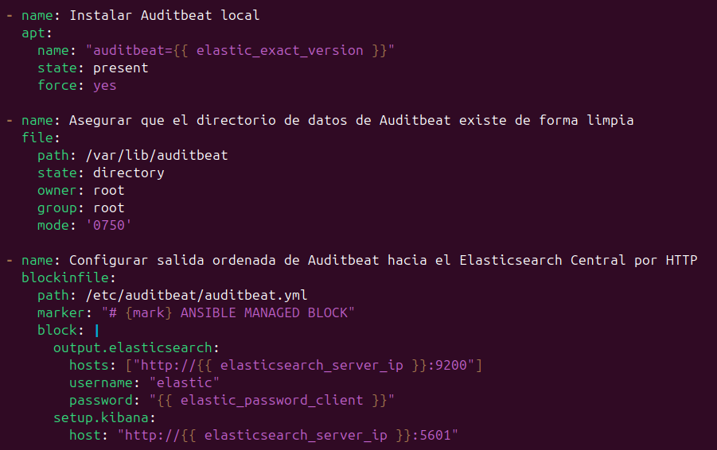

* En el Bloque 3, se ejecuta el comando auditbeat setup de manera secuencial para inyectar automáticamente las vistas y cuadros de mando interactivos en Kibana. Finalmente, se utiliza el módulo systemd para arrancar el servicio y dejarlo en modo de inicio automático (enabled: yes) ante posibles reinicios del sistema operativo.

  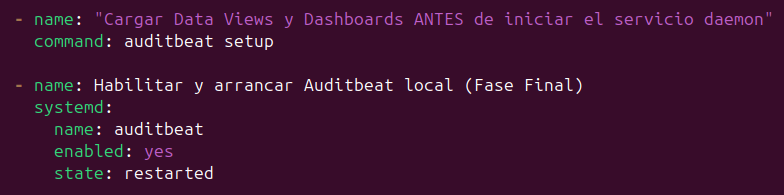

### <a href="#48-ansible---auditar-nuevos-servidores">4.8 Ansible - Auditar nuevos servidores</a>
[↑ Volver al índice](#indice)

Para finalizar con la sección de automatización, tenemos un playbook diseñado específicamente para auditar nuevos servidores en caso de que se añadan más a la infraestructura, sin tener que hacer absolutamente nada <strong>aparte</strong> de ejecutar el archivo. Con esto conseguimos una total <strong>escalabilidad</strong> para el crecimiento futuro de la red.  
* En este primer bloque, gestionamos el acceso inicial y la preparación del entorno en esas nuevas máquinas. Lo que lo diferencia de los otros playbooks es que aquí se emplean obligatoriamente el usuario y la llave .pem iniciales de AWS, al tratarse de servidores recién lanzados que aún no tienen nuestra configuración de seguridad. 

A partir de ahí, se realiza la instalación de <strong>auditd</strong>, la <strong>descarga criptográfica</strong> de Elastic en formato <strong>.gpg</strong>, el despliegue de la versión exacta y la <strong>resolución dinámica</strong> de la IP del servidor de logs; procesos que, como ya se han detallado anteriormente, garantizan la monitorización inmediata del nuevo nodo.  

  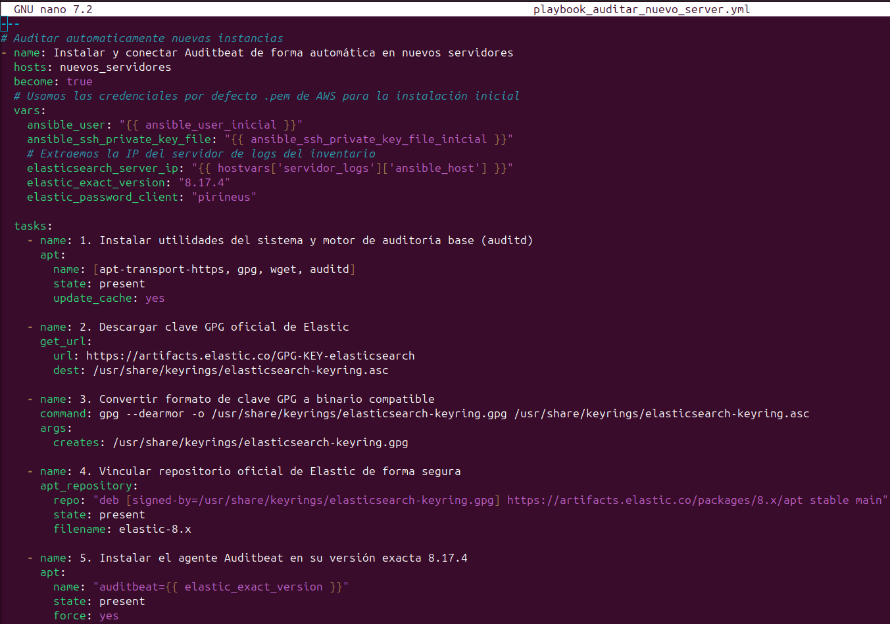

Por <strong>último</strong>, se aplica la <strong>monitorización estándar</strong> para toda la infraestructura:  

  

Para poner a prueba la escalabilidad real de la infraestructura, simulamos la incorporación de una nueva máquina al entorno. En primer lugar, registramos este nuevo servidor de base de datos dentro del archivo de inventario <strong>hosts.ini</strong>, lo que permite a Ansible identificarlo formalmente:  
Una vez actualizado el inventario, ejecutamos el <strong>playbook diseñado para la auditoría de nuevos servidores</strong>. Con este único comando, el flujo de automatización toma el control absoluto, desplegando el agente y conectándolo al servidor central sin necesidad de intervenir manualmente en la nueva máquina.  

  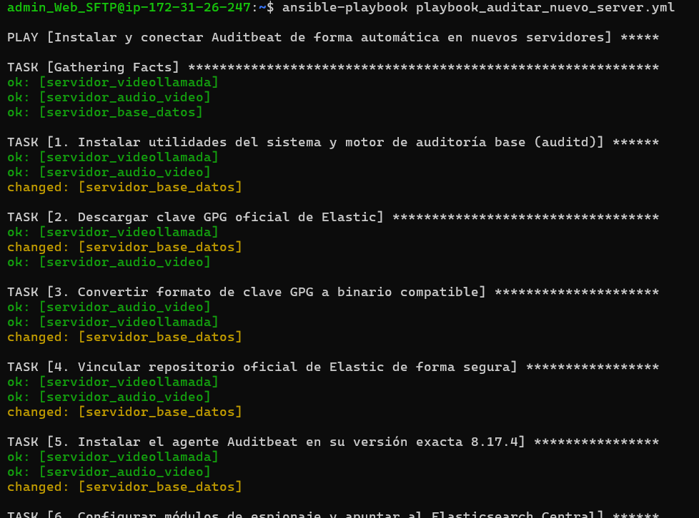

### <a href="#49-pruebas-de-logs">4.9 Pruebas de logs</a>
[↑ Volver al índice](#indice)

Nos conectamos sftp para hacer una prueba que aparece en los logs.  

  

<strong>auditd.data.acct – iker
</strong>Indica el usuario del sistema que ha iniciado la sesión.  
<strong>auditd.data.hostname – 79.117.182.87
</strong>Es la dirección IP pública del cliente desde la que se ha realizado la conexión remota.  
<strong>auditd.data.op – PAM:session_open
</strong>La operación que se ha registrado en el Kernel: el módulo de seguridad PAM ha abierto una sesión en el sistema.  
<strong>auditd.data.terminal –  ssh
</strong>El canal de comunicación. Al ser una conexión SFTP, viaja cifrada a través del demonio de SSH.  
<strong>auditd.result–  success
</strong>El resultado de la autenticación ha sido un éxito rotundo. Si hubiera fallado la contraseña, aquí pondría <em>failed</em>.  
<strong>auditd.summary.how – /usr/sbin/sshd
</strong>Muestra exactamente qué binario del sistema operativo ha procesado la solicitud (el servicio de SSH).  

  

  

  

  

  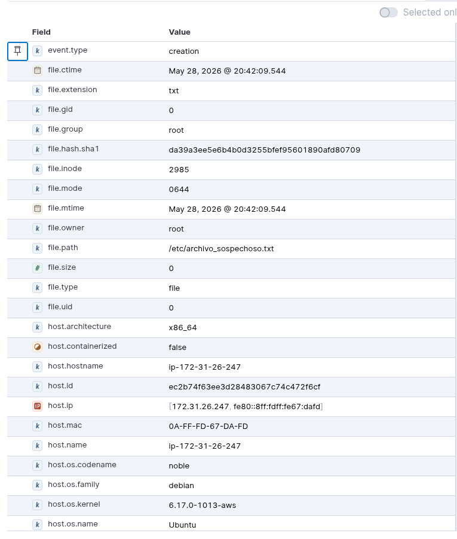

Para comprobar el correcto funcionamiento del módulo FIM (File Integrity Monitoring) configurado en Auditbeat, realizamos una prueba de concepto simulando una intrusión o alteración de archivos del sistema en el directorio /etc. Como se observa en los logs centralizados de Kibana, el agente interceptó en tiempo real tanto la modificación de atributos de un fichero en /etc/mtab como la creación de un nuevo archivo de texto (.txt) modificado por el usuario root, capturando de forma automática su hash criptográfico SHA-1.   
<strong>event.module</strong><strong> — </strong><strong>file_integrity</strong><strong>:</strong> El encargado de avisar ha sido el módulo de integridad.  
<strong>event.action</strong><strong> — </strong><strong>attributes_modified</strong><strong>:</strong> Indica que se han modificado los atributos o permisos de un archivo.  
<strong>event.action</strong><strong> / </strong><strong>event.type</strong><strong> — </strong><strong>created</strong><strong> / </strong><strong>creation</strong><strong>:</strong> Avisa de que se ha creado un archivo que antes no existía.  

  

  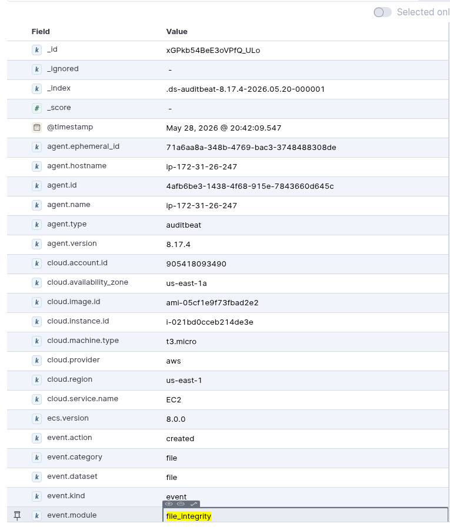

  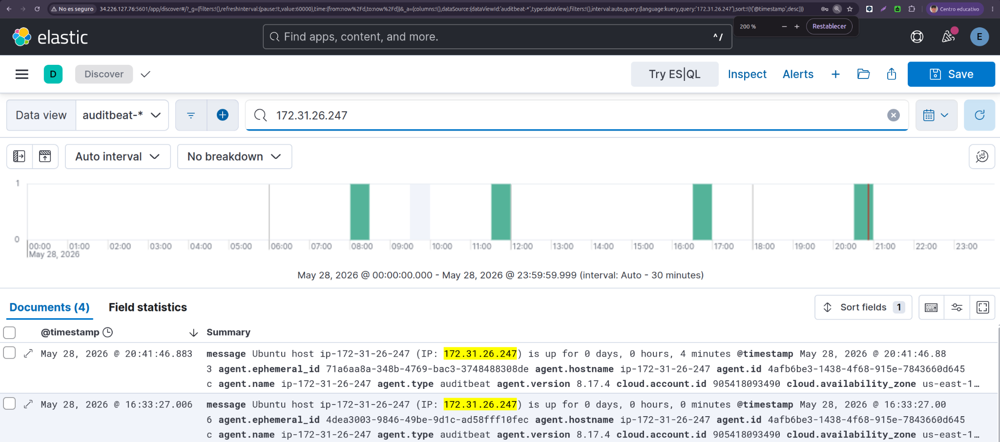

Por <strong>último</strong>, comprobamos que todos los logs de los servidores que hemos configurado <strong>funcionan</strong> correctamente. Mediante su <strong>IP privada</strong>, filtramos y localizamos los diferentes servidores dentro de Kibana para verificar la correcta recepción de los datos de auditoría.  
<strong>Servidor Web:</strong>  

  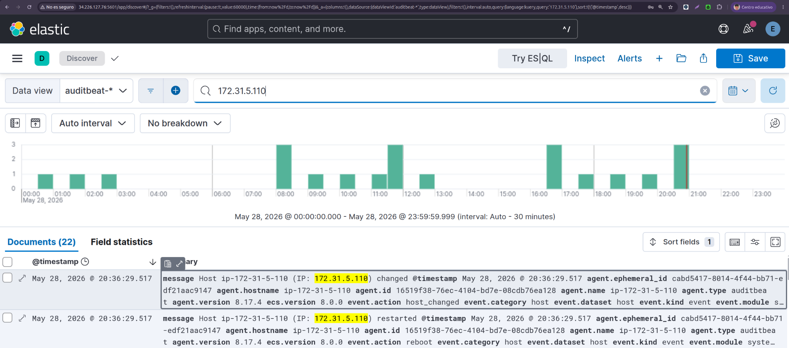

<strong>Servidor audio y video:</strong>  

  

<strong>
</strong>  
<strong>Servidor videollamada:</strong>  

  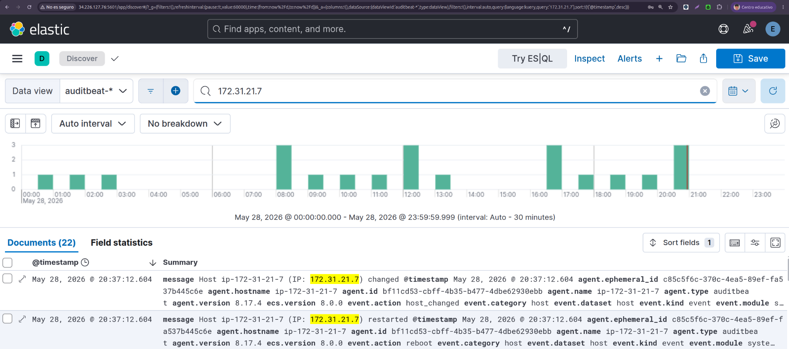

<strong>Servidor de LDAP:</strong>  

  

<strong>Servidor Base de datos:</strong>  

  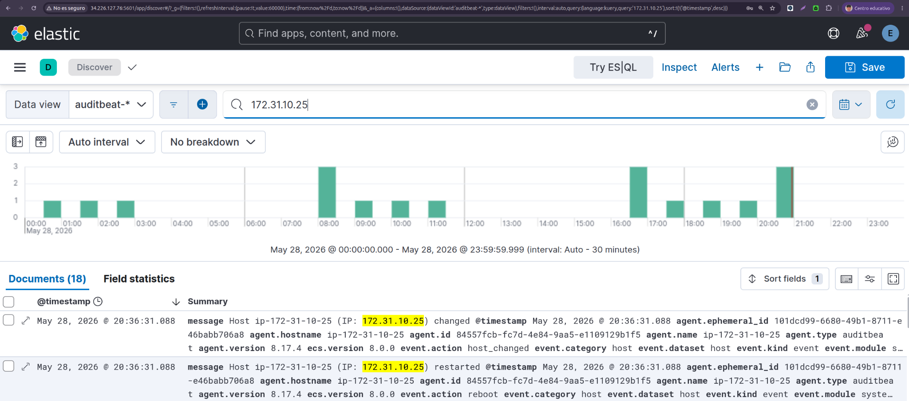

## <a href="#5-servidores-de-audio-video-y-videoconferencia">5. Servidores de audio, video y videoconferencia:</a>
[↑ Volver al índice](#indice)

Para optimizar el rendimiento y evitar la degradación de los servicios bajo carga, la infraestructura tecnológica en AWS la hemos dividido en dos instancias EC2 independientes (Ubuntu Server) dentro de la misma VPC, permitiendo una comunicación fluida entre ellas y los clientes externos a través de Internet:  
* Servidor 1 (Streaming de Audio y Vídeo): Nos permitirá ofrecer servicios de audio y video bajo demanda y en directo. Aloja el servidor Icecast2 (Puerto 8000) y NGINX con el módulo RTMP (Puerto 1935), hemos unificado estos dos servicios para aprovechar el servicio nginx.
* Servidor 2 (Videoconferencia): Este servidor es exclusivamente para la plataforma Jitsi Meet (Puertos 443 TCP para HTTPS y 10000 UDP para el tráfico de vídeo/audio de los participantes).

### <a href="#51-funcionalidad-del-servicio-de-audio">5.1. Funcionalidad del servicio de audio:</a>
[↑ Volver al índice](#indice)

Hemos escogido <strong>Icecast2</strong>. Es un servidor de streaming de medios digitales muy eficiente que permite transmitir audio a través de Internet en tiempo real (emisiones en directo) o bajo demanda. Actuará como un intermediario que recibe la señal de un cliente emisor (source client) y la distribuye simultáneamente a múltiples oyentes conectados de forma nativa a través de la web.  

### <a href="#52-instalacion-servicio-de-audio">5.2. Instalación servicio de audio:</a>
[↑ Volver al índice](#indice)

1. Nos conectamos a nuestro <strong>Servidor 1 en donde instalaremos nuestros servicios de audio y video</strong> y actualizaremos los repositorios e instalamos el paquete oficial con el siguiente comando:  
<strong>` sudo apt update &amp;&amp; sudo apt install icecast2 -y`</strong>  
2. Una vez ejecutada la instalación se nos abrirá una guía de configuración, en esta añadiremos un nombre a nuestro servicio en este caso pondremos nuestra IP (`35.169.183.22`) está será la parte clave que permitirá que los clientes se conecte a nuestro servicio.  

  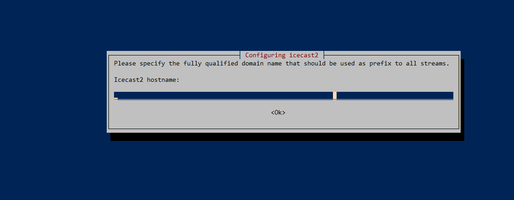

<em>Si necesitamos modificar manualmente la configuración o los puertos, editamos el fichero principal:</em><em> </em>  
<em>`sudo nano /etc/icecast2/icecast.xml`</em>  
* El siguiente paso será iniciar el servicio y lo habilitamos para que arranque automáticamente con el sistema con el comando:

<strong>`sudo systemctl start icecast2`</strong>  

  

### <a href="#53-configuracion-del-source-client">5.3. Configuración del Source Client:</a>
[↑ Volver al índice](#indice)

* Para enviar el audio al servidor, utilizamos el software Butt (Broadcast Using This Tool) instalado que instalaremos previamente en el equipo cliente (En este caso un cliente windows).
* Una vez instalado para comenzar con la configuración añadiremos nuestros servidor, a este le hemos de colocar un nombre en este caso lo llamaremos (ServerAudio):

  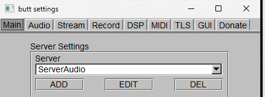

* Para poder establecer conexión con nuestro servicio de audio en streaming deberemos de configurar los siguientes datos:
* Tipo de servidor: Icecast2
* Dirección IP / Dominio: IP pública del Servidor 1 de AWS.
* Puerto: 8000
* Password: La contraseña de transmisión configurada anteriormente en el XML.
* Mountpoint (Punto de montaje): /stream

  

### <a href="#54-formatos-de-audio-digital-utilizados">5.4. Formatos de audio digital utilizados:</a>
[↑ Volver al índice](#indice)

Utilizaremos los formatos <strong>MP3</strong> ya que nos ofrece una compresión de código abierto excelente:  

  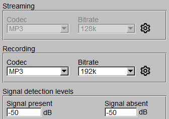

### <a href="#55-validacion-y-comprobacion-del-acceso">5.5. Validación y comprobación del acceso:</a>
[↑ Volver al índice](#indice)

* Una vez que el cliente emisor (source client) está transmitiendo de forma activa dandole al boton play en nuestro programa y en la parte inferior nos presente “Connection established”, ya podemos intentar reproducir nuestro stream desde cualquier navegador:

  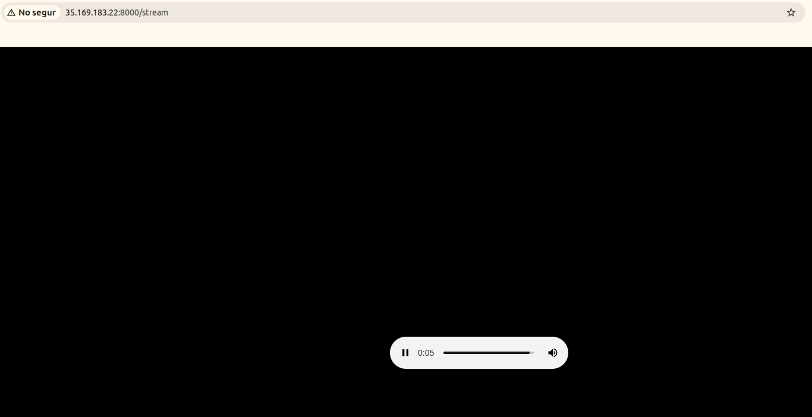

* El siguiente paso será abrir nuestro navegador web en cualquier equipo cliente e introducimos la URL según el siguiente formato: 

<strong>`http://IP_PUBLICA_SERVIDOR_1:8000/stream `</strong>  

  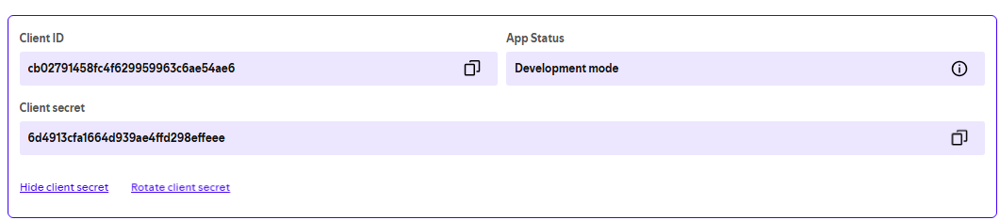

<em>Podremos ver como el reproductor de audio integrado nativo carga y reproduce el flujo correctamente.</em>  

## <a href="#6-implementacion-de-servicio-de-audio-en-emisora">6. Implementación de servicio de audio en emisora:</a>
[↑ Volver al índice](#indice)

Uno de nuestros objetivos principales consiste en la <strong>implementación de un servicio de radio en directo</strong>. Para el planteamiento del diseño, determinamos que la opción más eficiente es integrar una <strong>plataforma de streaming externa</strong> que ya albergará un <strong>catálogo musical extenso</strong>. De este modo, <strong>optimizamos los recursos del servidor</strong> al <strong>evitar el almacenamiento local</strong> de archivos de audio y eliminamos la necesidad de gestionar listas de reproducción masivas de forma manual. Por estos motivos, seleccionamos <strong>Spotify como la fuente emisora</strong> del contenido multimedia.  
<strong>Spotify ofrece un servicio para desarrolladores</strong> de aplicaciones mediante el cual, a través de la creación de un proyecto en su panel de control, nos proporciona <strong>credenciales de autenticación exclusivas: el Client ID y el Client Secret</strong>. Estas claves nos permiten realizar <strong>peticiones asíncronas y consultas seguras</strong> a su base de datos. De este modo, nuestro servidor puede enviar el texto de la canción capturada en tiempo real y <strong>recibir de vuelta los metadatos oficiales</strong>, incluyendo el título verificado, el nombre del artista y la <strong>URL de la carátula del álbum en alta resolución</strong> para inyectarla directamente en nuestro portal web:  

  

### <a href="#61-instalacion-y-configuracion-del-servicio-de-radio">6.1. Instalación y configuración del servicio de radio:</a>
[↑ Volver al índice](#indice)

Para conseguir que nuestra radio emita la playlist o la canción que queramos de Spotify (o de cualquier otra plataforma), el proceso es súper sencillo. El truco está en <strong>cambiar la entrada de audio en BUTT y seleccionar el dispositivo Loopback</strong>. Esto lo que hace es <strong>capturar el sonido interno</strong> de nuestro ordenador Windows (lo que sale por los altavoces) y mandarlo directamente al streaming. Una vez hecho este puente, <strong>cualquier música que pongamos a reproducir</strong> en el PC se escuchará en la web en tiempo real:  

  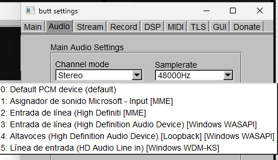

Nuestro objetivo principal es que este servicio no solo envíe el sonido, sino que también <strong>recoja el nombre de la canción, el artista y la carátula</strong> del álbum en tiempo real. Para conseguirlo, <strong>utilizaremos el programa Snip</strong>. Esta aplicación se ejecuta de fondo en Windows, se conecta con nuestro Spotify y, cada vez que cambia la canción, <strong>guarda automáticamente toda la información en un archivo de texto</strong>. De esta forma, dejamos el terreno preparado para que la web pueda leer ese archivo y actualizar la pantalla del usuario sin que tenga que hacer nada:  

  

Para configurar Snip, tuvimos que hacer clic derecho sobre su icono en la barra de tareas y <strong>activar varias casillas clave para el proyecto</strong>:  
* Primero, marcamos Spotify como nuestro reproductor principal para que el programa empiece a escuchar la música.

  

* Activamos Save Album Artwork y Keep Spotify Album Artwork, que son las opciones que se encargan de guardar la carátula del disco en una carpeta local de Windows cada vez que cambia la canción.

  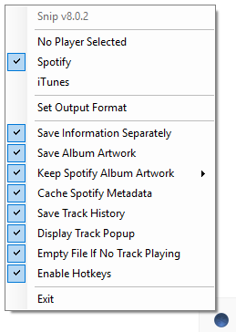

* Por último, dejamos activada la opción Empty File If No Track Playing. Esto es súper útil porque si cerramos Spotify o pausamos la música, el archivo de texto se queda vacío automáticamente, evitando que la web muestre información vieja cuando la radio no está emitiendo

  

El siguiente paso será vincular ese archivo de texto que se generará dentro de la carpeta snipp con nuestro programa de emisión. Para ello, entramos en los <strong>configuraciones de BUTT</strong> (butt settings) y nos iremos a la pestaña de <strong>Stream</strong>.  
En el apartado <strong>Update song name from file</strong>, le daremos al botón de la carpeta para buscar la ruta exacta donde Snip nos estaba guardando la información. Como se puede ver en la imagen, seleccionamos el archivo `Snip_Track.txt` que teníamos dentro de las descargas de nuestro usuario.  
Por último, tuvimos que <strong>marcar las casillas de 'Activate' y 'Read last line instead of first'</strong>. Esto es superimportante porque le dice a BUTT que el sistema está encendido y que, cada vez que cambie la canción en Spotify, lea siempre la última línea del archivo de texto para enviar el título correcto y actualizado hacia nuestro servidor en AWS.  

  

### <a href="#62-comprobacion-de-funcionamiento">6.2. Comprobación de funcionamiento:</a>
[↑ Volver al índice](#indice)

Para verificar que todo funciona a la perfección, lo primero que hacemos es abrir la <strong>aplicación de Spotify en nuestro Windows</strong> y poner a reproducir cualquier canción, asegurándonos de que el sonido sale correctamente por el sistema:  

  

Una vez que la música está sonando, nos vamos directos a la <strong>página web que hemos creado para el servicio de radio</strong>. Después de un par de segundos para que el servidor se sincronice, podremos comprobar que <strong>la canción se reproduce en streaming con total fluidez</strong> y que, además, la web nos muestra de forma automática la carátula oficial del disco, el título y el artista:  

  

## <a href="#7-funcionalidad-del-servicio-de-video">7. Funcionalidad del servicio de vídeo:</a>
[↑ Volver al índice](#indice)

Para la implementación del servicio de vídeo en streaming hemos elegido el servidor web <strong>NGINX configurado con el módulo RTMP</strong>. Esto nos permitirá recibir flujos de vídeo de alta definición enviados desde el codificador que nosotros elijamos utilizando el protocolo RTMP.  

### <a href="#71-instalacion-del-servicio-de-video">7.1. Instalación del servicio de video:</a>
[↑ Volver al índice](#indice)

1. En nuestro servidor de vídeo, instalaremos el servidor web NGINX junto con el módulo multimedia RTMP a través del siguiente comando:  
<strong>`sudo apt install nginx libnginx-mod-rtmp -y`</strong>  

  

2. Crearemos un directorio donde pondremos el archivo de video que queremos reproducir en nuestro servidor:  

  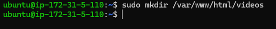

3. Editamos el fichero de configuración de NGINX `/etc/nginx/nginx.conf` para añadir el bloque RTMP al final del documento:  

  

  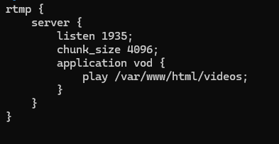

* La palabra VoD significa Video on Demand (Vídeo Bajo Demanda), como Netflix. Al configurarlo con la línea play /var/www/html/videos;, le decimos a NGINX que reproduzca archivos que ya están grabados en esa carpeta. Esto permite al usuario pausar, avanzar o retroceder el vídeo cuando quiera, y cada persona que entre lo verá desde el principio.
* Si activamos la opción live on;, el servidor cambia por completo y funciona como Twitch o la televisión, este ya no lee un archivo del disco duro, sino que se queda esperando a que le mandemos vídeo en tiempo real desde un programa como OBS.

4. Una vez creado el directorio, nos descargamos un video el cual lo pondremos en modo streaming para que se reproduzca. Como a veces los comandos de descarga directa fallan, <strong>lo ideal es subir nuestro archivo en este caso: </strong><strong>`pelicula.mp4`</strong><strong> por SFTP (usando FileZilla o WinSCP)</strong> a la carpeta que acabamos de crear y luego aplicarle los permisos de lectura con este comando:   
<strong>`sudo chmod -R 755 /var/www/html/videos`</strong>  

  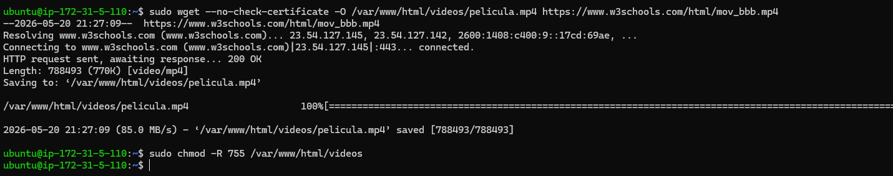

5. Una vez que hayamos descargado nuestro video nos iremos directamente a visualizarlo desde el navegador web. Para ello, entraremos en la <strong>página secundaria </strong><strong>`video.html`</strong> que creamos en nuestro servidor NGINX. El reproductor HTML5 de la web llamará al archivo local de la máquina a través de la ruta interna, lo que nos permitirá <strong>ver el vídeo directamente en el navegador</strong>, con total fluidez, pudiendo pausar y avanzar la reproducción en alta definición:  

  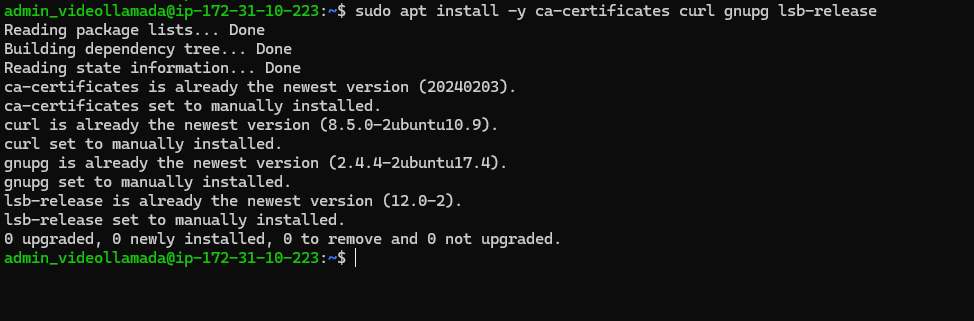

## <a href="#8-implementacion-del-servicio-de-videollamada">8. Implementación del servicio de videollamada:</a>
[↑ Volver al índice](#indice)

En <strong>InnovateTech</strong>, la comunicación ágil y segura es el pilar de nuestros servicios. Con el objetivo de centralizar, proteger y optimizar nuestras herramientas de colaboración interna y externa, hemos seleccionado <strong>Jitsi Meet</strong> cómo nuestra plataforma oficial de videoconferencias.  
Para garantizar un despliegue ágil, modular y de fácil mantenimiento, adoptamos una arquitectura basada en <strong>Docker</strong> y <strong>Docker Compose</strong>. Esto nos permite aislar los componentes principales de Jitsi (web, shards, audio/video) en contenedores independientes.  

### <a href="#81-que-es-docker-y-por-que-lo-usamos">8.1. ¿Qué es Docker y por qué lo usamos?</a>
[↑ Volver al índice](#indice)

<strong>Docker</strong> es una plataforma de software que permite empaquetar, distribuir y ejecutar aplicaciones dentro de entornos aislados llamados <strong>contenedores</strong>.  
A diferencia de las máquinas virtuales tradicionales (que duplican todo un sistema operativo y consumen muchos recursos), los contenedores de Docker comparten el núcleo del sistema operativo anfitrión. Esto los hace increíblemente ligeros, rápidos de iniciar y eficientes en el uso de memoria y CPU.  
* Contenedor: Es la unidad estándar de software que empaqueta el código y todas sus dependencias para que la aplicación se ejecute de forma rápida y confiable en cualquier entorno. En nuestro caso, Jitsi no corre como un "todo en uno", sino que se divide en varios contenedores especializados:
* web: El servidor que sirve la interfaz de usuario.
* prosody: El servidor de mensajería interna (XMPP).
* jicofo: El coordinador de las salas de conferencia.
* jvb (Jitsi Videobridge): El motor que procesa y distribuye el video y audio.

<strong>Docker Compose:</strong> Es la herramienta que utilizamos para definir y correr aplicaciones multi-contenedor. En lugar de levantar cada componente de Jitsi de forma individual con comandos largos, usamos un único archivo de configuración (`docker-compose.yml`) que coordina y conecta todos los contenedores de <strong>InnovateTech</strong> con un solo comando.  

### <a href="#82-instalacion-del-servicio-jitsi-de-videollamada">8.2. Instalación del servicio Jitsi de videollamada:</a>
[↑ Volver al índice](#indice)

El primer paso para la configuración de Jitsi será la configuración de un Hostname, Jitsi Meet requiere un Nombre de Dominio Completamente Calificado (<strong>FQDN</strong>) para la correcta gestión de salas pero nosotros al utilizar Docker <strong>no es necesario</strong> que modifiquemos el hostname del sistema operativo del servidor. Jitsi Meet gestionará su identidad, el enrutamiento de las salas y la validación de certificados SSL directamente a través de sus variables de entorno.  
Para que el servicio sea accesible y los navegadores web permiten el uso de la cámara y el micrófono de forma segura (obligatorio por protocolo HTTPS), debemos definir la dirección del servicio:  
* En Producción: Se utilizará un subdominio real (ej. https://videoconf.innovatetech.com) apuntando a la IP pública del servidor para automatizar los certificados con Let's Encrypt.
* En Pruebas Locales: Se puede utilizar la IP privada del servidor (ej. https://192.168.1.50) o un dominio ficticio (https://videoconf.innovatetech.local).

Como el servidor no cuenta con las herramientas de contenedores, procedemos a instalarlas utilizando el repositorio oficial de Docker para asegurar la versión más reciente:  
* Actualizaremos el índice de paquetes e instalaremos las dependencias previas, prepararemos el sistema para que se comunique de forma segura por HTTPS, descargar llaves criptográficas y gestionar repositorios:

  

* Descargamos e instalamos la llave pública oficial de Docker. Esto garantiza que el software que vamos a instalar en el servidor de InnovateTech es auténtico y no ha sido alterado:

  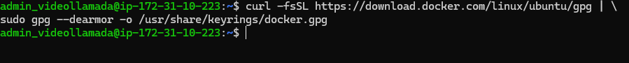

* Añadimos la ruta de descarga de Docker a las fuentes de nuestro gestor de paquetes (apt) para que el sistema busque directamente las versiones estables más recientes:

  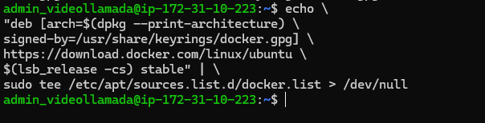

* Actualizamos los repositorios para registrar el cambio anterior e instalamos el motor de Docker (docker-ce), la interfaz de comandos (docker-ce-cli) y el plugin de Docker Compose:

  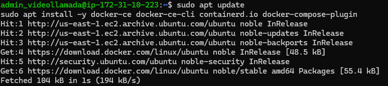

* Comprobamos que las herramientas están operativas imprimiendo sus versiones instaladas en la terminal:

  

Jitsi provee una plantilla oficial con la arquitectura de contenedores ya unificada y lista para ser desplegada mediante Docker Compose.  
* Nos movemos al directorio /opt (estándar de la industria para almacenar aplicaciones opcionales o de terceros) y clonamos el repositorio oficial utilizando Git:

  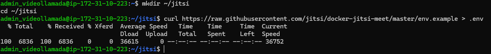

Los contenedores de Jitsi <strong>requieren parámetros iniciales para saber cómo comunicarse entre ellos,</strong> qué contraseñas usar y bajo qué dominio operar. <strong>Toda esta configuración se centraliza en un archivo oculto llamado</strong> `.env.`  
* Copiamos el archivo de ejemplo (env.example) proporcionado por los desarrolladores para crear nuestro archivo de producción .env:

* Con el comando: sudo cp env.example .env

Por defecto, el archivo de ejemplo viene con contraseñas en blanco. Jitsi incluye un script en Bash que <strong>genera automáticamente claves criptográficas aleatorias y únicas para cada microservicio.</strong> Esto asegura que la comunicación interna entre los contenedores <strong>quede completamente blindada contra intrusos.</strong>  
* Con el comando: sudo ./gen-passwords.sh

  

* Abrimos el archivo con el editor de texto Nano para ajustar los parámetros a la infraestructura de InnovateTech, dentro del editor, localizamos y modificaremos las siguientes líneas según corresponda a nuestro entorno:
* URL con la que los usuarios accederán a las conferencias:  

`PUBLIC_URL= https:// 32.199.24.67:8443`  
* Cómo estamos desarrollando este sistema, primero para las pruebas internas, dejaremos el  ENABLE_LETSENCRYPT=0 (por defecto). Jitsi generará certificados auto-firmados.

  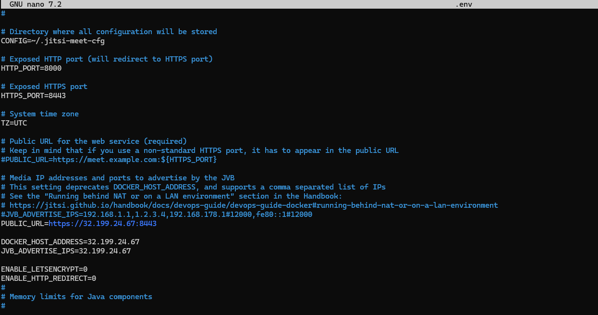

* Los contenedores son volátiles por naturaleza (si se destruyen, sus datos internos se borran). Para evitar la pérdida de configuraciones, salas creadas o historiales, creamos carpetas en el almacenamiento físico del servidor que Docker utilizará para escribir la información de forma permanente:

  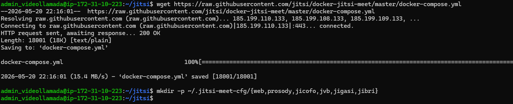

Con toda la arquitectura definida y configurada, procedemos a iniciar el ecosistema de videoconferencias de InnovateTech.  
* El comando docker compose up leerá el archivo docker-compose.yml, descargará de internet las imágenes oficiales de Jitsi (Web, Prosody, Jicofo, JVB) y las pondrá en marcha. Añadimos el parámetro -d (detached) para que el proceso se ejecute en segundo plano, liberando la terminal:

  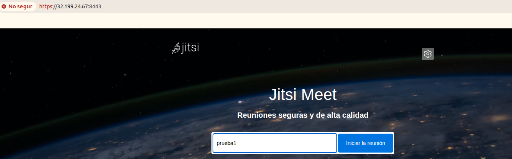

* Por último paso pasaremos a las comprobaciones, para ello abriremos en un cliente a través de nuestra URL (http://34.199.24.67:8443) y crearemos una sala:

  

* Una vez dentro podremos invitar a nuestros clientes o hacer reuniones a través de las funciones de invitación que nos ofrece el Jitsi:

  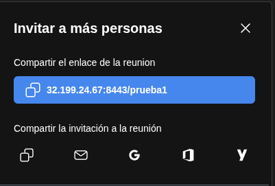

* Cuando el otro usuario reciba la  invitación podremos comprobar que el sistema funciona correctamente:

  

### <a href="#83-comprobaciones-de-ancho-de-banda-y-rendimiento-de-red">8.3. Comprobaciones de Ancho de Banda y Rendimiento de Red:</a>
[↑ Volver al índice](#indice)

Una vez completada la instalación y puesta en marcha de los servicios multimedia corporativos (<strong>Servicio de Audio por Streaming con Icecast2</strong>, <strong>Servicio de Vídeo bajo Demanda</strong> y el <strong>Servidor de Videoconferencia con Jitsi Meet</strong>), procedemos a realizar una auditoría estricta de la infraestructura de red. El objetivo es certificar que el ancho de banda disponible en nuestra instancia dedicada para Jitsi con dirección IP <strong>32.199.24.67</strong> es capaz de absorber la carga de trabajo concurrente sin degradar la <strong>Calidad del Servicio (QoS)</strong>, evitar la congelación de pantallas en <strong>Jitsi</strong> ni provocar pérdidas de paquetes en transmisiones en tiempo real mediante <strong>WebRTC</strong>.   
Para registrar un escenario de carga real en las gráficas de <strong>`nload`</strong>, inicializamos una sala de reunión virtual activa en <strong>Jitsi Meet</strong> (`https://35.169.183.22`) conectando múltiples participantes en alta definición (HD) con compartición de pantalla simultánea y flujos de audio y vídeo bidireccionales cruzados.   

  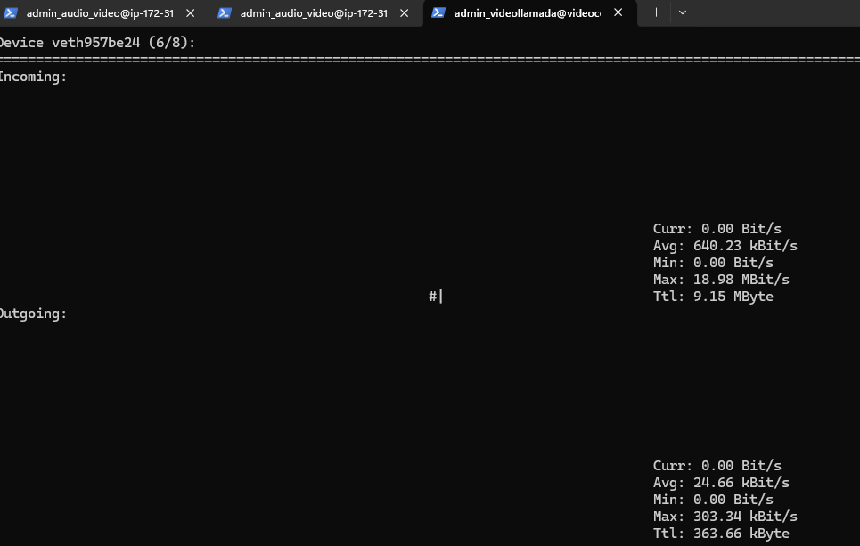

<em>Servicio de Videoconferencia</em>  
Durante la sesión multimedia interactiva, la pantalla de <strong>`nload`</strong> en el servidor <strong>32.199.24.67</strong> registra las siguientes métricas de rendimiento real estabilizado, las cuales se adjuntan como evidencia en la memoria técnica:  
* Métricas de Entrada (Incoming - Tráfico que recibe el Servidor Jitsi):
* Curr (Actual): Registra una tasa instantánea de recepción de 2.51 MBit/s (Megabits por segundo).
* Avg (Medio): Mantiene un promedio de 2.18 MBit/s (Megabits por segundo).
* Max (Pico Máximo): Alcanza un límite superior de 2.53 MBit/s (Megabits por segundo), correspondiente a la inyección del flujo de cámara del cliente.
* Métricas de Salida (Outgoing - Tráfico que distribuye el Servidor Jitsi hacia los clientes):
* Curr (Actual): Registra una tasa instantánea de transmisión de 4.21 MBit/s (Megabits por segundo).
* Avg (Medio): Mantiene un promedio de 3.95 MBit/s (Megabits por segundo).
* Max (Pico Máximo): Alcanza un límite superior de 5.01 MBit/s (Megabits por segundo) —lo que equivale a 5010.00 kBit/s (Kilobits por segundo)—, reflejando el esfuerzo del servidor al redistribuir los flujos de vídeo combinados de la sala hacia los terminales de los participantes.

  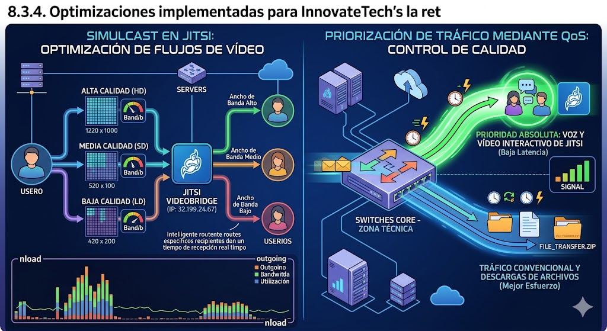

<em>Servicios de audio y video icecast2</em>  

#### <a href="#831-analisis-del-comportamiento-en-concurrencia-de-servicios">8.3.1. Análisis del Comportamiento en Concurrencia de Servicios:</a>
[↑ Volver al índice](#indice)

Para certificar la <strong>Alta Disponibilidad</strong>, sometemos al <strong>CPD</strong> a un escenario crítico de <strong>estrés concurrente</strong>, simulando una jornada laboral de alta demanda en <strong>InnovateTech</strong>. Iniciamos de manera simultánea los siguientes hilos de tráfico cruzados entre nuestros servidores:  
* Transmisión de Audio Continua (Icecast2): Conexión simultánea de múltiples estaciones de trabajo al punto de montaje activo para la reproducción del hilo musical corporativo.
* Streaming de Vídeo bajo Demanda (VOD): Reproducción de material audiovisual formativo en resolución Full HD desde las terminales de los empleados de forma simultánea.
* Sesión de Videoconferencia Activa (Jitsi): Mantenimiento de salas interactivas multimedia utilizando canales de comunicación síncronos en tiempo real apuntando a la IP 32.199.24.67.

El comportamiento del hardware de red demuestra estabilidad: la <strong>CPU</strong> de la instancia de AWS no experimenta picos de saturación superiores al <strong>`15%`</strong>, y los componentes de <strong>Jitsi</strong> (<strong>Jicofo</strong> y <strong>Jitsi Videobridge</strong>) gestionan la conmutación de flujos de vídeo de manera eficiente. Los búferes de red no reportan descartes de paquetes (<strong>dropped packets</strong>), manteniendo la sincronización multimedia sin congelamientos de pantalla por falta de almacenamiento en búfer (<strong>buffering</strong>).  

#### <a href="#832-relacion-de-resultados-con-el-consumo-teorico-de-los-servicios">8.3.2. Relación de Resultados con el Consumo Teórico de los Servicios:</a>
[↑ Volver al índice](#indice)

Para contrastar los datos experimentales obtenidos en el monitor, realizamos el cálculo de consumo de ancho de banda teórico nominal basado en las configuraciones reales de nuestros servidores:  
* Servicio de Audio (Icecast2): Codificación en flujo continuo utilizando el códec MP3 / Ogg Vorbis a una tasa de bits fija de 192 kbps por oyente. Para una estimación de 50 usuarios concurrentes: Consumo de Audio = 50 usuarios multiplicado por 192 kbps = 9.6 Mbps
* Servicio de Vídeo (VOD): Difusión bajo el códec H.264 / AVC en resolución 1080p con un bitrate objetivo de 4 Mbps por flujo. Para 15 sesiones simultáneas: Consumo de Vídeo = 15 usuarios multiplicado por 4 Mbps = 60 Mbps
* Servicio de Videoconferencia (Jitsi): Flujos bidireccionales síncronos mediante WebRTC con un consumo medio medido empíricamente en la captura de 2.53 Mbps de subida y 5.01 Mbps de bajada por sala activa en la IP 32.199.24.67. Consumo de Videoconferencia = Flujo combinado de la sala de reuniones = 7.54 Mbps
* Carga Total Teórica Estimada: 9.6 Mbps + 60 Mbps + 7.54 Mbps = 77.14 Mbps.

Al comparar la carga total requerida en el escenario de máxima concurrencia (<strong>77.14 Mbps</strong>) con el ancho de banda disponible verificado en los tests de nuestras instancias de AWS, demostramos que la infraestructura dispone de un amplio margen de seguridad (<strong>headroom</strong>), garantizando que las transmisiones de <strong>Jitsi Meet</strong> en la IP <strong>32.199.24.67</strong>, <strong>Icecast2</strong> y el resto de servicios operarán holgadamente sin llegar nunca a la saturación de los enlaces de red.  
seguridad (<strong>headroom</strong>), garantizando que las transmisiones de <strong>Icecast2</strong> y el resto de servicios operarán holgadamente sin llegar nunca a la saturación de los enlaces de red.  

#### <a href="#833-classification-del-sistema-y-propuestas-de-optimizacion">8.3.3. Classification del Sistema y Propuestas de Optimización:</a>
[↑ Volver al índice](#indice)

Basándonos en las métricas de rendimiento extraídas de la captura de <strong>`nload`</strong> y en el análisis de concurrencia, clasificamos formalmente el sistema de comunicaciones de <strong>InnovateTech</strong> como <strong>ACCEPTABLE (Aceptable)</strong>. La infraestructura cumple holgadamente con los requisitos de baja latencia y caudal necesarios para la operatividad diaria.  

#### <a href="#834-propuestas-de-optimizacion-implementadas">8.3.4. Propuestas de Optimización Implementadas:</a>
[↑ Volver al índice](#indice)

* Activación de Simulcast en Jitsi: Configuración del servidor para permitir que los clientes envíen múltiples resoluciones de vídeo a la vez (baja, media y alta calidad). El Jitsi Videobridge en la IP 32.199.24.67 decide de forma inteligente qué resolución enviar a cada participante según su ancho de banda actual, optimizando el consumo saliente que registramos en nload.
* Priorización de Tráfico mediante QoS: Marcado de paquetes en los switches core de la zona técnica para dar prioridad absoluta a los canales de voz interactivos y flujos de vídeo de Jitsi frente al tráfico de red convencional o descargas de archivos.

  

## <a href="#9-servidor-mysql">9. Servidor MySQL:</a>
[↑ Volver al índice](#indice)

### <a href="#91-infraestructura-y-despliegue-de-la-base-de-datos">9.1. Infraestructura y Despliegue de la Base de Datos</a>
[↑ Volver al índice](#indice)

Para dar soporte analítico, transaccional y operativo a los servicios centrales de <strong>InnovateTech</strong> (gestión de personal, streaming multimedia de audio y vídeo, plataformas de videollamadas y telemetría de mediciones de ancho de banda), se ha implementado un sistema de gestión de bases de datos relacionales (<strong>RDBMS</strong>) basado en <strong>MySQL Server</strong>. Este servicio se ejecuta de forma aislada sobre una instancia dedicada <strong>AWS EC2</strong> dentro de la zona de la LAN interna, garantizando la persistencia y la integridad de la información corporativa.  
El repositorio de código y el esquema estructural completo se encuentra disponible en el siguiente enlace:  
<u><strong>`Innovatetech_DB.sql (link github)`</strong></u>  

#### <a href="#911-arquitectura-del-modelo-relacional">9.1.1. Arquitectura del Modelo Relacional</a>
[↑ Volver al índice](#indice)

La base de datos lógica denominada `innovatetech_db` está constituida por un ecosistema de <strong>18 tablas interconectadas</strong> mediante restricciones de integridad referencial (claves primarias y foráneas). Los bloques funcionales se categorizan según el servicio al que prestan soporte:  
* Módulo de Gestión Corporativa y Recursos Humanos: departaments, empleats, nominas y grup_nivell.
* Módulo de Autenticación e Identidad: usuaris_sistema y rols_ldap.
* Módulo de Plataforma E-Commerce y Contenidos: cataleg_videos, productes, cistell y comandes.
* Módulo de Telecomunicaciones y Streaming: servidors_videoconferencia, registre_trucades, quotes_trucades y configuracio_qualitat.
* Módulo de Telemetría y Monitorización: meusers_amplada_banda.
* Módulo de Mantenimiento y Auditoría Interna: control_backups y taula_avisos.

La estrategia de implementación se divide rigurosamente en dos fases operativas:  
* Fase Estructural (DDL - Data Definition Language): Creación y normalización de las tablas, definición de tipos de datos, índices y restricciones FOREIGN KEY para evitar la redundancia y garantizar la consistencia.
* Fase Lógica y de Automatización (DML/Procedimental): Inyección de la lógica de negocio mediante la programación de Triggers (Disparadores) y Eventos programados en el motor para la auditoría de accesos, control de cuotas y mantenimiento automático.

#### <a href="#912-procedimiento-de-implantacion-en-el-servidor-ec2">9.1.2. Procedimiento de Implantación en el Servidor EC2:</a>
[↑ Volver al índice](#indice)

El proceso de aprovisionamiento del esquema de datos en el servidor de producción se realiza mediante la consola de comandos de Linux siguiendo las siguientes directrices técnicas:  
* Almacenamiento del Script: Se genera un directorio securizado en el sistema de archivos del servidor para alojar el script de despliegue:

  

* Edición y Verificación: Se vuelca el código fuente estructurado en el fichero local mediante el editor de texto nativo de la terminal:

  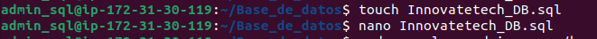

* Ejecución e Ingesta del Esquema: Se invoca al cliente de MySQL para procesar de forma automatizada las sentencias de creación de la base de datos e importación de estructuras:

  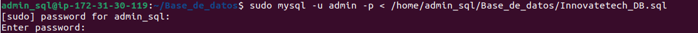

* Verificación de la Consistencia Física: Para validar el correcto despliegue y asegurar que las 18 entidades han sido mapeadas en el motor de almacenamiento (InnoDB), se realiza una consulta de verificación interna:

  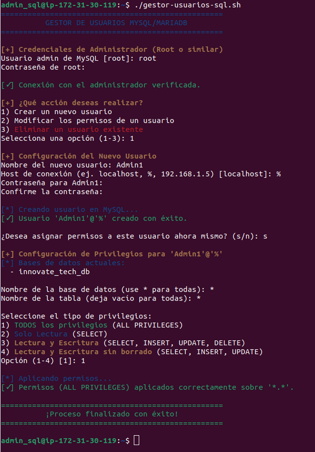

### <a href="#92-automatizacion-y-gestion-de-usuarios-mediante-scripting-bash">9.2. Automatización y Gestión de Usuarios mediante Scripting (Bash):</a>
[↑ Volver al índice](#indice)

Con el objetivo de mitigar errores humanos, acelerar las tareas de administración y cumplir con el principio de mínimo privilegio de manera ágil, se ha desarrollado un script de automatización en <strong>Bash</strong>. Este script actúa como una interfaz CLI (interfaz de línea de comandos) interactiva y segura para la provisión, modificación de privilegios y revocación (eliminación) de cuentas de usuario en el motor MySQL.  
El código fuente del script de automatización se encuentra auditado en el repositorio central:   
<u><strong>`codi (link github)`</strong></u>  
<em><strong>Prueba del funcionamiento + creación de usuario admin</strong></em><em><strong> </strong></em>  

  

#### <a href="#921-funcionalidades-principales-del-script">9.2.1. Funcionalidades Principales del Script</a>
[↑ Volver al índice](#indice)

* Operación de Alta (Create): Automatiza la creación del usuario, asigna contraseñas robustas y define el host de conexión permitido (ej. restringiendo accesos únicamente a la subred interna 10.0.1.0/24).
* Operación de Modificación (Update): Permite alterar dinámicamente los roles o privilegios (GRANT) sobre tablas específicas de la base de datos.
* Operación de Baja (Delete/Drop): Revoca de forma limpia todos los privilegios del usuario y elimina la cuenta del sistema, aplicando la instrucción FLUSH PRIVILEGES de forma nativa para actualizar las tablas de concesiones de MySQL de manera inmediata.

#### <a href="#922-funcionamiento-del-script">9.2.2. Funcionamiento del Script:</a>
[↑ Volver al índice](#indice)

Para certificar la fiabilidad del script en un entorno de pruebas idéntico al de producción, se procedió a realizar un caso de uso práctico enfocado en la creación de una cuenta con privilegios administrativos (`admin`):  
* Ejecución del Script: Se ejecuta el script con permisos de superusuario, seleccionando la opción de aprovisionamiento de cuentas e introduciendo los parámetros requeridos (Nombre de usuario: admin, Host: localhost, Privilegios: ALL PRIVILEGES).
* Validación de Conexión: Se realiza un login interactivo en la terminal con el nuevo usuario generado para confirmar que la autenticación basada en contraseñas funciona correctamente:

  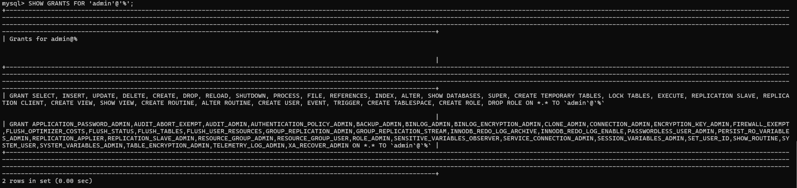

* Auditoría de Privilegios: Desde la consola de MySQL se verifica que los permisos asignados por el script coinciden con las políticas de seguridad lógica de la empresa mediante la sentencia:

  

### <a href="#93-triggers-y-eventos-periodicos">9.3 Triggers y eventos periódicos:</a>
[↑ Volver al índice](#indice)

Una vez creada la estructura de la base de datos, se implementa la <strong>lógica de seguridad y automatización</strong> mediante <strong>triggers</strong> y un <strong>evento periódico</strong>.  
Los <strong>triggers</strong> cubren tres áreas: el <strong>control de cuotas de llamadas</strong> (límite de minutos mensuales y llamadas diarias por usuario), el <strong>bloqueo de usuarios</strong> en estado bloqueado para que no puedan realizar ni recibir llamadas, y la <strong>auditoría de accesos no autorizados</strong>, registrando en la tabla <em>«taula_avisos»</em> de auditoría cualquier intento de modificar tablas restringidas según el rol del usuario de la base de datos.  
El <strong>evento periódico</strong> realiza un <strong>backup automático diario a las 02:00 AM</strong> exportando las tablas críticas a <strong>ficheros .csv</strong>, minimizando así el impacto en el rendimiento del servidor durante el horario laboral. Cada ejecución queda registrada en la tabla <em>«control_backups»</em> con la fecha, las tablas incluidas y el resultado.  
* Primero se crea el fichero Triggers_y_Eventos.sql, el contenido del mismo está en este enlace del git.

  

* Seguidamente, se mostrará el comando que permitirá ejecutarlo.

  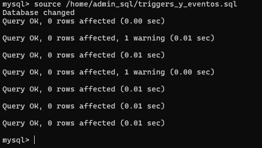

* Se hacen las verificaciones de los triggers. (SHOW TRIGGERS;):

  

* Se hacen las verificaciones de los eventos. (SHOW EVENTS;):

  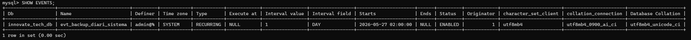

* Para la realización de los backups es necesario que creemos el directorio en el /var/ y se ajusta la propiedad hacia mysql como propietario y grupo:

  

* Y para que persista tras reinicios, se añade al fichero lo siguiente “event_scheduler = ON”:

  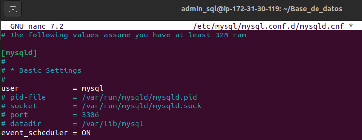

* Y se reinicia el servicio.:

  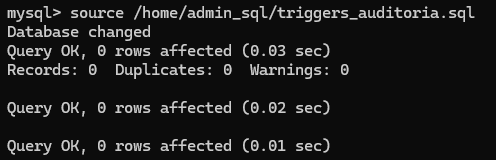

* Ahora creamos y ejecutamos los triggers de auditoría:
PROBLEMA: No se puede crear un trigger que registre cada vez que a un usuario le salta el error de permiso denegado, ya que cuando este sucede, mysql “mata” el proceso sin oportunidad de ejecutar el trigger.
SOLUCION: Le damos permisos a los usuarios, incluso fuera de sus campos, luego un trigger denegará las operaciones y creará el registro en taula_avisos.

  

#### <a href="#931-comprobacion-triggers-y-eventos">9.3.1 Comprobación Triggers y eventos:</a>
[↑ Volver al índice](#indice)

* PRUEBA DE TRIGGER (cuota de llamada y bloqueo de usuarios por exceso)

Creamos un registro de llamada para probar que se sumen los 10 minutos a la quota del usuario:
  

  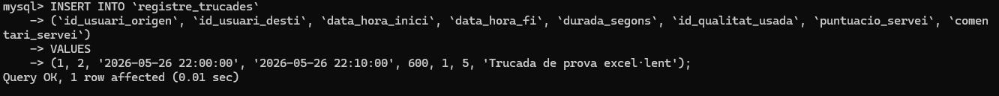

Y vemos como se ha sumado automáticamente la cuota al usuario 1:  

  

Ahora vamos a modificar las llamadas del dia para que superen las 50 máximas, de manera que se superará la cuota y verificaremos si se añade el usuario 1   

  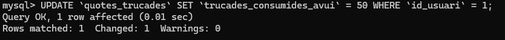

  

* PRUEBA DE EVENTO:

Podemos observar, que con los días se han ido guardando las copias de seguridad:  

  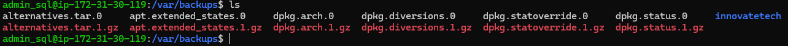

* PRUEBA DE TRIGGER DE AUDITORÍA:

Hacemos un intento de INSERT, UPDATE y DELETE con el usuario vendes en diferentes tablas donde no tiene permisos para tales acciones, y vemos como el trigger ofrece el error de permisos insuficientes (en vez de utilizar el predeterminado de mysql que mataría el proceso y no permitiría guardar el registro de auditoría):  

  

  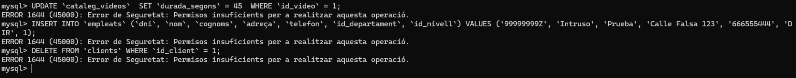

Comprovamos los registros de estas acciones sobre la tabla “taula_avisos”.  

  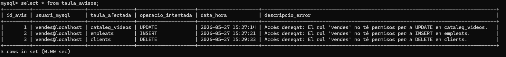

### <a href="#94-diagrama-er-y-modelo-relacional">9.4 Diagrama ER y Modelo Relacional:</a>
[↑ Volver al índice](#indice)

Para una mayor visibilidad revisar las <u>`imágenes en el repositorio de github`</u> (img_30.1, img_30.2)  
* Diagrama ER:

  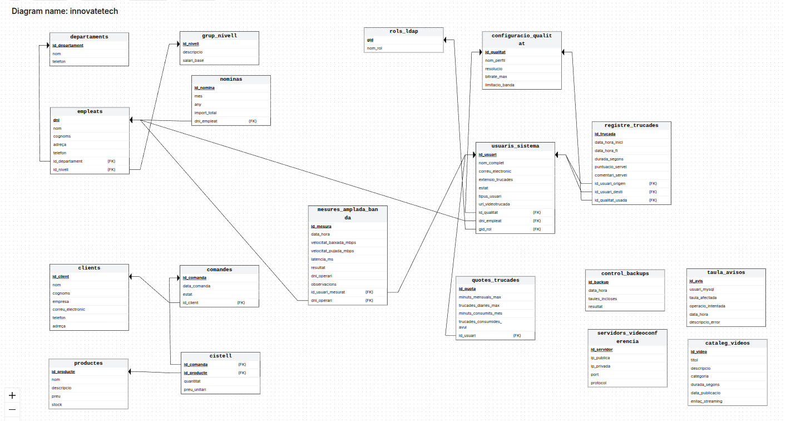

* Modelo relacional:

  

## <a href="#10-servidor-web---sftp">10. Servidor Web - SFTP</a>
[↑ Volver al índice](#indice)

### <a href="#101-nginx">10.1 Nginx:</a>
[↑ Volver al índice](#indice)

Verificamos la instalación:  

  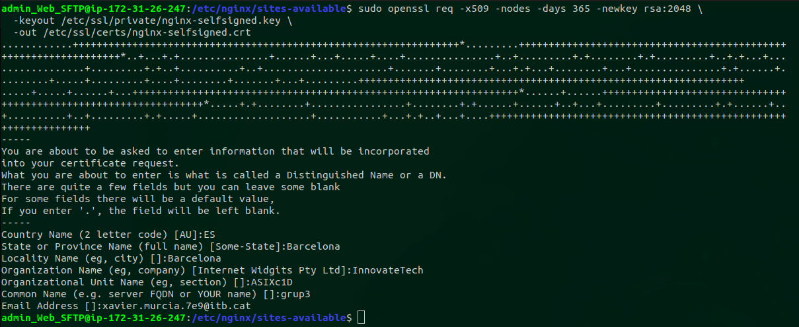

#### <a href="#1011-creacion-de-certificados-ssl">10.1.1. Creación de certificados SSL:</a>
[↑ Volver al índice](#indice)

Para garantizar la <strong>confidencialidad e integridad</strong> de la información y encriptar toda la comunicación entre nuestro servidor web y los clientes (evitando ataques de interceptación de datos o <em>Man-in-the-Middle</em>), se ha implementado el protocolo <strong>HTTPS</strong>. Para ello, generamos un <strong>certificado SSL/TLS autofirmado</strong> utilizando la herramienta criptográfica <strong>OpenSSL</strong>.  
La generación de la clave privada y del certificado se realiza mediante el siguiente comando estructurado:  

  

Durante este proceso, hemos introducido los datos identificativos de la organización para conformar el Nombre Distinguido (<strong>Distinguished Name</strong> o <strong>DN</strong>) del certificado:  
* Country Name (C): ES (España)
* State or Province Name (S): Barcelona
* Locality Name (L): Barcelona
* Organization Name (O): Innovate Tech
* Organizational Unit Name (OU): Departamento de IT / CPD
* Common Name (CN): https://innovatetech-g3.ddns.net

#### <a href="#1012-configuracion-de-la-pagina">10.1.2. Configuración de la Página:</a>
[↑ Volver al índice](#indice)

Instalamos y verificamos la versión de php, paquete necesario para procesar nuestras páginas escritas en php, las cuales tendrán el código necesario para comunicarse con la base de datos y el dominio LDAP.  

  

  

Hacemos las configuraciones necesarias para el funcionamiento de la página con las siguientes funciones:  
* Compatibilidad con PHP
* Funcionamiento HTTPS
* Redirección 80->443
* Uso de certificados autofirmados

  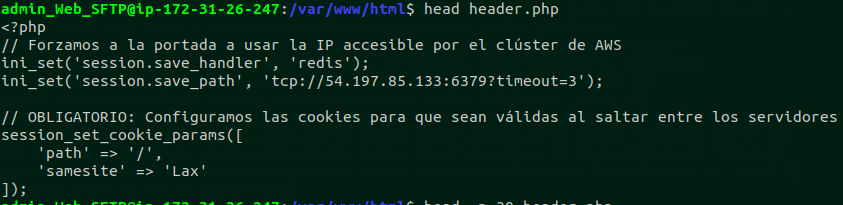

#### <a href="#1013-configuracion-php-multiservidor">10.1.3. Configuración PHP Multiservidor:</a>
[↑ Volver al índice](#indice)

Debido a nuestro amplio despliegue de variados servicios, nuestro sitio web está compuesto por varios servidores (Server Web-SFTP, Server Icecast y Server Jitsi). Todos estos deben compartir sesión entre ellos, ya que de lo contrario deberíamos iniciar sesión continuamente durante la navegación de nuestra página. Por lo tanto utilizaremos un <strong>inicio de sesión</strong> conectado con el servidor <strong>LDAP</strong>, y sincronizamos nuestro servidores con <strong>php-redis</strong>.  
Esto funciona con las siguientes líneas de código al principio de cada página:  

  

Ponemos aquí un esquema gráfico para ver cómo funciona esta estructura y que funciones tiene cada server:  

  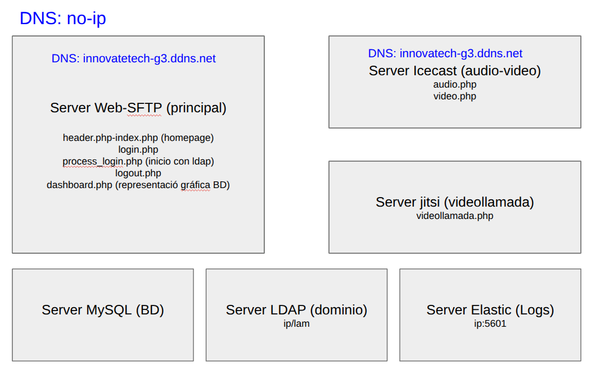

Al entrar en <strong>index</strong>, no hay sesión iniciada, tenemos un <strong>home público</strong>.  
<strong>Al iniciar sesión: </strong><strong>process_login.php</strong><strong> </strong>consulta con el server <strong>LDAP </strong>para iniciar sesión con el usuario, una vez este da el OK, utiliza el GID del usuario para asignarle un rol de <strong>mysql </strong>(admin, vendes, comercial, treballador, cliente). Entonces inicia sesión también en la base de datos con sus debidos permisos.  
<strong>Al navegar entre páginas: </strong>Gracias a <strong>php_redis</strong>, la sesión se mantiene y no hace falta volverla a iniciar. Cabe decir que el LAM y el Elastic, al ser servicios diferentes, requieren de otro login.  
<strong>DNS: </strong>Para tener un dns público gratuito, hemos utilizado no-ip, este tiene sus limitaciones, por esto mismo tenemos un nombre de host diferente para cada uno de los servidores. También destaca que no tenemos dns para otras paginas como videollamada (porque el servicio no funciona correctamente con este).  
<u>`Enlace a página`</u>  

### <a href="#102-servicio-sftp-autenticacion-con-usuario-de-ldap">10.2 Servicio SFTP, autenticación con usuario de LDAP</a>
[↑ Volver al índice](#indice)

#### <a href="#1021-autentificar-con-usuarios-ldap-en-el-servicio-sftp">10.2.1 Autentificar con usuarios LDAP en el servicio SFTP:</a>
[↑ Volver al índice](#indice)

Para que nuestro servidor <strong>SFTP</strong> pueda autenticar a los usuarios, necesitamos instalar una serie de paquetes y configurar la conexión directa con el servidor <strong>LDAP</strong>. Estos paquetes convierten a nuestro servidor <strong>Web-SFTP</strong> en un <strong>cliente de LDAP</strong>, permitiendo que el sistema consulte y autentique a los usuarios en el directorio centralizado en lugar de recurrir a los <strong>usuarios locales</strong>.  

  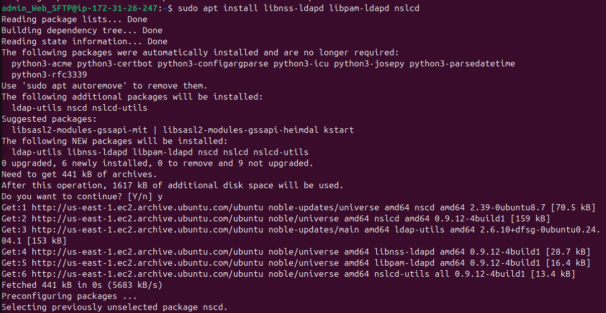

Durante el proceso de instalación, el asistente nos irá pidiendo que configuremos los siguientes apartados. En primer lugar, indicamos la <strong>IP privada</strong> del <strong>servidor LDAP</strong>:  

  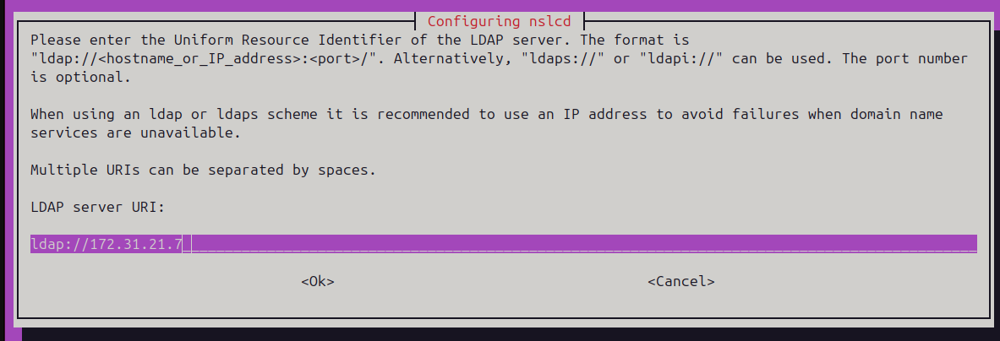

En la siguiente pantalla, se nos solicita la <strong>base de búsqueda (Base DN)</strong> de <strong>LDAP</strong>:  

  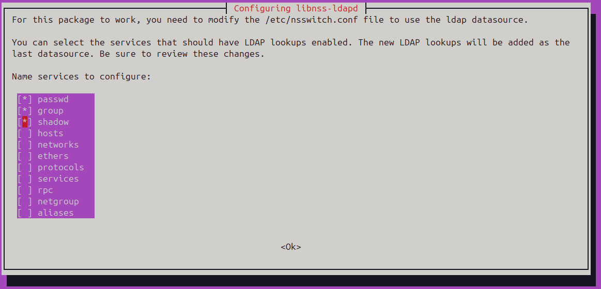

Aquí configuramos automáticamente el archivo <strong>/etc/nsswitch.conf</strong>, indicando al sistema operativo <strong>qué tipo</strong> de datos debe consultar en el servidor <strong>LDAP</strong>:  

  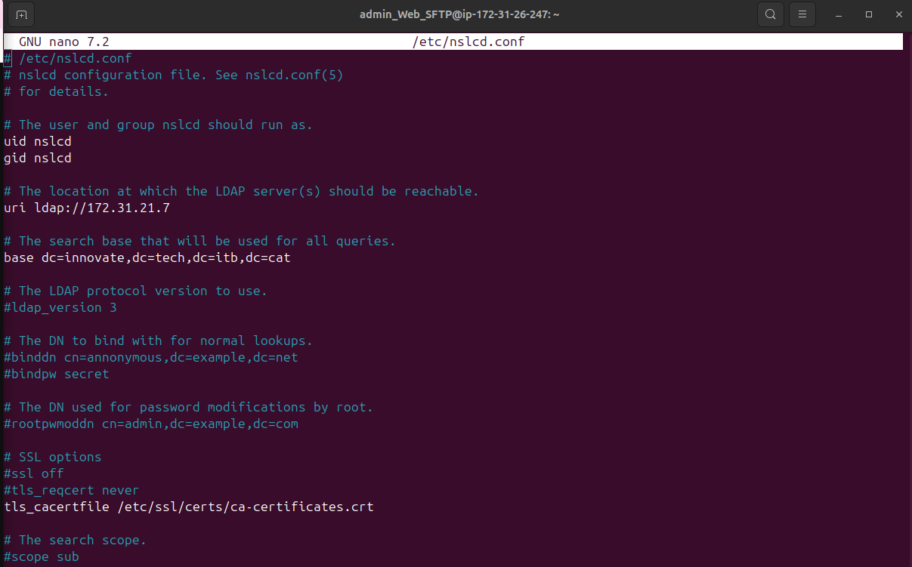

A continuación, confirmamos que los cambios indicados durante el proceso de instalación se han <strong>aplicado correctamente</strong>:  

  

A continuación, en el siguiente fichero de configuración, añadimos la última línea para que, cuando un usuario de <strong>LDAP</strong> se valide con éxito, el sistema compruebe primero si dispone de su correspondiente directorio en <strong>/home</strong> y, en caso de no existir, lo <strong>cree automáticamente</strong>.  
Dentro del archivo <strong>/etc/ssh/sshd_config</strong>, definimos la jaula (<em>chroot</em>) para el <strong>GID 3000</strong>, correspondiente al grupo <strong>sftp_users</strong> que creamos previamente en el playbook del servidor LDAP. Indicamos como ruta de enjaulamiento <strong>/home</strong>, la cual es propiedad estricta de root; esto es un requisito indispensable para que OpenSSH no rechace la conexión por motivos de seguridad, ya que el usuario que se conecta no debe tener permisos de escritura sobre la raíz de la jaula. Al establecer la conexión, la ruta /home pasará a ser la raíz virtual (/) para el cliente, luego el usuario si podrá ir a su home en donde sí tendrá control total de sus ficheros de manera aislada.  
Por defecto, al desplegar instancias en AWS, el proveedor restringe el acceso exigiendo llaves privadas <strong>.pem</strong>. Mediante la modificación de esta directiva, habilitamos la <strong>autenticación mediante contraseña</strong> al conectarnos vía SFTP, permitiendo así que los usuarios del directorio LDAP validen su identidad de forma convencional.  

  

  

Lo siguiente es que aplicamos las reglas específicas y restrictivas para asegurar el entorno del grupo <strong>sftp_users</strong>:  
* Enjaulado en el directorio raíz: Confinamos a los usuarios dentro del entorno seguro, vinculando de forma dinámica la ruta donde se creará la carpeta correspondiente a cada cuenta (/home/usuario).
* ForceCommand internal-sftp: Forzamos de manera estricta el uso del comando interno de SFTP. Con esta medida de seguridad, evitamos por completo que un usuario pueda obtener una terminal interactiva (impidiendo que acceda al sistema ejecutando un comando como ssh usuario@IP) y restringiendo su actividad única y exclusivamente a la transferencia de archivos.

  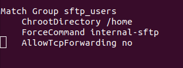

Por último aplicamos el comando chmod 700 /home/* , logrando que a partir de ahora, si un usuario intenta hacer un ls dentro de una carpeta que no es la suya le denegara.  

  

  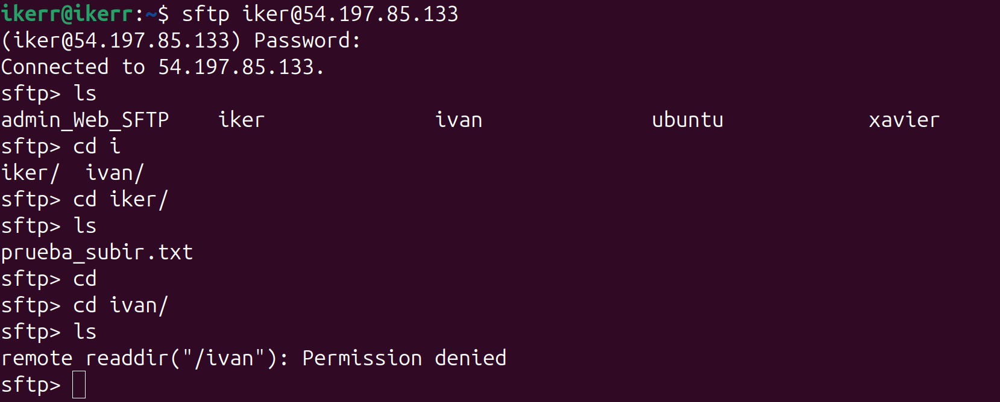

<strong>Reiniciamos los servicios</strong> para aplicar de forma definitiva los cambios en el demonio SSH y comenzar con las comprobaciones del entorno.  

  

#### <a href="#1022-pruebas-de-conexion">10.2.2 Pruebas de conexión:</a>
[↑ Volver al índice](#indice)

En primer lugar, realizamos la prueba de acceso utilizando un usuario registrado en el directorio centralizado <strong>LDAP</strong>. Introducimos las credenciales correspondientes y confirmamos que el inicio de sesión se realiza correctamente vía <strong>SFTP</strong>:  

  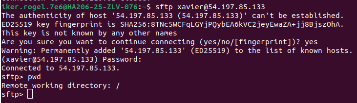

Por el contrario, al intentar acceder al servidor empleando una cuenta que no se encuentra dada de alta o autenticada en el servidor <strong>LDAP</strong>, el sistema operativo aplica las políticas de seguridad y <strong>deniega los permisos</strong> de entrada de forma automática:  

  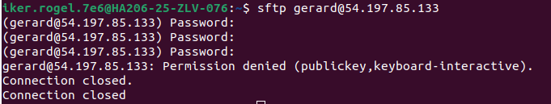

Tal y como se detalló en la configuración del servicio OpenSSH, en el momento en que un usuario se valida con éxito, el sistema comprueba su entorno. Si es su primera conexión, se crea de forma dinámica una carpeta con su nombre dentro de la ruta raíz de la jaula (/home). Debido a las restricciones aplicadas, el usuario visualiza este directorio como la raíz del sistema (/) y <strong>carece por completo de permisos</strong> para navegar fuera de él, quedando totalmente aislado.  

  

  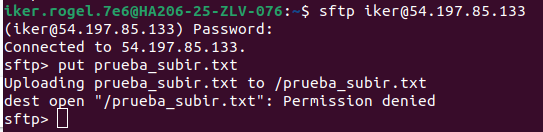

Finalmente, comprobamos que las restricciones de la jaula no afectan al flujo de trabajo del usuario. Una vez situado dentro de su propio directorio asignado, el cliente tiene pleno control sobre sus datos, estando plenamente capacitado tanto para <strong>subir</strong> como para <strong>descargar </strong>archivos de forma segura:  

  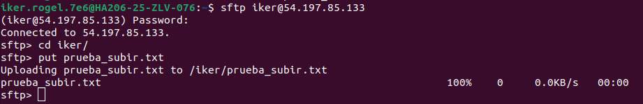

### <a href="#conclusion">Conclusión</a>
[↑ Volver al índice](#indice)

El desarrollo de este proyecto para el CPD de <strong>Innovate Tech</strong> nos ha permitido diseñar e implementar una infraestructura tecnológica completa, uniendo la parte física, la lógica y la automatización en un entorno empresarial real.  
Por un lado, en la <strong>infraestructura física</strong>, logramos optimizar la eficiencia y la seguridad. El diseño acristalado de la sala no solo facilita la supervisión visual, sino que junto al suelo técnico aísla el aire frío de los racks, reduciendo el gasto energético del sistema de climatización. Además, aplicando el principio de <em>seguridad por oscuridad</em> y el uso de vidrios electrocrómicos, conseguimos mantener el CPD oculto y protegido ante miradas externas no autorizadas.  
Por otro lado, a nivel de <strong>red y sistemas</strong>, la segmentación estricta entre las zonas WAN, LAN y DMZ garantiza que si el servidor web se ve comprometido, los datos internos sigan a salvo. La automatización con Ansible en AWS nos demostró lo ágil que es desplegar servicios complejos (como el directorio LDAP o el sistema de auditoría elástica) de forma rápida y sin errores humanos, permitiendo detectar cualquier acceso o cambio sospechoso en tiempo real.  
Finalmente, la separación de los servicios multimedia (streaming de audio y vídeo) del resto de la red corporativa asegura que la alta concurrencia no afecte al rendimiento del día a día, mientras que las jaulas SFTP integradas con LDAP garantizan un intercambio de archivos totalmente seguro y aislado.  
<strong>En definitiva</strong>, este proyecto nos ha servido para entender que un CPD moderno no solo necesita potencia, sino una estrategia inteligente que combine eficiencia energética, automatización y una seguridad implacable en capas. Estamos muy satisfechos con el resultado, ya que la infraestructura queda lista, es escalable y está preparada para el futuro.  
<em><strong>Elaborado por:</strong></em><em> Xavier, Ivan, Iker y Piero.</em>  

